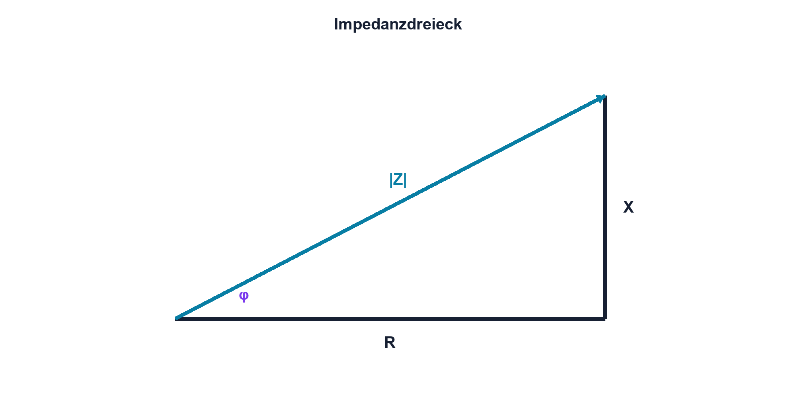

# 07.7 – Impedanz und komplexe Lasten

[← Zurück](06-blindwiderstand-von-c-und-l.md) · [Modulübersicht](README.md) · [Kursübersicht](../README.md) · [Weiter →](../08-filter-resonanz/README.md)

## Lernziele

Nach dieser Lektion kannst du:

- Impedanz als Betrag und Phase verstehen
- R und Blindanteil vektoriell kombinieren
- Wirkleistung Scheinleistung und Leistungsfaktor unterscheiden

## Einleitung

In einer Wechselstromschaltung reicht eine einzelne Ohmzahl oft nicht. Impedanz beschreibt gleichzeitig, wie stark eine Last den Strom begrenzt und wie weit Strom und Spannung phasenverschoben sind.

<!-- context-expansion-2026 -->
Elektronische Signale verändern sich mit der Zeit. Frequenz, Amplitude, Effektivwert und Phase beschreiben unterschiedliche Eigenschaften desselben Verlaufs. Für Messung und Schaltungsentwurf muss deshalb stets geklärt werden, welche Signalgrösse gemeint ist und unter welchen Bedingungen sie gilt.

Beim Thema **Impedanz und komplexe Lasten** geht es deshalb nicht nur um eine einzelne Formel oder Definition. Entscheidend ist, wie sich das Prinzip im Schema erkennen, im Datenblatt beurteilen, im Aufbau messen und bei einer Abweichung systematisch überprüfen lässt.

## Theorie

<!-- theory-expansion-2026 -->
### Einordnung und Grundidee

Ein Signal wird zuerst im Zeitdiagramm mit Bezugslinie und Einheiten beschrieben. Daraus lassen sich Periodendauer, Frequenz, Momentanwert und Phasenbezug ableiten. Messgeräte können je nach Kopplung, Bandbreite und Auswerteverfahren unterschiedliche Kennwerte desselben Signals anzeigen.

### Komplexe Darstellung

Impedanz wird als `Z = R + jX` geschrieben. j kennzeichnet eine Drehung um 90°; X ist positiv induktiv und negativ kapazitiv. Betrag und Winkel sind `|Z| = sqrt(R²+X²)` und `φ = atan(X/R)`.

| Zeichen | Bedeutung | Einheit |
|---|---|---|
| `Z` | komplexe Impedanz | Ω |
| `X` | Blindanteil | Ω |
| `j` | imaginäre Einheit in Elektrotechnik | – |

Reihenelemente werden als Impedanzen addiert. Parallele Netze lassen sich oft übersichtlicher mit Admittanz behandeln.

### Leistung

Wirkleistung P wird dauerhaft umgesetzt, Blindleistung Q pendelt zwischen Quelle und Speicher, Scheinleistung S beschreibt das Produkt der Effektivwerte. Der Leistungsfaktor ist bei Sinus `cos φ = P/S`.

### Reale Lasten

Motoren, Netzteile und Treiber können nichtlinear sein. Dann entstehen Oberwellen, und der Leistungsfaktor wird nicht allein durch einen Phasenwinkel beschrieben.

## Anwendungsfall

Typische elektronische Anwendungen und Baugruppen für dieses Thema sind:

- Last- und Quellenanpassung
- Analyse von Filtern und Leitungen
- Bewertung komplexer Verbraucher über Frequenz

In einer konkreten Entwicklung wird nicht nur geprüft, ob die gewünschte Funktion grundsätzlich entsteht. Ebenso wichtig sind zulässige Grenzwerte, Toleranzen, Temperatur, Messbarkeit und das Verhalten bei Unterbruch, Kurzschluss oder falscher Ansteuerung.

## Anschauliches Beispiel

Ein Seilzug kann eine Kraft teils in Bewegungsrichtung und teils quer dazu übertragen. Der Betrag ist die Gesamtkraft, doch nur der Anteil in Bewegungsrichtung verrichtet die gewünschte Arbeit. Das Impedanzdreieck trennt ähnlich Wirk- und Blindanteil.

## Berechnungsbeispiel

Eine Reihenschaltung besitzt R = 100 Ω und XL = 100 Ω. `|Z| = 141,4 Ω`, der Winkel beträgt +45°. An 10 V RMS fliessen ungefähr 70,7 mA RMS; der Strom hinkt um 45° hinterher.

## Praxisbezug

Bestimme Betrag und Phase aus gleichzeitiger Spannungs- und Strommessung. Für Labor-Kleinspannung wird Strom über einen bekannten Shunt abgeleitet. Massebezug und Kanalpolarität werden dokumentiert.

## 🔗 Hardware ↔ Firmware

Digitale Regelungen benötigen Betrag und Phase der realen Strecke. Abtast- und Rechenverzögerungen fügen zusätzliche Phase hinzu; ein Modell nur aus Bauteilnennwerten reicht bei hohen Frequenzen nicht.

## Merksatz

> Impedanz verbindet Strombegrenzung und Phasenverschiebung in einer frequenzabhängigen Grösse.

## Häufige Fehler und Missverständnisse

- R und X arithmetisch als Beträge addieren
- Vorzeichen des kapazitiven X vergessen
- P mit S gleichsetzen
- nichtlineare Last nur mit cos φ beschreiben

## Zusammenfassung

Komplexe Impedanz fasst Wirk- und Blindanteil zusammen. Betrag bestimmt Stromhöhe, Winkel die Phase. Reale und nichtlineare Lasten verlangen Messung und erweitertes Modell.

## Übungsfragen

1. Berechne |Z| für R = 30 Ω und X = 40 Ω.
2. Welches Vorzeichen hat kapazitives X?
3. Worin unterscheiden sich P und S?
4. Welche zusätzliche Phase kann Firmware erzeugen?

Weitere Aufgaben: [Übungen zu Modul 07](../uebungen/modul-07.md).

## Bezug Bildungsplan 2026

- Handlungskompetenzen: `a3`, `b1-LK02–03`, `b1-LK06`, `b4-LK01–10`, `c2`
- Nachweise: Impedanzdreieck und Zweikanal-Phasenmessung; [Kompetenzmatrix](../bildungsplan-2026/kompetenzmatrix.md)
