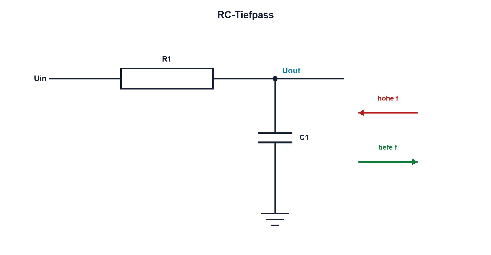

# 08.1 – RC-Tiefpass

[← Zurück](README.md) · [Modulübersicht](README.md) · [Kursübersicht](../README.md) · [Weiter →](02-rc-hochpass.md)

## Lernziele

Nach dieser Lektion kannst du:

- RC-Tiefpass im Zeit- und Frequenzbereich erklären
- Übertragungsbetrag berechnen
- Belastung und Quellenwiderstand berücksichtigen

## Warum ist das wichtig?

Ein Tiefpass glättet schnelle Änderungen und lässt langsame Signalanteile eher passieren. Er begrenzt ADC-Rauschen, formt PWM in eine Mittelspannung und reduziert hochfrequente Störungen. Dabei entsteht immer ein Kompromiss zwischen Glättung und Reaktionsgeschwindigkeit.

## Theorie

### Schaltung und Wirkung

R liegt in Serie, C nach GND; Uout wird über C gemessen. Bei niedriger Frequenz ist XC gross und Uout folgt Uin. Bei hoher Frequenz leitet C stärker nach GND und Uout wird kleiner.

Der ideale Übertragungsbetrag lautet `|H(f)| = 1/sqrt[1+(f/fG)²]`. H ist das Verhältnis Uout/Uin. An fG beträgt der Betrag `1/√2 ≈ 0,707`, entsprechend −3,01 dB; die Phase beträgt −45°.

### Zeitbereich

Ein Eingangssprung erzeugt die bekannte RC-Ladekurve. Hohe Frequenzdämpfung und verlangsamte Sprungantwort sind zwei Beschreibungen desselben Systems.

### Belastung

Eine Last parallel zu C verändert den wirksamen Widerstand und die Gleichspannungsverstärkung. Auch der Quellenwiderstand addiert sich zu R. Der ideale Aufbau gilt nur bei niederohmiger Quelle und hochohmiger Last.

### Belastung und Störquelle

Vor der Dimensionierung werden Ausgangswiderstand der Quelle, Eingangswiderstand und Eingangskapazität der Folgestufe ermittelt. Der reale Quellwiderstand liegt zu R1 in Serie; eine Last am Ausgang verändert den wirksamen Widerstand. Dadurch verschieben sich Gleichverstärkung und Grenzfrequenz. Der Messkopf ist ebenfalls eine Last und gehört bei hohen Widerständen oder Frequenzen zum Modell.

Ein Tiefpass entfernt Störungen nicht spurlos, sondern schwächt Frequenzanteile abgestuft. Bei einer Dekade über fG beträgt die ideale Dämpfung erster Ordnung ungefähr 20 dB, also Faktor 10 in der Spannung. Gleichzeitig verzögert der Filter schnelle Nutzsignaländerungen. Die Wahl von fG ist damit ein Kompromiss zwischen Rauschunterdrückung und Reaktionszeit. Für ADC-Eingänge kommt hinzu, dass der Sample-and-Hold-Kondensator kurzzeitig Ladung verlangt. Ein zu grosser R1 kann trotz passender Filterkurve zu Einschwingfehlern während der Abtastzeit führen.

## Anschauliches Beispiel

Ein schweres Pendel folgt einer langsamen Handbewegung, kann schnellen Zitterbewegungen aber nicht vollständig folgen. Der Tiefpass überträgt langsame Änderungen und mittelt schnelle Anteile.

## Berechnungsbeispiel

Für R = 10 kΩ und C = 100 nF ist `fG = 1/(2πRC) ≈ 159 Hz`. Bei 1,59 kHz, also zehnfacher Grenzfrequenz, ist |H| ungefähr 0,0995 oder −20 dB.

## Praxisbezug

Speise den Tiefpass mit konstantem Sinus-Uin und variiere f logarithmisch. Miss Betrag und Phase. Generatorausgang und Oszilloskopeingang bleiben Teil des realen Netzwerks.

## 🔗 Hardware ↔ Firmware

Vor einem ADC reduziert der Tiefpass Aliasing nicht beliebig; fG und Abtastrate müssen zusammenpassen. Zu grosser R kann die ADC-Abtastkapazität nicht schnell genug laden. Hardwarefilter und digitale Filter erfüllen unterschiedliche Aufgaben.

## Merksatz

> Ein Tiefpass glättet schnelle Änderungen und verzögert dadurch zwangsläufig die Reaktion.

## Häufige Fehler und Missverständnisse

- Uout am Widerstand statt am Kondensator abgreifen
- Last ignorieren
- −3 dB als halbe Spannung deuten
- RC-Filter als vollständigen Aliasschutz annehmen

## Zusammenfassung

Der RC-Tiefpass verbindet exponentielle Sprungantwort und frequenzabhängige Dämpfung. fG, Quelle und Last bestimmen das reale Verhalten.

## Übungsfragen

1. Wo wird Uout abgegriffen?
2. Berechne fG für 4,7 kΩ und 1 µF.
3. Was bedeutet −3 dB als Spannungsverhältnis?
4. Warum kann hoher R einen ADC beeinflussen?

Weitere Aufgaben: [Übungen zu Modul 08](../uebungen/modul-08.md).

## Bezug Bildungsplan 2026

- Handlungskompetenzen: `a3`, `b1-LK02–03`, `b1-LK06`, `b4-LK01–10`, `c1–c2`
- Nachweise: Tiefpassdimensionierung und Frequenzmessung; [Kompetenzmatrix](../bildungsplan-2026/kompetenzmatrix.md)
