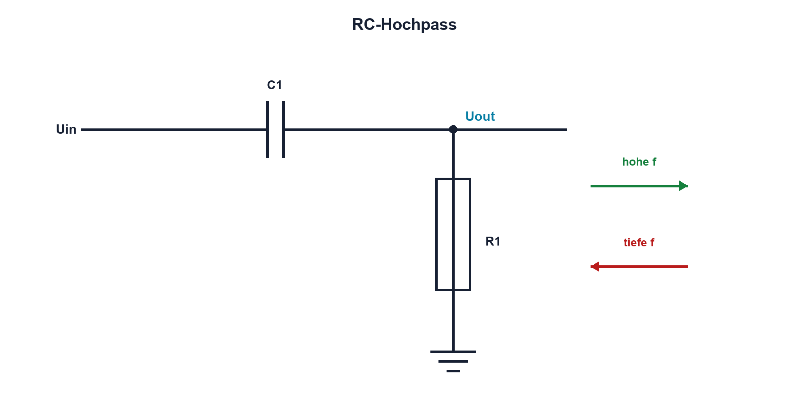

# 08.2 – RC-Hochpass

[← Zurück](01-rc-tiefpass.md) · [Modulübersicht](README.md) · [Kursübersicht](../README.md) · [Weiter →](03-grenzfrequenz-und-zeitkonstante.md)

## Lernziele

Nach dieser Lektion kannst du:

- RC-Hochpass als Wechselanteilkopplung erklären
- Betrag und Phase berechnen
- Biaspfad und Einschwingvorgang beurteilen

## Warum ist das wichtig?

Ein Hochpass unterdrückt Gleichanteile und langsame Änderungen. Er koppelt Audiosignale zwischen unterschiedlichen Arbeitspunkten, erkennt Flanken und trennt Offset. Ohne definierten Gleichstrompfad kann der Ausgang jedoch schweben.

## Theorie

### Schaltung

C liegt in Serie, R nach GND; Uout wird über R gemessen. Bei tiefer Frequenz ist XC gross und dämpft. Bei hoher Frequenz wird XC klein und Uout nähert sich Uin.

Der Betrag ist `|H(f)| = (f/fG)/sqrt[1+(f/fG)²]`. An fG gilt erneut 0,707; die Phase beträgt +45°.

### Sprungantwort

Ein idealer positiver Sprung erscheint zunächst am Ausgang und fällt dann exponentiell gegen null. Das Bauteil «erkennt» nicht die Flanke; das Netzwerk reagiert physikalisch auf Änderung und Ladungsausgleich.

### Bias und Schutz

Bei einem ADC muss R den Ausgang auf einen zulässigen Biaspegel statt zwingend auf 0 V ziehen. Koppelkondensator, Eingangsimpedanz und Schutz bestimmen fG und Extremwerte.

### Koppelkondensator und Arbeitspunkt

Ein typischer Hochpass ist der Koppelkondensator zwischen zwei Verstärkerstufen. Er blockiert unterschiedliche Gleichspannungs-Arbeitspunkte, lässt aber den veränderlichen Signalanteil passieren. Der für die Grenzfrequenz wirksame Widerstand ist dabei nicht automatisch nur ein eingezeichneter R1. Ausgangswiderstand der vorherigen und Eingangswiderstand der folgenden Stufe wirken aus Sicht des Kondensators zusammen. Diese Ersatzschaltung wird zuerst gebildet, danach wird fG berechnet.

Beim Einschalten oder nach einer sprunghaften Offsetänderung lädt sich C1 neu auf. Am Ausgang erscheint vorübergehend ein Impuls, obwohl der Hochpass stationäre Gleichspannung sperrt. Grosse Zeitkonstanten können deshalb hörbares Knacken, lange Einschwingzeiten oder scheinbar falsche Sensorsignale verursachen. Elektrolytkondensatoren benötigen ausserdem passende Polarität; bei wechselnder Spannung um 0 V ist ein ungepoltes Bauteil oder eine geeignete Bias-Schaltung nötig. Die zulässige Spannung und Leckstromwirkung werden zusätzlich zur Kapazität geprüft.

## Anschauliches Beispiel

Ein Drehkreuz lässt Veränderungen durch, aber keine Person dauerhaft in der Mitte stehen. Ein Hochpass überträgt Bewegung beziehungsweise Änderung, während ein konstanter Zustand verschwindet.

## Berechnungsbeispiel

R = 47 kΩ und C = 10 nF ergeben `fG ≈ 339 Hz`. Bei 33,9 Hz ist |H| ungefähr 0,0995; bei 3,39 kHz ungefähr 0,995.

## Praxisbezug

Miss Sinusfrequenzgang und Rechteck-Sprungantwort. Variiere Offset nur innerhalb sicherer Grenzen und beobachte, wie der Ausgang nach einer Flanke zum Bias zurückkehrt.

## 🔗 Hardware ↔ Firmware

Ein digitaler Eingang hinter einem Hochpass sieht nur Pulse an Flanken. Firmware muss Pulsbreite und Schaltschwellen beachten. Ein langsames Signal kann vollständig verschwinden, obwohl der Quellcode einen stabilen Pegel setzt.

## Merksatz

> Ein Hochpass überträgt Änderungen und benötigt einen definierten Gleichstrompfad für seinen Ausgang.

## Häufige Fehler und Missverständnisse

- Uout über C abgreifen und Hochpass erwarten
- Biaspfad vergessen
- Flankenpuls als dauerhaftes Logiksignal interpretieren
- Kondensatorpolarität ignorieren

## Zusammenfassung

Der RC-Hochpass sperrt tiefe und überträgt hohe Frequenzanteile. Seine Sprungantwort, Grenzfrequenz und Biasbeschaltung müssen gemeinsam geplant werden.

## Übungsfragen

1. Wo liegt R im Hochpass?
2. Warum fällt der Ausgang nach einem Sprung zurück?
3. Berechne fG für 100 nF und 10 kΩ.
4. Welche Firmwareprobleme verursacht ein zu kurzer Flankenpuls?

Weitere Aufgaben: [Übungen zu Modul 08](../uebungen/modul-08.md).

## Bezug Bildungsplan 2026

- Handlungskompetenzen: `a3`, `b1-LK02–03`, `b1-LK06`, `b4-LK01–10`, `c1–c2`
- Nachweise: Hochpassfrequenzgang und Sprungantwort; [Kompetenzmatrix](../bildungsplan-2026/kompetenzmatrix.md)
