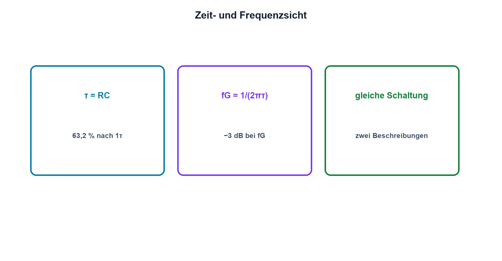

# 08.3 – Grenzfrequenz und Zeitkonstante

[← Zurück](02-rc-hochpass.md) · [Modulübersicht](README.md) · [Kursübersicht](../README.md) · [Weiter →](04-frequenzgang-und-bode-diagramm.md)

## Lernziele

Nach dieser Lektion kannst du:

- Zusammenhang zwischen τ und fG herleiten
- Grenzfrequenz korrekt interpretieren
- Bauteiltoleranzen auf fG übertragen

## Einleitung

Zeitkonstante und Grenzfrequenz sind keine getrennten Eigenschaften. Sie beschreiben dasselbe RC-Netz einmal anhand einer Sprungantwort und einmal anhand eines Sinus-Frequenzgangs.

<!-- context-expansion-2026 -->
Filter formen Signale abhängig von ihrer Frequenz. Widerstände, Kondensatoren und Spulen bilden dazu frequenzabhängige Spannungsteiler und Energiespeicher. Zeitverhalten, Frequenzgang und reale Verluste sind drei Sichten auf dasselbe Netzwerk.

Beim Thema **Grenzfrequenz und Zeitkonstante** geht es deshalb nicht nur um eine einzelne Formel oder Definition. Entscheidend ist, wie sich das Prinzip im Schema erkennen, im Datenblatt beurteilen, im Aufbau messen und bei einer Abweichung systematisch überprüfen lässt.

## Theorie

<!-- theory-expansion-2026 -->
### Einordnung und Grundidee

Filter werden zunächst als frequenzabhängige Spannungsteiler verstanden. Danach folgen Grenzfrequenz, Phase und asymptotischer Verlauf. Bauteiltoleranzen, Quell- und Lastimpedanz sowie parasitäre Elemente erklären die Abweichung zwischen idealer Kurve und Messung.

### Eine Schaltung, zwei Ansichten

Für den RC-Filter erster Ordnung gilt `τ = RC` und `fG = 1/(2πτ) = 1/(2πRC)`.

fG ist der Punkt, an dem der Betrag auf 0,707 des Durchlasswerts gefallen ist. Die Leistung an gleicher ohmscher Last halbiert sich, daher die Bezeichnung −3 dB. Das Signal ist nicht «ab fG weg».

### Toleranzen

Da fG umgekehrt proportional zu R und C ist, führt grösseres R oder C zu kleinerem fG. Worst Case wird mit den passenden Grenzwerten berechnet. Temperatur- und Biasänderungen können die wirksame Kapazität verschieben.

### Messdefinition

Der Durchlasswert muss festgelegt werden. Bei belasteten Filtern kann er unter 1 liegen. fG wird relativ zu diesem Plateau bestimmt, nicht zwingend relativ zu Uin.

### Zwei Messungen derselben Dynamik

Die Sprungantwort und der Frequenzgang stammen aus derselben Differentialgleichung. Wird im Zeitbereich τ gemessen, kann daraus `fG = 1/(2πτ)` vorhergesagt werden. Umgekehrt liefert eine gemessene Grenzfrequenz die erwartete Zeitkonstante. Stimmen beide Ergebnisse nicht innerhalb der Unsicherheit überein, sind zusätzliche Pole, Bauteiltoleranzen, Quell- oder Lastwiderstände wahrscheinlich.

Für eine saubere Sprungmessung muss die Generatorflanke deutlich schneller als die zu untersuchende Schaltung sein. Die 63,2-%-Marke wird zwischen tatsächlichem Anfangs- und Endwert bestimmt, nicht pauschal gegen 0 V. Im Frequenzversuch wird Uout/Uin gemessen, damit eine frequenzabhängige Generatoramplitude das Ergebnis nicht verfälscht. Die Grenzfrequenz liegt dort, wo das Verhältnis gegenüber dem Durchlassbereich auf 0,707 gefallen ist. Diese Vorgehensweise verbindet Vorhersage, zwei unabhängige Messmethoden und Plausibilitätskontrolle.

## Anwendungsfall

Typische elektronische Anwendungen und Baugruppen für dieses Thema sind:

- Abstimmung von Zeit- und Frequenzanforderung
- Dimensionierung von Entprellung und Filterung
- Plausibilisierung gemessener Sprungantworten

In einer konkreten Entwicklung wird nicht nur geprüft, ob die gewünschte Funktion grundsätzlich entsteht. Ebenso wichtig sind zulässige Grenzwerte, Toleranzen, Temperatur, Messbarkeit und das Verhalten bei Unterbruch, Kurzschluss oder falscher Ansteuerung.

## Anschauliches Beispiel

Eine Tür mit Dämpfer schliesst langsam im Zeitbereich und reagiert gleichzeitig schlecht auf sehr schnelle Hin-und-her-Bewegungen. Dämpfungszeit und Frequenzgrenze sind zwei Messweisen derselben Trägheit.

## Berechnungsbeispiel

`τ = 2 ms` ergibt `fG = 1/(2π·2 ms) ≈ 79,6 Hz`. Bei R und C mit je ±5 % liegt fG im einfachen Worst Case zwischen etwa 72,2 Hz und 88,2 Hz.

## Praxisbezug

Bestimme τ aus der Sprungantwort und fG aus dem Sinusgang desselben Aufbaus. Prüfe `2πfGτ ≈ 1` und erkläre Abweichungen durch Toleranz und Messbelastung.

## 🔗 Hardware ↔ Firmware

Eine digitale Abtastung muss das analoge Einschwingen beachten. Nach Multiplexerumschaltung kann Firmware mehrere τ warten oder ungültige erste Samples verwerfen; die nötige Zeit stammt aus dem realen Netzwerk.

## Merksatz

> τ und fG beschreiben dasselbe Filter – langsam in der Zeit bedeutet tief in der Frequenz.

## Häufige Fehler und Missverständnisse

- fG als harte Sperrgrenze sehen
- −3 dB mit halber Spannung verwechseln
- Durchlassplateau nicht bestimmen
- Nennwerte ohne Toleranz verwenden

## Zusammenfassung

Der Faktor 2π verbindet Zeit- und Frequenzsicht des RC-Filters. Grenzfrequenz, Einschwingzeit und Toleranzen lassen sich gegenseitig prüfen.

## Übungsfragen

1. Welche fG gehört zu τ = 100 µs?
2. Was ist an fG halbiert?
3. Welche Grenzwerte maximieren fG?
4. Warum kann Firmware nach ADC-Umschaltung warten müssen?

Weitere Aufgaben: [Übungen zu Modul 08](../uebungen/modul-08.md).

## Bezug Bildungsplan 2026

- Handlungskompetenzen: `a3`, `b1-LK02–03`, `b1-LK06`, `b4-LK07–09`
- Nachweise: Zeit- und Frequenzmessung desselben Filters; [Kompetenzmatrix](../bildungsplan-2026/kompetenzmatrix.md)
