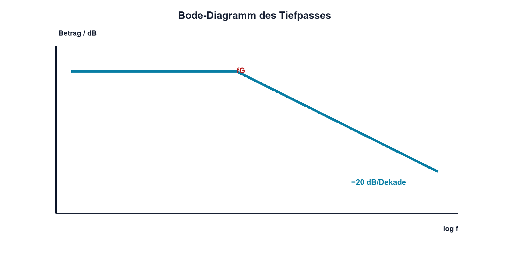

# 08.4 – Frequenzgang und Bode-Diagramm

[← Zurück](03-grenzfrequenz-und-zeitkonstante.md) · [Modulübersicht](README.md) · [Kursübersicht](../README.md) · [Weiter →](05-rl-netzwerke.md)

## Lernziele

Nach dieser Lektion kannst du:

- Betrag in dB umrechnen
- logarithmische Frequenzachsen lesen
- Messdaten als Bode-Diagramm darstellen

## Warum ist das wichtig?

Elektronische Systeme wirken über viele Frequenzdekaden. Ein lineares Diagramm würde wichtige Bereiche zusammendrängen. Das Bode-Diagramm stellt Betrag und Phase über logarithmischer Frequenz dar und macht Eckpunkte sowie Steigungen sichtbar.

## Theorie

### Dezibel

Für ein Spannungsverhältnis bei gleichen Bezugsimpedanzen gilt `AdB = 20·log10(|Uout/Uin|)`. 0 dB bedeutet Verhältnis 1, −20 dB Verhältnis 0,1 und +20 dB Verhältnis 10.

| Zeichen | Bedeutung | Einheit |
|---|---|---|
| `AdB` | logarithmischer Betragsgang | dB |
| `log10` | Zehnerlogarithmus | – |

### Asymptote

Ein Tiefpass erster Ordnung fällt weit oberhalb fG mit ungefähr −20 dB pro Dekade. Die reale Kurve geht weich über und liegt an fG bei −3,01 dB. Die Phase wandert von ungefähr 0° gegen −90°.

### Messreihe

Frequenzen werden logarithmisch gewählt, etwa 1-2-5 pro Dekade und dichter um fG. Uin wird an jedem Punkt kontrolliert; Generator und Last können frequenzabhängig sein.

### Messpunkte und Interpretation

An jedem Messpunkt werden Eingangsamplitude, Ausgangsamplitude und Zeitverschiebung dokumentiert. Der Betrag folgt aus `20·log10(Uout/Uin)`, die Phase aus `360°·Δt/T`. `Δt` ist der gemessene Zeitversatz gleichartiger Signalpunkte. Mehrere Punkte pro Dekade zeigen die asymptotische Steigung, zusätzliche Punkte um fG erfassen den Übergang.

Bei sehr kleiner Ausgangsspannung steigt der relative Einfluss von Rauschen und Oszilloskopauflösung. Gleichzeitig können Generatorausgang und Tastkopfkapazität die Schaltung belasten. Eine geglättete Kurve darf diese Unsicherheit nicht verbergen; auffällige Punkte werden wiederholt oder mit veränderter Amplitude kontrolliert. Ein gemessener Peak deutet auf Resonanz, Rückkopplung oder parasitäre Kopplung hin und passt nicht zum idealen RC-Filter erster Ordnung. Das Diagramm dient deshalb nicht nur zur Bestätigung, sondern auch zur Diagnose eines unvollständigen Modells.

## Anschauliches Beispiel

Eine Landkarte nutzt Massstab und Höhenlinien, um sehr grosse Entfernungen und Steigungen lesbar zu machen. Das Bode-Diagramm komprimiert Frequenzbereiche und macht Steigungen vergleichbar.

## Berechnungsbeispiel

`Uout/Uin = 0,25` ergibt `20·log10(0,25) ≈ −12,04 dB`. Ein weiterer Faktor 0,1 würde 20 dB zusätzliche Dämpfung ergeben.

## Praxisbezug

Erstelle aus mindestens zehn Frequenzpunkten Tabellen für Verhältnis, dB und Phase. Zeichne die Frequenz logarithmisch und markiere gemessene fG sowie theoretische Asymptote.

## 🔗 Hardware ↔ Firmware

Digitale Filter werden ebenfalls mit Betrag und Phase bewertet. Abtastrate, Quantisierung und Rechenverzögerung verändern den Frequenzgang. Der analoge Vorfilter bleibt für Frequenzen oberhalb der Nyquist-Grenze wichtig.

## Merksatz

> Dezibel machen Verhältnisse addierbar; die logarithmische Frequenzachse macht Dekaden vergleichbar.

## Häufige Fehler und Missverständnisse

- 10·log für Spannungsverhältnis verwenden
- negative dB als negative Spannung deuten
- Uin nicht kontrollieren
- lineare x-Achse als Bode-Achse bezeichnen

## Zusammenfassung

Das Bode-Diagramm zeigt Betrag und Phase übersichtlich über viele Dekaden. dB, logarithmische Frequenzpunkte und dokumentierte Messbedingungen sind dafür unverzichtbar.

## Übungsfragen

1. Welches Verhältnis entspricht −20 dB?
2. Warum werden Frequenzen logarithmisch gewählt?
3. Welche Steigung hat ein Tiefpass erster Ordnung?
4. Was kann digitale Filterung oberhalb Nyquist nicht reparieren?

Weitere Aufgaben: [Übungen zu Modul 08](../uebungen/modul-08.md).

## Bezug Bildungsplan 2026

- Handlungskompetenzen: `a3`, `b1-LK03`, `b1-LK09`, `b4-LK07–10`, `c2`
- Nachweise: gemessener und berechneter Bode-Plot; [Kompetenzmatrix](../bildungsplan-2026/kompetenzmatrix.md)
