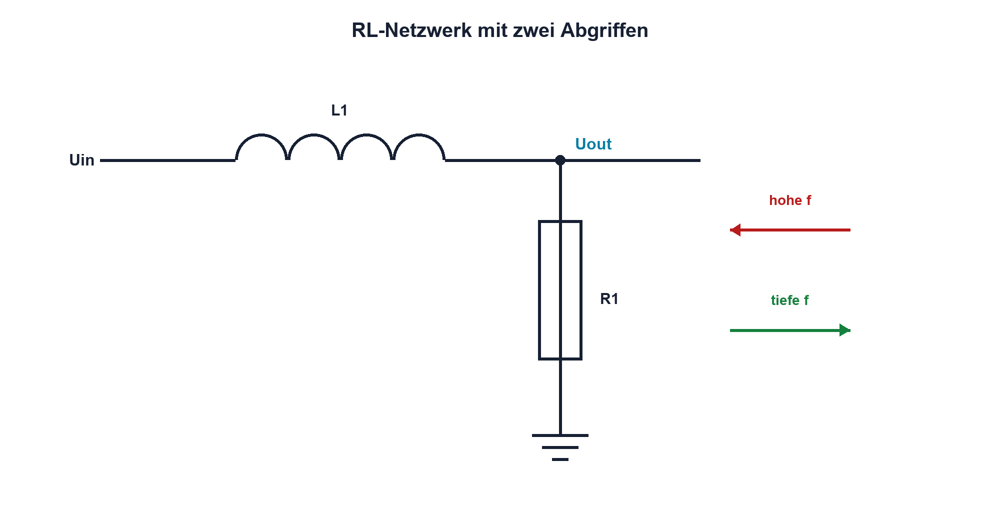

# 08.5 – RL-Netzwerke

[← Zurück](04-frequenzgang-und-bode-diagramm.md) · [Modulübersicht](README.md) · [Kursübersicht](../README.md) · [Weiter →](06-rlc-netzwerke.md)

## Lernziele

Nach dieser Lektion kannst du:

- RL-Tief- und Hochpass anhand des Abgriffs unterscheiden
- Grenzfrequenz berechnen
- Wicklungswiderstand und Sättigung berücksichtigen

## Warum ist das wichtig?

Eine Spule besitzt steigenden Blindwiderstand mit Frequenz. Zusammen mit R entstehen Filter, Stromglättung und Entstörung. Reale Spulen bringen jedoch DCR, Kernverlust und Sättigung mit.

## Theorie

### Abgriff bestimmt Funktion

In einer Reihenschaltung aus R und L ist der Abgriff über R bei niedriger Frequenz gross und wirkt als Tiefpass. Der Abgriff über L wächst mit Frequenz und wirkt als Hochpass.

Für das ideale Netzwerk gilt `fG = R/(2πL)`. R umfasst alle wirksamen Serienwiderstände, also auch DCR und Quellwiderstand.

### Zeitbereich

Die Zeitkonstante ist `τ = L/R`. Ein grosses L oder kleines R verlangsamt den Stromanstieg. Wieder sind Zeit- und Frequenzsicht über `fG = 1/(2πτ)` verbunden.

### Reale Grenzen

Mit Gleichstrom kann L wegen Sättigung sinken. DCR verändert Verstärkung und Erwärmung. Oberhalb der Selbstresonanz ist das einfache RL-Modell ungültig.

### Gleichstrompfad und Frequenzpfad

Ein RL-Netzwerk kann dieselben Bauteile je nach Ausgangsabgriff als Tief- oder Hochpass verwenden. Wird die Ausgangsspannung über R abgegriffen, ist sie bei tiefen Frequenzen gross und fällt mit zunehmendem XL: Das ist ein Tiefpass. Der Abgriff über L liefert dagegen einen Hochpass. Vor jeder Formel muss daher klar sein, über welchem Bauteil Uout definiert ist.

Reale Spulen besitzen den Serienwiderstand Rdc. Er liegt nicht ausserhalb des Bauteils, sondern ist Teil des wirksamen Rges und verursacht bereits bei Gleichstrom Verlustleistung `Pcu = Ieff²·Rdc`. Bei höheren Frequenzen können Kern- und Skin-Effekt-Verluste hinzukommen. Der gemessene Frequenzgang weicht dann vom idealen Verlauf ab. Für Leistungsschaltungen werden Induktivität, Rdc, Sättigungsstrom und thermisch zulässiger Effektivstrom gemeinsam geprüft; ein richtiger fG-Wert allein schützt die Spule nicht vor Überhitzung.

## Anschauliches Beispiel

Eine schwere Drehtür lässt langsame Bewegung zu, widersetzt sich aber schnellen Richtungswechseln. Je stärker die mechanische Dämpfung, desto schneller beruhigt sie sich – ähnlich bestimmt R die RL-Zeitkonstante.

## Berechnungsbeispiel

Rges = 100 Ω und L = 10 mH ergeben `fG ≈ 1,59 kHz` und `τ = 100 µs`. Zusätzliche 20 Ω DCR erhöhen fG auf etwa 1,91 kHz.

## Praxisbezug

Miss beide Abgriffe desselben RL-Netzes. Halte den Strom unter Sättigungs- und thermischer Grenze. Vergleiche Resultate mit einem Modell inklusive DCR.

## 🔗 Hardware ↔ Firmware

Bei PWM-Stromregelung bestimmen L, R und Frequenz den Ripple. Firmware kann f ändern, aber Sättigungs- und Spitzenstromschutz gehören in einen schnellen Hardwarepfad.

## Merksatz

> Beim RL-Netz entscheidet der Abgriff über Tief- oder Hochpass; Rges bestimmt Zeitkonstante und Grenzfrequenz.

## Häufige Fehler und Missverständnisse

- DCR vergessen
- Abgriff falsch benennen
- Nenn-L trotz DC-Strom annehmen
- nur Mittelstrom statt Spitzenstrom prüfen

## Zusammenfassung

RL-Netze filtern durch den steigenden XL. Ideale Formeln werden mit realem R, Stromgrenzen und Selbstresonanz ergänzt.

## Übungsfragen

1. Welcher Abgriff ist RL-Tiefpass?
2. Berechne fG für 47 Ω und 4,7 mH.
3. Wie wirkt DCR auf fG?
4. Warum braucht PWM einen Spitzenstromschutz?

Weitere Aufgaben: [Übungen zu Modul 08](../uebungen/modul-08.md).

## Bezug Bildungsplan 2026

- Handlungskompetenzen: `a3`, `b1-LK01–06`, `b4-LK01–10`, `c1–c2`
- Nachweise: RL-Doppelabgriff und DCR-korrigierte Rechnung; [Kompetenzmatrix](../bildungsplan-2026/kompetenzmatrix.md)
