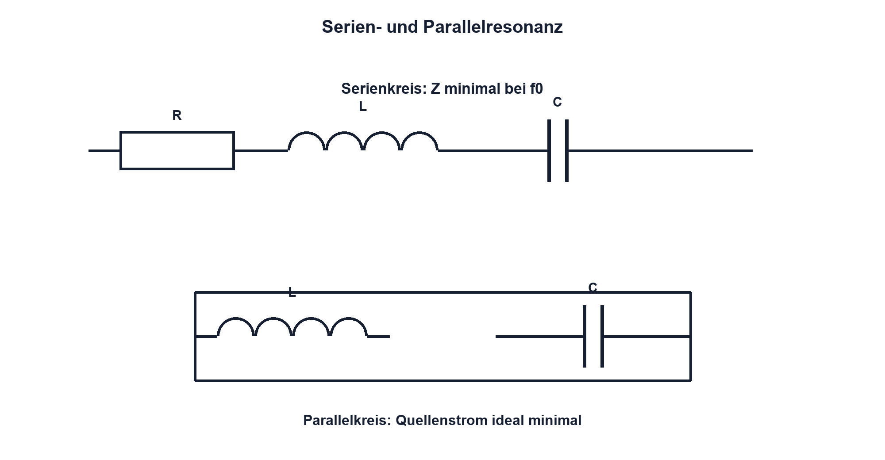

# 08.6 – RLC-Netzwerke

[← Zurück](05-rl-netzwerke.md) · [Modulübersicht](README.md) · [Kursübersicht](../README.md) · [Weiter →](07-resonanz-guete-und-reale-verluste.md)

## Lernziele

Nach dieser Lektion kannst du:

- Energieaustausch zwischen L und C erklären
- Serien- und Parallelresonanz unterscheiden
- Resonanzfrequenz berechnen

## Einleitung

Spule und Kondensator besitzen gegensätzliche Blindwiderstände. Bei einer bestimmten Frequenz können sie sich kompensieren. Dadurch entstehen selektive Filter, Schwingkreise und zugleich unerwartete Überhöhungen.

<!-- context-expansion-2026 -->
Filter formen Signale abhängig von ihrer Frequenz. Widerstände, Kondensatoren und Spulen bilden dazu frequenzabhängige Spannungsteiler und Energiespeicher. Zeitverhalten, Frequenzgang und reale Verluste sind drei Sichten auf dasselbe Netzwerk.

Beim Thema **RLC-Netzwerke** geht es deshalb nicht nur um eine einzelne Formel oder Definition. Entscheidend ist, wie sich das Prinzip im Schema erkennen, im Datenblatt beurteilen, im Aufbau messen und bei einer Abweichung systematisch überprüfen lässt.

## Theorie

<!-- theory-expansion-2026 -->
### Einordnung und Grundidee

Filter werden zunächst als frequenzabhängige Spannungsteiler verstanden. Danach folgen Grenzfrequenz, Phase und asymptotischer Verlauf. Bauteiltoleranzen, Quell- und Lastimpedanz sowie parasitäre Elemente erklären die Abweichung zwischen idealer Kurve und Messung.

### Energiependel

C speichert elektrische, L magnetische Energie. Im idealen LC-Kreis pendelt Energie zwischen beiden Speichern. Reale Widerstände entziehen pro Zyklus Energie.

Die ideale Resonanzfrequenz ist `f0 = 1/(2πsqrt(LC))`.

| Zeichen | Bedeutung | Einheit |
|---|---|---|
| `f0` | Resonanzfrequenz | Hz |

### Serienresonanz

Bei XL = XC heben sich die Blindanteile in Serie auf. Die Impedanz wird minimal und durch Verluste begrenzt; der Strom kann gross werden. Einzelspannungen über L und C können die Quellenspannung übersteigen.

### Parallelresonanz

Im idealen Parallelkreis können grosse interne Blindströme zirkulieren, während der Quellenstrom klein ist. Reale Topologie und Verlustmodell entscheiden über den genauen Verlauf.

### Was sich bei Resonanz tatsächlich aufhebt

Bei Serienresonanz sind die Blindanteile der Impedanz betragsgleich und entgegengesetzt: `XL = XC`. Die Spannungen über L und C können dennoch gross sein und heben sich nur in ihrer vektoriellen Summe auf. Sie dürfen deshalb nicht als ungefährlich betrachtet werden. Der verbleibende Serienwiderstand begrenzt den Strom und bestimmt zusammen mit L und C die Güte.

Im Parallelkreis kompensieren sich dagegen die Blindanteile der Zweigströme am Eingang. Innerhalb der Zweige können trotzdem hohe Ströme fliessen. Wicklungswiderstand, Kondensator-ESR und Belastung verschieben die Resonanz und verändern die Impedanzspitze. Für den Laborversuch wird ein Serienwiderstand vorgesehen, die Generatorleistung klein gehalten und jede Bauteilspannung vorab abgeschätzt. Ein Frequenz-Sweep beginnt ausserhalb der Resonanz mit kleinen Schritten und wird abgebrochen, sobald Strom, Spannung oder Temperatur die festgelegte Grenze erreicht.

## Anwendungsfall

Typische elektronische Anwendungen und Baugruppen für dieses Thema sind:

- Abstimmkreise und selektive Filter
- Schwingkreise in Funk- und Sensorsystemen
- Bewertung parasitärer Resonanzen

In einer konkreten Entwicklung wird nicht nur geprüft, ob die gewünschte Funktion grundsätzlich entsteht. Ebenso wichtig sind zulässige Grenzwerte, Toleranzen, Temperatur, Messbarkeit und das Verhalten bei Unterbruch, Kurzschluss oder falscher Ansteuerung.

## Anschauliches Beispiel

Bei einer Schaukel wechselt Energie zwischen Höhe und Bewegung. Im richtigen Rhythmus genügt wenig Anregung für grosse Ausschläge; Reibung begrenzt sie. C entspricht eher der Lageenergie, L der Bewegungsenergie.

## Berechnungsbeispiel

L = 10 mH und C = 100 nF ergeben `f0 ≈ 5,03 kHz`. Dieser Idealwert verschiebt sich durch Toleranzen und parasitäre Elemente.

## Praxisbezug

Vermesse einen niederenergetischen Serien-RLC-Kreis mit begrenzter Generatoramplitude und Serienwiderstand. Beobachte Strommaximum sowie Spannungen über L und C und bleibe innerhalb ihrer Grenzwerte.

## 🔗 Hardware ↔ Firmware

PWM kann eine mechanische oder elektrische Resonanz anregen. Frequenzänderungen sollten Resonanzbereiche berücksichtigen; eine Sweep-Funktion wird nur mit Strom- und Spannungsgrenzen ausgeführt.

## Merksatz

> Bei Resonanz tauschen L und C Energie; Verluste begrenzen die Überhöhung.

## Häufige Fehler und Missverständnisse

- Resonanz als energiefreie Verstärkung deuten
- Einzelspannungen nicht prüfen
- Serien- und Parallelresonanz verwechseln
- parasitäre Verschiebung ignorieren

## Zusammenfassung

RLC-Netze zeigen Resonanz, weil XL und XC gleich gross werden. Topologie entscheidet, ob Quellenstrom minimal oder maximal wird; R bestimmt Dämpfung.

## Übungsfragen

1. Berechne f0 für 1 mH und 1 µF.
2. Was wird bei Serienresonanz minimal?
3. Warum können Einzelspannungen gross werden?
4. Wie kann PWM Resonanz anregen?

Weitere Aufgaben: [Übungen zu Modul 08](../uebungen/modul-08.md).

## Bezug Bildungsplan 2026

- Handlungskompetenzen: `a3`, `b1-LK02–06`, `b4-LK01–10`, `c1–c2`
- Nachweise: begrenzter Resonanz-Sweep und Spannungsprüfung; [Kompetenzmatrix](../bildungsplan-2026/kompetenzmatrix.md)
