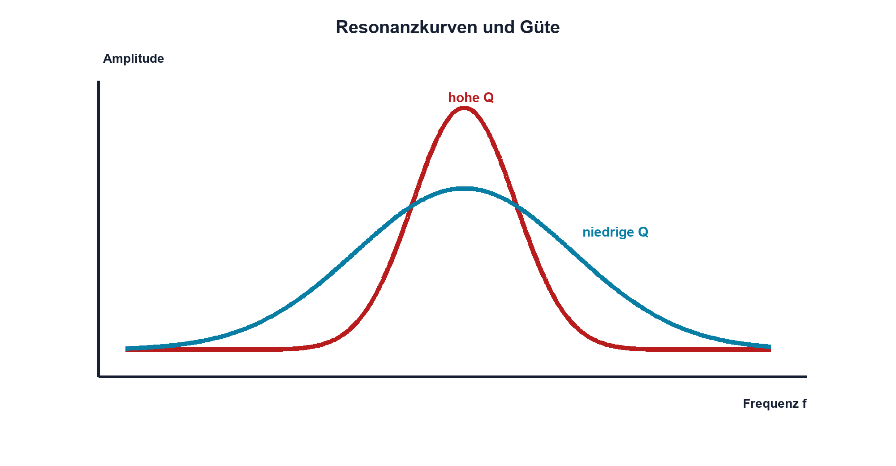

# 08.7 – Resonanz, Güte und reale Verluste

[← Zurück](06-rlc-netzwerke.md) · [Modulübersicht](README.md) · [Kursübersicht](../README.md) · [Weiter →](../09-dioden-schutz/README.md)

## Lernziele

Nach dieser Lektion kannst du:

- Güte und Bandbreite qualitativ und rechnerisch verbinden
- reale Verlustquellen zuordnen
- Resonanzmessungen sicher auswerten

## Einleitung

Zwei Schwingkreise mit gleicher f0 können völlig verschieden reagieren. Die Güte beschreibt, wie wenig Energie pro Zyklus verloren geht und wie schmal beziehungsweise hoch die Resonanz ausfällt.

<!-- context-expansion-2026 -->
Filter formen Signale abhängig von ihrer Frequenz. Widerstände, Kondensatoren und Spulen bilden dazu frequenzabhängige Spannungsteiler und Energiespeicher. Zeitverhalten, Frequenzgang und reale Verluste sind drei Sichten auf dasselbe Netzwerk.

Beim Thema **Resonanz, Güte und reale Verluste** geht es deshalb nicht nur um eine einzelne Formel oder Definition. Entscheidend ist, wie sich das Prinzip im Schema erkennen, im Datenblatt beurteilen, im Aufbau messen und bei einer Abweichung systematisch überprüfen lässt.

## Theorie

<!-- theory-expansion-2026 -->
### Einordnung und Grundidee

Filter werden zunächst als frequenzabhängige Spannungsteiler verstanden. Danach folgen Grenzfrequenz, Phase und asymptotischer Verlauf. Bauteiltoleranzen, Quell- und Lastimpedanz sowie parasitäre Elemente erklären die Abweichung zwischen idealer Kurve und Messung.

### Güte und Bandbreite

Für eine hinreichend schwach gedämpfte Resonanz gilt `Q = f0/B`, wobei B die −3-dB-Bandbreite zwischen f1 und f2 ist: `B = f2−f1`.

| Zeichen | Bedeutung | Einheit |
|---|---|---|
| `Q` | Gütefaktor | einheitenlos |
| `B` | Bandbreite | Hz |
| `f1`, `f2` | untere und obere −3-dB-Frequenz | Hz |

Hohe Q bedeutet schmale Bandbreite und lange Ausschwingzeit. Niedrige Q bedeutet breite, flache Resonanz und schnelle Dämpfung.

### Verlustquellen

DCR, ESR, Kernverluste, Strahlung, Last und Quellenwiderstand reduzieren Q. Messgerät und Tastkopf werden Teil dieser Dämpfung. Ein ideal berechneter Schwingkreis kann deshalb deutlich weniger selektiv sein.

### Grenzwerte

Hohe Güte kann interne Spannungen und Ströme stark erhöhen. Vor einem Sweep werden Maximalwerte abgeschätzt und Generatoramplitude klein gewählt.

### Bandbreite, Einschwingen und Toleranzen

Für ein schwach gedämpftes System gilt näherungsweise `Q = f0/B`, wobei `B = f2 − f1` die Bandbreite zwischen den beiden −3-dB-Punkten ist. `f1` und `f2` sind die untere und obere Grenzfrequenz. Diese Beziehung macht Güte messbar: Resonanzfrequenz suchen, beide Abfallpunkte bestimmen und Bandbreite berechnen. Bei stark asymmetrischen oder belasteten Kurven muss geprüft werden, ob das einfache Modell noch passt.

Eine hohe Güte bedeutet nicht nur schmale Auswahl, sondern auch langes Einschwingen und Nachschwingen. Ein kurzer Anregungsimpuls kann deshalb noch viele Perioden sichtbar bleiben. Bauteiltoleranzen wirken auf f0 nicht linear; bei Toleranzen von L und C wird eine obere und untere Grenzfrequenz berechnet. Temperatur, Gleichstrom-Bias und Alterung können den Bereich weiter verschieben. Ein robustes Design prüft daher nicht nur den Nennwert, sondern Resonanzlage und Bauteilbelastung im ungünstigsten zulässigen Zustand.

## Anwendungsfall

Typische elektronische Anwendungen und Baugruppen für dieses Thema sind:

- Frequenzauswahl in Oszillatoren und Filtern
- Dämpfung unerwünschter Schwingungen
- Bauteilwahl anhand Güte und Verlusten

In einer konkreten Entwicklung wird nicht nur geprüft, ob die gewünschte Funktion grundsätzlich entsteht. Ebenso wichtig sind zulässige Grenzwerte, Toleranzen, Temperatur, Messbarkeit und das Verhalten bei Unterbruch, Kurzschluss oder falscher Ansteuerung.

## Anschauliches Beispiel

Ein Weinglas klingt lange und schmalbandig nach, ein gepolsterter Gegenstand kurz und breitbandig. Beide besitzen eine bevorzugte Frequenz, aber sehr unterschiedliche Güte.

## Berechnungsbeispiel

Eine Resonanz liegt bei 10 kHz; die −3-dB-Punkte sind 9,5 kHz und 10,5 kHz. B = 1,0 kHz und `Q = 10`. Eine Halbierung der Verlustwiderstände würde im passenden Serienmodell Q ungefähr verdoppeln.

## Praxisbezug

Messe die Kurve mit logarithmischem Grob-Sweep und dichtem Raster um f0. Bestimme f1, f0, f2, B und Q. Halte Uin konstant und kontrolliere Bauteiltemperatur.

## 🔗 Hardware ↔ Firmware

Digitale Anregung kann f0 suchen oder vermeiden. Eine automatische Suche braucht Amplitudenbegrenzung und Abbruchkriterien, weil hohe Q schmale, grosse Spitzen erzeugt und Frequenzdrift auftreten kann.

## Merksatz

> Hohe Güte bedeutet geringe Verluste, schmale Bandbreite und stärkere mögliche Überhöhung.

## Häufige Fehler und Missverständnisse

- Bandbreite an falschen Pegeln bestimmen
- Messlast ignorieren
- hohe Q nur als Vorteil betrachten
- Sweep ohne Grenzwertkontrolle ausführen

## Zusammenfassung

Q verbindet Resonanzfrequenz, Bandbreite und Verluste. Eine reale Messung muss Belastung, Temperatur und interne Überhöhung berücksichtigen.

## Übungsfragen

1. Berechne Q für f0 = 2 kHz und B = 200 Hz.
2. Wie wirkt höhere Dämpfung auf Bandbreite?
3. Welche Messmittel reduzieren Q?
4. Welche Sicherheitsfunktion braucht ein automatischer Sweep?

Weitere Aufgaben: [Übungen zu Modul 08](../uebungen/modul-08.md).

## Bezug Bildungsplan 2026

- Handlungskompetenzen: `a3`, `b1-LK01–06`, `b1-LK09`, `b4-LK01–10`, `b5-LK01–05`, `c2`
- Nachweise: Resonanzkurve, Bandbreite, Güte und Grenzwertprotokoll; [Kompetenzmatrix](../bildungsplan-2026/kompetenzmatrix.md)
