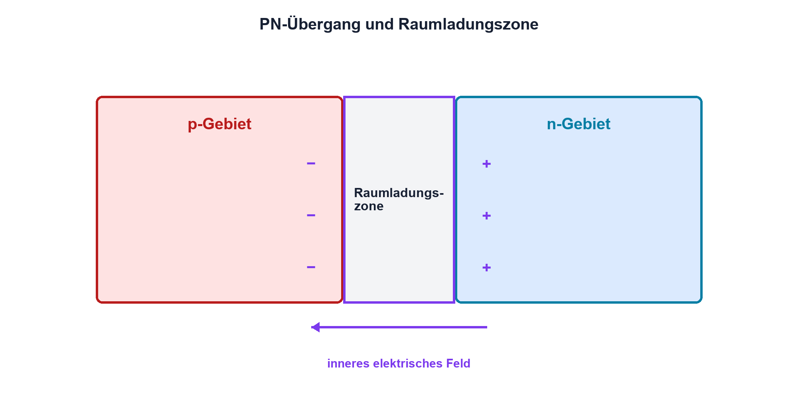

# 09.1 – Halbleitergrundlagen und PN-Übergang

[← Zurück](README.md) · [Modulübersicht](README.md) · [Kursübersicht](../README.md) · [Weiter →](02-diodenkennlinie-und-arbeitspunkt.md)

## Lernziele

Nach dieser Lektion kannst du:

- Eigenleitung und Dotierung verständlich unterscheiden
- Entstehung der Raumladungszone erklären
- Durchlass- und Sperrrichtung physikalisch deuten

## Warum ist das wichtig?

Dioden erscheinen im Schaltplan als einfaches Zweipolbauteil. Ihr Verhalten entsteht jedoch aus beweglichen Ladungsträgern, einem inneren elektrischen Feld und einer Grenzschicht. Wer diese Vorstellung versteht, kann Durchlassspannung, Leckstrom, Temperaturwirkung und Durchbruch besser einordnen, statt die Diode als idealen Einwegschalter zu behandeln.

## Theorie

### Vom Kristall zum Halbleiter

Reines Silizium besitzt bei Raumtemperatur nur wenige freie Ladungsträger. Durch gezielte Dotierung entstehen n-Gebiete mit vielen beweglichen Elektronen und p-Gebiete mit vielen beweglichen Löchern. Löcher sind keine materiellen Teilchen, sondern eine nützliche Beschreibung fehlender Bindungselektronen.

Treffen p- und n-Gebiet aufeinander, diffundieren Ladungsträger über die Grenze und rekombinieren. Zurück bleiben ortsfeste, ionisierte Dotieratome. Diese Raumladungszone erzeugt ein inneres Feld, das weitere Diffusion bremst. Im unbelasteten Gleichgewicht heben sich Diffusions- und Feldwirkung auf.

### Äussere Spannung

In Durchlassrichtung verkleinert die äussere Spannung die Potentialbarriere. Viele Ladungsträger können die Grenzschicht überwinden und der Strom steigt stark an. In Sperrrichtung wird die Zone breiter; es fliesst nur ein kleiner Sperrstrom, bis der zulässige Durchbruchbereich erreicht wird. Die häufig genannte Siliziumspannung von etwa 0,7 V ist kein fester Schwellwert, sondern ein typischer Arbeitspunktwert.

### Temperatur

Höhere Temperatur erzeugt mehr Ladungsträger. Bei gleichem Durchlassstrom sinkt die benötigte Durchlassspannung typischerweise; der Sperrstrom steigt. Das beeinflusst Stromaufteilung und thermische Stabilität.

## Anschauliches Beispiel

Zwei Räume sind durch einen Hügel getrennt. Ohne äussere Hilfe gelangen nur wenige Personen hinüber. Senkt man den Hügel in einer Richtung ab, wächst der Strom stark; erhöht man ihn, bleibt fast alles zurück. Die Analogie erklärt Barriere und Richtung, nicht jedoch die quantenphysikalischen Details.

## Berechnungsbeispiel

Eine Diode führt bei einem Arbeitspunkt 10 mA und besitzt dort 0,68 V. Ihre Verlustleistung ist `PD = UD·ID = 0,68 V·0,010 A = 6,8 mW`. Dieser Wert beschreibt nur den gewählten Punkt; bei höherem Strom ändern sich UD und Temperatur.

## Praxisbezug

Vergleiche Diodentestwerte einer Silizium- und Schottky-Diode. Der Prüfstrom des DMM wird dokumentiert, denn das Ergebnis ist eine Arbeitspunktmessung und keine universelle Bauteilkonstante.

## 🔗 Hardware ↔ Firmware

Schutzdioden an MCU-Pins leiten, wenn ein Pin ausserhalb der Versorgungsschienen getrieben wird. Firmware kann diesen Strom nicht abschalten; sie muss externe Pegel, Pinmodus und Einschaltreihenfolge berücksichtigen. Ein scheinbar versorgter MCU über einen Eingang ist ein Hardwareproblem.

## Merksatz

> Der PN-Übergang steuert Ladungsträger über eine spannungs- und temperaturabhängige Potentialbarriere.

## Häufige Fehler und Missverständnisse

- 0,7 V als idealen Schaltpunkt behandeln
- Löcher mit frei beweglichen positiven Teilchen verwechseln
- Sperrstrom mit null gleichsetzen
- Durchbruch ohne Strombegrenzung zulassen

## Zusammenfassung

Dotierung erzeugt p- und n-Gebiete. An ihrer Grenze bildet sich eine Raumladungszone; äussere Spannung verändert ihre Barriere und damit den Strom stark.

## Übungsfragen

1. Wie entsteht die Raumladungszone?
2. Weshalb ist 0,7 V kein Naturkonstante?
3. Was ändert sich bei höherer Temperatur?
4. Wie kann ein MCU über einen Schutzpfad rückgespeist werden?

Weitere Aufgaben: [Übungen zu Modul 09](../uebungen/modul-09.md).

## Bezug Bildungsplan 2026

- Handlungskompetenzen: `b1-LK01–04`, `b1-LK06`, `b4-LK03`, `d8`
- Nachweise: physikalische Erklärung und sichere Diodentestmessung; [Kompetenzmatrix](../bildungsplan-2026/kompetenzmatrix.md)
