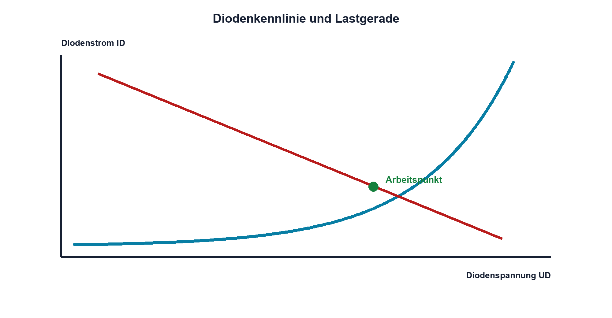

# 09.2 – Diodenkennlinie und Arbeitspunkt

[← Zurück](01-halbleitergrundlagen-und-pn-uebergang.md) · [Modulübersicht](README.md) · [Kursübersicht](../README.md) · [Weiter →](03-gleichrichter-und-schottky-dioden.md)

## Lernziele

Nach dieser Lektion kannst du:

- Diodenkennlinie lesen
- Arbeitspunkt mit Vorwiderstand bestimmen
- statischen und differentiellen Widerstand unterscheiden

## Einleitung

Eine reale Diode entscheidet ihren Strom nicht allein. Quelle und Serienwiderstand liefern eine zweite Beziehung; ihr Schnittpunkt ist der Arbeitspunkt. Diese Denkweise verhindert Überstrom und bildet die Grundlage für LEDs, Gleichrichter und Schutzklemmen.

<!-- context-expansion-2026 -->
Dioden steuern Strom abhängig von Polarität, Spannung und Temperatur. Sie werden zum Gleichrichten, Begrenzen, Schützen und Erzeugen von Licht eingesetzt. Das einfache Schaltzeichen steht dabei für einen realen PN- oder Metall-Halbleiter-Übergang mit klaren Grenzwerten.

Beim Thema **Diodenkennlinie und Arbeitspunkt** geht es deshalb nicht nur um eine einzelne Formel oder Definition. Entscheidend ist, wie sich das Prinzip im Schema erkennen, im Datenblatt beurteilen, im Aufbau messen und bei einer Abweichung systematisch überprüfen lässt.

## Theorie

<!-- theory-expansion-2026 -->
### Einordnung und Grundidee

Für jede Diodenschaltung werden zuerst Anode, Kathode, vorgesehene Stromrichtung und Sperrspannung markiert. Danach folgen Arbeitspunkt und Verlustleistung. Diese Reihenfolge macht sichtbar, ob die Diode im Normalbetrieb leitet, sperrt oder nur im Fehlerfall Energie übernimmt.

### Nichtlineare Kennlinie

Der Durchlassstrom wächst näherungsweise exponentiell mit der Diodenspannung. Für praktische Handrechnung wird meist ein Datenblattpunkt oder ein stückweise lineares Modell verwendet. Ein einzelner Wert wie 0,7 V ist nur innerhalb eines begrenzten Strom- und Temperaturbereichs brauchbar.

### Lastgerade

Für Quelle UQ, Widerstand R1 und Diode D1 gilt `ID = (UQ − UD)/R1`. Diese Gerade enthält alle Arbeitspunkte, die die äussere Schaltung zulässt. Der Schnitt mit der Diodenkennlinie erfüllt beide Bedingungen gleichzeitig.

### Zwei Widerstandsbegriffe

Der statische Widerstand am Arbeitspunkt ist `Rstat = UD/ID`. Der differentielle Widerstand `rd = ΔUD/ΔID` beschreibt die lokale Steigung und ist meist deutlich kleiner. `rd` ist ein Kleinsignalwert, kein Ersatz für den Vorwiderstand.

Temperatur verschiebt die Kennlinie. Parallele Dioden teilen Strom deshalb nicht zwangsläufig gleich; kleine Temperatur- oder Bauteilunterschiede können sich verstärken.

## Anwendungsfall

Typische elektronische Anwendungen und Baugruppen für dieses Thema sind:

- Bestimmung von Vorwiderstand und Arbeitspunkt
- Bewertung von Verlust und Temperatur
- Vergleich verschiedener Diodentypen

In einer konkreten Entwicklung wird nicht nur geprüft, ob die gewünschte Funktion grundsätzlich entsteht. Ebenso wichtig sind zulässige Grenzwerte, Toleranzen, Temperatur, Messbarkeit und das Verhalten bei Unterbruch, Kurzschluss oder falscher Ansteuerung.

## Anschauliches Beispiel

Eine Pumpe liefert Druck, ein Ventil besitzt eine stark nichtlineare Öffnung und das Rohr begrenzt den Durchfluss. Der tatsächliche Durchfluss entsteht aus allen drei Eigenschaften, nicht aus dem Ventil allein.

## Berechnungsbeispiel

UQ = 5 V, R1 = 330 Ω und der erwartete Diodenpunkt UD = 0,72 V. Dann gilt `ID = (5 V − 0,72 V)/330 Ω ≈ 13,0 mA`. Mit 0,65 V wären es 13,2 mA: Der Widerstand stabilisiert den Strom gegenüber der unsicheren Flussspannung.

## Praxisbezug

Nimm die Kennlinie mit strombegrenzter Quelle und Serienwiderstand punktweise auf. Miss UD und die Widerstandsspannung; berechne ID daraus. Verändere nie die Schaltung unter Spannung.

## 🔗 Hardware ↔ Firmware

Ein ADC kann UD und Shuntspannung erfassen. Firmware darf aus einem einzigen Diodenwert keine Temperatur ableiten, solange Prüfstrom, Kalibrierung und Eigenerwärmung unbekannt sind.

## Merksatz

> Der Arbeitspunkt ist der Schnitt aus Bauteilkennlinie und äusserer Schaltung.

## Häufige Fehler und Missverständnisse

- Diodenstrom ohne Serienwiderstand einstellen
- statischen mit differentiellem Widerstand verwechseln
- Kennlinie zwischen verschiedenen Temperaturen vergleichen
- Strombereich des Messgeräts überschreiten

## Zusammenfassung

Kennlinie und Lastgerade bestimmen gemeinsam UD und ID. Datenblatt, Temperatur und Messbedingungen gehören zu jedem Kennlinienpunkt.

## Übungsfragen

1. Was beschreibt die Lastgerade?
2. Berechne ID für 3,3 V, 220 Ω und 0,7 V. Wozu dient rd?
3. Warum ist paralleles Schalten kritisch?

Weitere Aufgaben: [Übungen zu Modul 09](../uebungen/modul-09.md).

## Bezug Bildungsplan 2026

- Handlungskompetenzen: `a3`, `b1-LK02–03`, `b4-LK01–10`, `b5`
- Nachweise: gemessene Kennlinie mit berechnetem Arbeitspunkt; [Kompetenzmatrix](../bildungsplan-2026/kompetenzmatrix.md)
