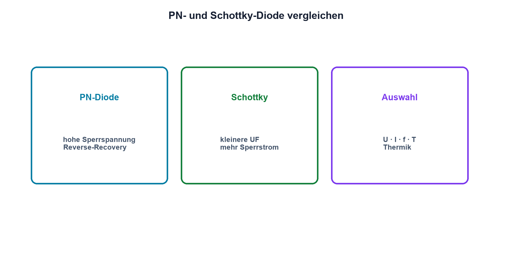

# 09.3 – Gleichrichter- und Schottky-Dioden

[← Zurück](02-diodenkennlinie-und-arbeitspunkt.md) · [Modulübersicht](README.md) · [Kursübersicht](../README.md) · [Weiter →](04-z-dioden-und-spannungsbegrenzung.md)

## Lernziele

Nach dieser Lektion kannst du:

- Silizium- und Schottky-Dioden vergleichen
- Sperrspannung und Strombelastung auswählen
- Reverse-Recovery und Leckstrom beurteilen

## Warum ist das wichtig?

Die «kleinere Durchlassspannung» einer Schottky-Diode ist attraktiv, aber nicht kostenlos: Sperrstrom, Sperrspannung und Temperaturverhalten unterscheiden sich. In schnellen Wandlern kommt die Umschaltladung hinzu. Die passende Diode wird aus dem gesamten Betriebsfall gewählt.

## Theorie

### PN-Gleichrichterdiode

Klassische Siliziumdioden erreichen hohe Sperrspannungen und robuste Strombereiche. Beim Umschalten von Durchlass- in Sperrrichtung müssen gespeicherte Ladungsträger entfernt werden. Dieser Reverse-Recovery-Strom verursacht Verluste und Störungen.

### Schottky-Diode

Der Metall-Halbleiter-Übergang einer Schottky-Diode speichert weniger Minderheitsträger. Sie schaltet schnell und besitzt bei vielen Arbeitspunkten eine kleinere Durchlassspannung. Dafür sind Sperrstrom und Temperaturabhängigkeit oft grösser, die verfügbare Sperrspannung häufig kleiner.

### Datenblattwahl

Geprüft werden wiederkehrende Spitzensperrspannung, mittlerer und gepulster Durchlassstrom, Flussspannung bei realem Strom, Sperrstrom bei maximaler Temperatur, Reverse-Recovery sowie Gehäuse und thermische Bedingungen. Absolute Maximum Ratings sind keine empfohlenen Arbeitspunkte.

## Anschauliches Beispiel

Zwei Rückschlagventile können denselben Zweck erfüllen. Das eine dichtet bei hohem Gegendruck besser, das andere öffnet leichter und reagiert schneller. Welches besser ist, entscheidet der reale Druck- und Temperaturbereich.

## Berechnungsbeispiel

Bei 2 A verursacht eine PN-Diode mit 0,85 V näherungsweise 1,70 W Leitverlust. Eine Schottky-Diode mit 0,45 V verursacht 0,90 W. Der Vergleich bleibt unvollständig, solange Sperrverlust, Schaltverlust und Kühlung fehlen.

## Praxisbezug

Miss UD beider Typen bei mehreren begrenzten Strömen. Erwärme Bauteile nicht absichtlich über sichere Grenzen; beobachte stattdessen Datenblattkurven und die Temperatur während der Messung.

## 🔗 Hardware ↔ Firmware

Die PWM-Frequenz beeinflusst Schaltverluste und damit die Diodenauswahl. Eine Firmwareänderung von 20 auf 100 kHz kann die Hardwaretemperatur verändern, obwohl Strom und Tastgrad gleich erscheinen.

## Merksatz

> Eine Schottky-Diode spart oft Flussspannung, verlangt aber Prüfung von Sperrstrom, Sperrspannung und Temperatur.

## Häufige Fehler und Missverständnisse

- nur die typische Flussspannung vergleichen
- Spitzensperrspannung ohne Reserve wählen
- Reverse-Recovery ignorieren
- Maximalwerte als Dauerbetrieb verwenden

## Zusammenfassung

PN- und Schottky-Dioden besitzen unterschiedliche Stärken. Auswahl und Kühlung folgen Strom, Spannung, Frequenz und Temperatur gemeinsam.

## Übungsfragen

1. Was ist Reverse-Recovery?
2. Warum steigt Sperrstrom bei Temperatur?
3. Welche vier Datenblattwerte sind zuerst zu prüfen?
4. Wie beeinflusst PWM die Auswahl?

Weitere Aufgaben: [Übungen zu Modul 09](../uebungen/modul-09.md).

## Bezug Bildungsplan 2026

- Handlungskompetenzen: `b1-LK01–04`, `b4-LK01–08`, `c1`
- Nachweise: begründeter Datenblattvergleich und Verlustabschätzung; [Kompetenzmatrix](../bildungsplan-2026/kompetenzmatrix.md)
