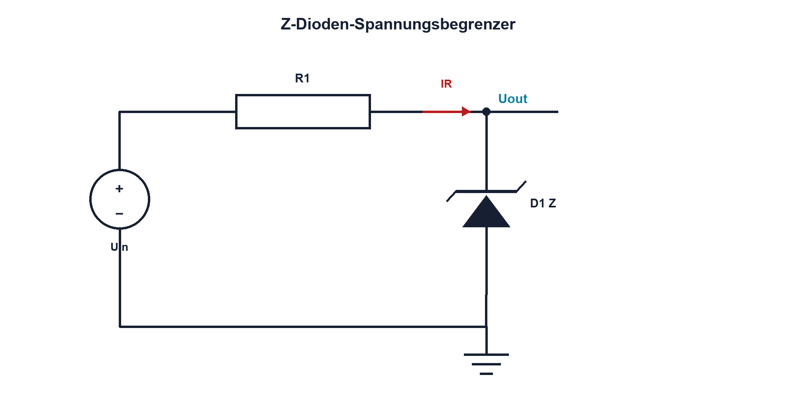

# 09.4 – Z-Dioden und Spannungsbegrenzung

[← Zurück](03-gleichrichter-und-schottky-dioden.md) · [Modulübersicht](README.md) · [Kursübersicht](../README.md) · [Weiter →](05-leds-und-optische-kennwerte.md)

## Lernziele

Nach dieser Lektion kannst du:

- Z-Diode im Durchbruchbereich erklären
- Vorwiderstand für Lastgrenzen dimensionieren
- Verlustleistung und dynamischen Widerstand prüfen

## Einleitung

Eine Z-Diode kann eine Spannung begrenzen oder eine einfache Referenz bilden. Ohne Strombegrenzung zerstört sie sich jedoch. Zudem bleibt ihre Spannung nicht exakt konstant; Strom, Temperatur und dynamischer Widerstand bestimmen die Genauigkeit.

<!-- context-expansion-2026 -->
Dioden steuern Strom abhängig von Polarität, Spannung und Temperatur. Sie werden zum Gleichrichten, Begrenzen, Schützen und Erzeugen von Licht eingesetzt. Das einfache Schaltzeichen steht dabei für einen realen PN- oder Metall-Halbleiter-Übergang mit klaren Grenzwerten.

Beim Thema **Z-Dioden und Spannungsbegrenzung** geht es deshalb nicht nur um eine einzelne Formel oder Definition. Entscheidend ist, wie sich das Prinzip im Schema erkennen, im Datenblatt beurteilen, im Aufbau messen und bei einer Abweichung systematisch überprüfen lässt.

## Theorie

<!-- theory-expansion-2026 -->
### Einordnung und Grundidee

Für jede Diodenschaltung werden zuerst Anode, Kathode, vorgesehene Stromrichtung und Sperrspannung markiert. Danach folgen Arbeitspunkt und Verlustleistung. Diese Reihenfolge macht sichtbar, ob die Diode im Normalbetrieb leitet, sperrt oder nur im Fehlerfall Energie übernimmt.

### Kontrollierter Durchbruch

Z-Dioden werden in Sperrrichtung betrieben. Unterhalb der Nennspannung fliesst wenig Strom; im Durchbruch steigt er stark. Je nach Spannung dominieren Zener- oder Lawineneffekt. Der gemeinsame Schaltplanname sagt nichts über ideale Konstanz aus.

Der Serienwiderstand führt `IR = (Uin − UZ)/R1`. Dieser Strom teilt sich in Z-Diodenstrom IZ und Laststrom IL: `IR = IZ + IL`. Für jeden Grenzfall müssen Mindest-IZ und maximal zulässige Leistung `PZ = UZ·IZ` eingehalten werden.

### Genauigkeit

Die Prüfspannung UZ gilt bei einem definierten Teststrom. Der dynamische Widerstand rz beschreibt die lokale Spannungsänderung. Toleranz, Temperaturkoeffizient und Leitungswiderstände kommen hinzu. Für präzise Referenzen sind spezielle Referenzbausteine meist besser.

## Anwendungsfall

Typische elektronische Anwendungen und Baugruppen für dieses Thema sind:

- Einfache Referenzen und Überspannungsbegrenzung
- Klemmen empfindlicher Eingänge
- Erkennen definierter Schwellwerte

In einer konkreten Entwicklung wird nicht nur geprüft, ob die gewünschte Funktion grundsätzlich entsteht. Ebenso wichtig sind zulässige Grenzwerte, Toleranzen, Temperatur, Messbarkeit und das Verhalten bei Unterbruch, Kurzschluss oder falscher Ansteuerung.

## Anschauliches Beispiel

Ein Überlauf hält den Wasserstand ungefähr konstant, aber nur wenn der Zulauf begrenzt ist. Bei zu wenig Zulauf fällt der Pegel; bei zu viel muss der Überlauf gefährlich viel Wasser abführen.

## Berechnungsbeispiel

Uin liegt zwischen 10 und 14 V, UZ = 5,1 V, die Last benötigt maximal 5 mA und IZ soll mindestens 5 mA sein. Bei 10 V gilt `R1 ≤ (10 − 5,1)/(10 mA) = 490 Ω`; gewählt werden 470 Ω. Bei 14 V ohne Last fliessen etwa 18,9 mA, also `PZ ≈ 96 mW`.

## Praxisbezug

Vermesse UZ bei mehreren begrenzten Strömen und zwei Lastzuständen. Vergleiche Messwerte mit Datenblatt-Teststrom und maximaler Leistung.

## 🔗 Hardware ↔ Firmware

Ein ADC kann eine Z-Spannung überwachen, aber nicht als genauer annehmen als deren Toleranz und Temperaturgang. Überspannungsereignisse benötigen zusätzlich Strombegrenzung und einen belastbaren Energiepfad.

## Merksatz

> Eine Z-Diode begrenzt Spannung nur dann sicher, wenn ihr Strom für alle Betriebsfälle begrenzt und geprüft ist.

## Häufige Fehler und Missverständnisse

- Vorwiderstand weglassen
- nur Nenneingang rechnen
- Laststrom vergessen
- Z-Spannung als ideale Referenz behandeln

## Zusammenfassung

Z-Begrenzer werden mit Mindeststrom, Höchststrom und Verlustleistung dimensioniert. Genauigkeit folgt Datenblatt und realem Arbeitspunkt.

## Übungsfragen

1. Warum braucht D1 einen Vorwiderstand?
2. Wie teilen sich IR IZ und IL?
3. Welcher Grenzfall erzeugt maximale PZ?
4. Warum ist UZ nicht exakt konstant?

Weitere Aufgaben: [Übungen zu Modul 09](../uebungen/modul-09.md).

## Bezug Bildungsplan 2026

- Handlungskompetenzen: `b1-LK01–06`, `b4-LK01–10`, `b5`
- Nachweise: Worst-Case-Dimensionierung eines Z-Begrenzers; [Kompetenzmatrix](../bildungsplan-2026/kompetenzmatrix.md)
