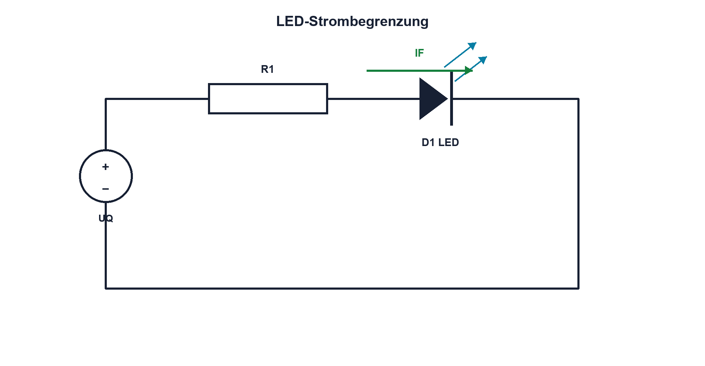

# 09.5 – LEDs und optische Kennwerte

[← Zurück](04-z-dioden-und-spannungsbegrenzung.md) · [Modulübersicht](README.md) · [Kursübersicht](../README.md) · [Weiter →](06-ein-und-mehrweg-gleichrichter.md)

## Lernziele

Nach dieser Lektion kannst du:

- LED-Strom sicher begrenzen
- elektrische und optische Daten unterscheiden
- PWM-Dimmung korrekt beurteilen

## Warum ist das wichtig?

LEDs wandeln Strom in Licht, sind aber keine Glühlampen. Kleine Spannungsänderungen können grosse Stromänderungen bewirken. Farbe, Helligkeit, Pulsbetrieb und Temperatur werden deshalb über Datenblatt und Strombegrenzung beherrscht.

## Theorie

### Licht aus Rekombination

Bei geeigneten Halbleitermaterialien wird bei der Rekombination Energie als Photon abgegeben. Die Bandlücke bestimmt die Wellenlänge und beeinflusst die Durchlassspannung. Rot, grün und blau besitzen daher unterschiedliche typische UD-Bereiche.

### Strombegrenzung

Für eine Anzeige-LED gilt näherungsweise `R1 = (UQ − UF)/IF`. `UF` ist die Flussspannung beim vorgesehenen Strom, `IF` der Durchlassstrom. Widerstandsleistung und ungünstige Kombination aus hoher Versorgung und kleiner UF werden geprüft. Konstantstromquellen sind bei Leistungs-LEDs zweckmässiger.

### Optische Angaben

Lichtstärke in Candela hängt vom Abstrahlwinkel ab; Lichtstrom in Lumen beschreibt die gesamte sichtbare Leistung gewichtet nach Augenempfindlichkeit. Dominante Wellenlänge, Farbort und Temperaturverschiebung sind nicht durch Gehäusefarbe zuverlässig festgelegt.

Pulsstromgrenzen gelten nur für definierte Pulsdauer, Tastgrad und Temperatur. Ein hoher zulässiger Pulsstrom ist keine Freigabe für beliebige PWM.

## Anschauliches Beispiel

Eine LED ist wie eine empfindliche Düse: Die Versorgung stellt Druck bereit, der Vorwiderstand begrenzt den Durchfluss. Die sichtbare Helligkeit hängt zusätzlich von Düse, Blickrichtung und menschlichem Auge ab.

## Berechnungsbeispiel

UQ = 5,0 V, UF liegt im Worst Case bei 1,8 V und IF soll höchstens 8 mA sein. `R1 ≥ (5,0 − 1,8)/8 mA = 400 Ω`; E24 liefert 430 Ω. Die maximale Widerstandsleistung liegt bei ungefähr 24 mW.

## Praxisbezug

Vergleiche LED-Strom und Helligkeit bei mehreren Widerständen. Strom wird über Widerstandsspannung bestimmt; die LED niemals direkt an eine starre Spannungsquelle anschliessen.

## 🔗 Hardware ↔ Firmware

PWM verändert den zeitlichen Mittelwert des Stroms, nicht automatisch dessen Spitzenwert. Timerfrequenz, Tastgrad, GPIO-Grenze und Treiberstufe bestimmen sichtbare Helligkeit, Flimmern und Belastung.

## Merksatz

> Eine LED wird über ihren Strom betrieben; Spannung und optische Wirkung sind strom-, temperatur- und typabhängig.

## Häufige Fehler und Missverständnisse

- LED ohne Strombegrenzung betreiben
- typische UF für Worst Case verwenden
- Candela und Lumen gleichsetzen
- PWM-Pulsstromgrenze ohne Bedingungen übernehmen

## Zusammenfassung

LED-Auslegung verbindet elektrischen Arbeitspunkt, thermische Grenze und optische Anforderungen. Widerstand oder Stromquelle begrenzen den Strom.

## Übungsfragen

1. Warum unterscheiden sich LED-Farben elektrisch?
2. Dimensioniere R1 für 3,3 V, 2,0 V und 5 mA. Was beschreibt Candela?
3. Welche Grenze prüfst du bei PWM?

Weitere Aufgaben: [Übungen zu Modul 09](../uebungen/modul-09.md).

## Bezug Bildungsplan 2026

- Handlungskompetenzen: `b1-LK01–04`, `b4-LK01–10`, `c1`
- Nachweise: LED-Worst-Case-Rechnung und PWM-Messung; [Kompetenzmatrix](../bildungsplan-2026/kompetenzmatrix.md)
