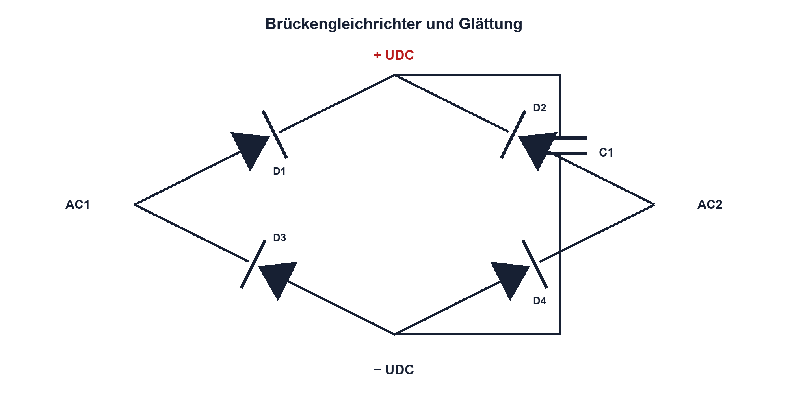

# 09.6 – Ein- und Mehrweg-Gleichrichter

[← Zurück](05-leds-und-optische-kennwerte.md) · [Modulübersicht](README.md) · [Kursübersicht](../README.md) · [Weiter →](07-tvs-dioden-und-schutzschaltungen.md)

## Lernziele

Nach dieser Lektion kannst du:

- Einweg- und Brückengleichrichter erklären
- Glättungskondensator dimensionieren
- Dioden- und Transformatorbelastung beurteilen

## Warum ist das wichtig?

Gleichrichtung erzeugt aus Wechselspannung keine ideale Gleichspannung. Diodenabfälle, Ladeimpulse, Ripple und Quellenwiderstand formen das Ergebnis. Diese Zusammenhänge tauchen in Netzteilen, Verpolschutz und Energieschnittstellen wieder auf.

## Theorie

### Einweg und Brücke

Beim Einweggleichrichter wird eine Halbwelle genutzt. Der Brückengleichrichter nutzt beide Halbwellen; pro Strompfad leiten zwei Dioden. Die Ripplefrequenz beträgt bei der Brücke das Doppelte der Eingangsfreqenz.

### Glättung

Der Kondensator lädt nahe den Spannungsspitzen und versorgt die Last dazwischen. Für kleine Ripple näherungsweise `ΔU ≈ IL/(fRipple·C)`. `fRipple` ist die Ladeimpulsfrequenz. Die Formel ignoriert Quellenwiderstand, Diodenabfall und kurze hohe Ladestromspitzen.

### Belastung

Dioden werden nach Spitzenstrom, mittlerem Strom, Sperrspannung und Verlustleistung gewählt. Transformator und Leitungen führen gepulste Ströme mit höherem Effektivwert als der Lastgleichstrom. Ein grosser Kondensator reduziert Ripple, erhöht aber Einschalt- und Ladeimpulse.

## Anschauliches Beispiel

Ein Speicherbecken wird nur an den Wellenkämmen nachgefüllt und versorgt dazwischen kontinuierlich einen Verbraucher. Ein grösseres Becken senkt den Pegelripple, verlangt beim Nachfüllen aber stärkere kurze Zuflüsse.

## Berechnungsbeispiel

Eine Brücke an 50 Hz erzeugt `fRipple = 100 Hz`. Bei IL = 100 mA und erlaubten 1 V Ripple gilt ideal `C = 0,1/(100·1) = 1000 µF`. Spitzenspannung und zwei Diodenabfälle werden zusätzlich geprüft.

## Praxisbezug

Verwende ausschliesslich eine sichere Kleinspannungs-AC-Quelle. Miss Eingang, gleichgerichtete Spannung und Ripple mit gemeinsamer Masse nur an galvanisch sicherem Aufbau. Vergleiche ohne und mit Last.

## 🔗 Hardware ↔ Firmware

Firmware kann Ripple mit dem ADC erfassen, wenn Abtastrate und Triggerbezug passen. Sie ersetzt weder ausreichende Kapazität noch Unterspannungsreserve; Brownout-Reset muss zur minimalen Zwischenkreisspannung passen.

## Merksatz

> Der Glättungskondensator senkt Ripple, erzeugt aber kurze hohe Ladeimpulse.

## Häufige Fehler und Missverständnisse

- Netzspannung im Grundlagenversuch verwenden
- zwei Diodenabfälle der Brücke vergessen
- Laststrom mit Diodenspitzenstrom gleichsetzen
- grösseres C ohne Einschaltstromprüfung wählen

## Zusammenfassung

Gleichrichter erzeugen pulsierende Gleichspannung. Topologie, Last, Kapazität und Quellenimpedanz bestimmen Ripple und Bauteilbelastung.

## Übungsfragen

1. Welche Ripplefrequenz hat eine 50-Hz-Brücke?
2. Warum leiten zwei Dioden?
3. Dimensioniere C für 50 mA, 100 Hz und 0,5 V. Weshalb steigt der Ladestrom bei grossem C?

Weitere Aufgaben: [Übungen zu Modul 09](../uebungen/modul-09.md).

## Bezug Bildungsplan 2026

- Handlungskompetenzen: `b1-LK02–06`, `b4-LK01–10`, `b5`, `d8`
- Nachweise: sicherer Kleinspannungs-Gleichrichter mit Ripplemessung; [Kompetenzmatrix](../bildungsplan-2026/kompetenzmatrix.md)
