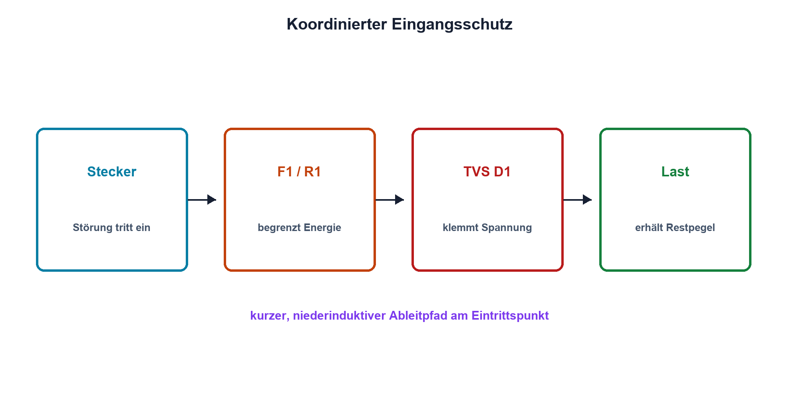

# 09.7 – TVS-Dioden und Schutzschaltungen

[← Zurück](06-ein-und-mehrweg-gleichrichter.md) · [Modulübersicht](README.md) · [Kursübersicht](../README.md) · [Weiter →](../10-bipolartransistoren/README.md)

## Lernziele

Nach dieser Lektion kannst du:

- TVS-Arbeitspunkte aus Datenblatt lesen
- Schutz als Energiepfad planen
- Verpol- und Eingangsschutz kombinieren

## Warum ist das wichtig?

Eine Schutzdiode macht einen Eingang nicht automatisch robust. Der Störstrom benötigt einen begrenzten, niederinduktiven Weg; Sicherung, Serienimpedanz, TVS und Massekonzept müssen zusammenarbeiten. Platzierung entscheidet bei schnellen Ereignissen ebenso wie der Nennwert.

## Theorie

### Stand-off, Durchbruch und Klemmung

Eine TVS-Diode bleibt bis zur maximalen Dauerspannung VRWM weitgehend sperrend. Bei VBR beginnt der spezifizierte Durchbruch; bei hohem Pulsstrom erreicht sie die Klemmspannung VC. VC kann deutlich über der aufgedruckten Nennspannung liegen.

| Zeichen | Bedeutung | Einheit |
|---|---|---|
| `VRWM` | zulässige Dauersperrspannung | V |
| `VBR` | Durchbruchspannung bei Prüfstrom | V |
| `VC` | Klemmspannung bei Pulsstrom | V |

### Koordination

Die Quelle oder Serienimpedanz begrenzt Strom. TVS und Massepfad führen Energie ab; Sicherung oder elektronische Abschaltung beendet länger dauernde Fehler. Für Verpolschutz kommen Seriendiode oder MOSFET-Schaltung hinzu. ESD, Surge und Dauerüberspannung besitzen sehr unterschiedliche Energien und Prüfprofile.

### Layout

TVS und Rückleiter liegen nahe am Eintrittspunkt. Lange Leiterbahnen erzeugen durch `u = L·di/dt` zusätzliche Spannung. Empfindliche Schaltungsteile dürfen nicht im Ableitstrompfad liegen.

## Anschauliches Beispiel

Ein Blitzableiter hilft nur, wenn sein Weg zur Erde kurz und belastbar ist. Ein Fangmast ohne geeigneten Ableitweg verschiebt das Problem. Ebenso braucht die TVS einen geplanten Stromkreis.

## Berechnungsbeispiel

Ein 24-V-Eingang kann 36 V über 2 Ω Quellenwiderstand liefern; eine TVS klemmt im betrachteten Punkt bei 30 V. Der Pulsstrom wäre näherungsweise `(36 − 30)/2 = 3 A`, die momentane TVS-Leistung 90 W. Zulässige Pulsdauer und Kurve müssen dies abdecken.

## Praxisbezug

Schutzwirkung wird nicht durch absichtliche Hochenergieimpulse auf dem Steckbrett getestet. Untersuche Datenblattkurven und demonstriere das Prinzip mit strombegrenzter Kleinspannung und Serienwiderstand.

## 🔗 Hardware ↔ Firmware

Firmware erkennt langsame Über- oder Unterspannung und kann Lasten abschalten. Nanosekunden-ESD muss die Hardware beherrschen. Ereigniszähler helfen nur, wenn der Schutz die Elektronik bis zur Softwarereaktion am Leben hält.

## Merksatz

> Schutz ist ein vollständiger, energiebegrenzter Strompfad – nicht nur ein einzelnes Bauteil.

## Häufige Fehler und Missverständnisse

- VRWM mit VC verwechseln
- TVS weit vom Stecker platzieren
- Dauerfehler mit Pulsrating absichern
- Massepfad und Leitungsinduktivität ignorieren

## Zusammenfassung

TVS-Auswahl verbindet Dauerspannung, Klemmspannung, Pulsstrom, Energie, Layout und nachgeschaltete Grenzwerte.

## Übungsfragen

1. Wie unterscheiden sich VRWM VBR und VC?
2. Warum braucht die TVS Serienimpedanz?
3. Weshalb ist Platzierung wichtig?
4. Was kann Firmware nicht schnell genug schützen?

Weitere Aufgaben: [Übungen zu Modul 09](../uebungen/modul-09.md).

## Bezug Bildungsplan 2026

- Handlungskompetenzen: `b1-LK01–06`, `b4-LK01–10`, `b5`, `c1`, `d8`
- Nachweise: koordinierter Schutzpfad mit Datenblatt- und Layoutbegründung; [Kompetenzmatrix](../bildungsplan-2026/kompetenzmatrix.md)
