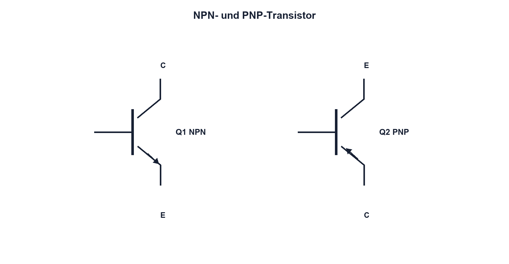

# 10.1 – NPN- und PNP-Grundprinzip

[← Zurück](../09-dioden-schutz/07-tvs-dioden-und-schutzschaltungen.md) · [Modulübersicht](README.md) · [Kursübersicht](../README.md) · [Weiter →](02-transistorstroeme-und-stromverstaerkung.md)

## Lernziele

Nach dieser Lektion kannst du:

- NPN und PNP anhand Symbol und Stromrichtung unterscheiden
- Basis Emitter und Kollektor funktional erklären
- Low-Side und High-Side einordnen

## Warum ist das wichtig?

Ein kleiner Steuerstrom kann einen grösseren Laststrom beeinflussen. Der BJT bildet damit Schalter, Verstärker, Stromquelle und Eingangsstufe. Entscheidend ist, dass Basis, Emitter und Kollektor nicht beliebig vertauschbar sind und immer auf reale Potentiale bezogen werden.

## Theorie

### Aufbau und Steuerung

Ein BJT besitzt zwei PN-Übergänge, verhält sich aber nicht wie zwei unabhängige Dioden. Im aktiven Betrieb injiziert der vorwärts gepolte Basis-Emitter-Übergang Ladungsträger in die dünne Basis; das Kollektorfeld übernimmt den grössten Teil. So steuert ein kleiner Basisstrom den Kollektorstrom.

Beim NPN zeigt der Emitterpfeil nach aussen; konventioneller Kollektorstrom fliesst typischerweise von C nach E. Beim PNP zeigt der Pfeil nach innen, die Polaritäten und Stromrichtungen sind umgekehrt. Der Pfeil gehört zum Emitter.

### Schaltungsrollen

NPN eignet sich häufig als Low-Side-Schalter: Last an Plus, Transistor nach GND. PNP kann als einfacher High-Side-Schalter dienen, verlangt aber eine auf seinen Emitter bezogene Basisansteuerung. Für beide Typen sind Basisstrombegrenzung und definierter Aus-Zustand nötig.

## Anschauliches Beispiel

Ein kleines Steuerventil beeinflusst einen grösseren Hauptstrom. Die Analogie hilft beim Verhältnis der Ströme; anders als ein ideales Ventil benötigt der BJT aber stetigen Basisstrom und besitzt Spannungs- sowie Temperaturgrenzen.

## Berechnungsbeispiel

Eine 12-V-Last zieht 40 mA. Wird ein NPN als Schalter mit erzwungenem Faktor 10 betrieben, werden mindestens 4 mA Basisstrom geplant. Bei 3,3-V-GPIO und 0,8 V Basis-Emitter-Spannung ergibt sich `RB = (3,3 − 0,8)/4 mA = 625 Ω`; der nächste geeignete Wert wird mit GPIO-Grenzen geprüft.

## Praxisbezug

Identifiziere an Datenblatt und Diodentest Basis, Emitter und Kollektor. Ein Diodentest kann die beiden Übergänge zeigen, beweist aber weder Verstärkung noch zulässige Pinvertauschung.

## 🔗 Hardware ↔ Firmware

Ein GPIO liefert Basisstrom und muss beim Reset einen sicheren Zustand behalten. Active-High beziehungsweise Active-Low hängt von NPN/PNP und Schaltung ab; Firmwarebezeichner sollen die reale Wirkung statt nur den Pinpegel ausdrücken.

## Merksatz

> Beim BJT steuert der Basis-Emitter-Kreis den Kollektorstrom; der Emitterpfeil unterscheidet NPN und PNP.

## Häufige Fehler und Missverständnisse

- BJT als zwei unabhängige Dioden behandeln
- C und E vertauschen
- Basis ohne Widerstand treiben
- PNP-Ansteuerung auf GND statt Emitter beziehen

## Zusammenfassung

NPN und PNP besitzen komplementäre Polaritäten. Symbol, Strompfad und Bezugspotential bestimmen ihre Rolle in der Schaltung.

## Übungsfragen

1. Woran erkennst du den Emitter?
2. Warum braucht die Basis R1?
3. Was ist ein Low-Side-Schalter?
4. Weshalb ist ein PNP-High-Side nicht einfach invertiert?

Weitere Aufgaben: [Übungen zu Modul 10](../uebungen/modul-10.md).

## Bezug Bildungsplan 2026

- Handlungskompetenzen: `b1-LK01–06`, `b4-LK01–10`, `c1`
- Nachweise: korrekte Symbol- und Strompfadanalyse; [Kompetenzmatrix](../bildungsplan-2026/kompetenzmatrix.md)
