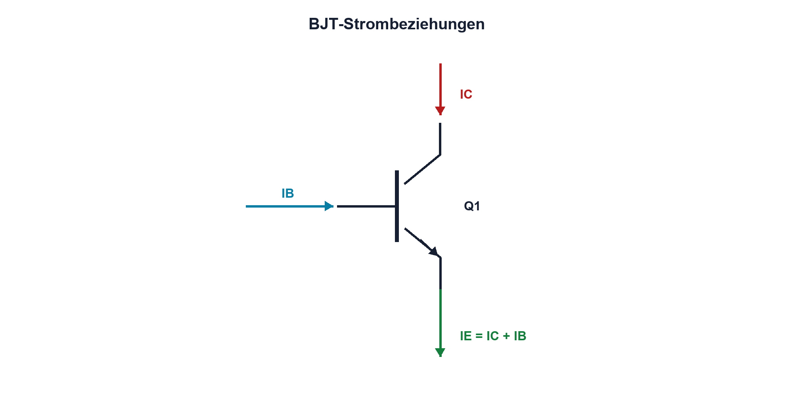

# 10.2 – Transistorströme und Stromverstärkung

[← Zurück](01-npn-und-pnp-grundprinzip.md) · [Modulübersicht](README.md) · [Kursübersicht](../README.md) · [Weiter →](03-kennlinien-und-betriebsbereiche.md)

## Lernziele

Nach dieser Lektion kannst du:

- Strombeziehungen des BJT anwenden
- β als streuenden Arbeitspunktparameter verstehen
- erzwungene Verstärkung für Schalter verwenden

## Einleitung

Die Datenblattverstärkung ist kein präziser Konstruktionswert. Sie hängt von Strom, Spannung, Temperatur und Exemplar ab. Gute Schaltungen funktionieren deshalb auch mit der garantierten unteren Grenze oder verwenden im Schaltbetrieb eine bewusst kleinere erzwungene Verstärkung.

<!-- context-expansion-2026 -->
Bipolartransistoren verbinden einen steuernden Basis-Emitter-Kreis mit einem Kollektor-Emitter-Lastpfad. Je nach Arbeitspunkt arbeiten sie als Schalter, Verstärker oder Stromquelle. Anschlussbelegung, Stromrichtung und thermische Rückwirkung gehören deshalb von Beginn an zur Betrachtung.

Beim Thema **Transistorströme und Stromverstärkung** geht es deshalb nicht nur um eine einzelne Formel oder Definition. Entscheidend ist, wie sich das Prinzip im Schema erkennen, im Datenblatt beurteilen, im Aufbau messen und bei einer Abweichung systematisch überprüfen lässt.

## Theorie

<!-- theory-expansion-2026 -->
### Einordnung und Grundidee

Beim BJT werden Basis-, Kollektor- und Emitterkreis getrennt verfolgt und anschliessend über den Arbeitspunkt verbunden. Der Steuerstrom stammt aus einer realen Quelle, der Laststrom aus einem eigenen Energiepfad. Verstärkung und Sättigung sind Betriebszustände, keine unveränderlichen Bauteilkonstanten.

### Drei Ströme

Nach der Knotenregel gilt `IE = IC + IB`. Im aktiven Bereich wird die Gleichstromverstärkung häufig als `β = IC/IB` beziehungsweise hFE angegeben. β kann zwischen Exemplaren stark streuen und fällt bei sehr kleinen oder grossen Strömen ab.

| Zeichen | Bedeutung | Einheit |
|---|---|---|
| `β` | Gleichstromverstärkung im Arbeitspunkt | 1 |
| `hFE` | Datenblattbezeichnung für DC-Verstärkung | 1 |

### Schalterdimensionierung

In Sättigung gilt `IC = β·IB` nicht zuverlässig. Für robustes Schalten wird `βforced = IC/IB` bewusst kleiner als die typische Verstärkung gewählt. Danach werden GPIO-Strom, Basiswiderstand, VCE(sat) und Verlustleistung geprüft.

### Verstärkerbetrieb

In einer linearen Stufe beeinflusst β den Arbeitspunkt, aber Gegenkopplung über einen Emitterwiderstand kann die Abhängigkeit reduzieren. Wechselstromverstärkung und Gleichstromarbeitspunkt sind getrennt zu analysieren.

## Anwendungsfall

Typische elektronische Anwendungen und Baugruppen für dieses Thema sind:

- Dimensionierung des Basiswiderstands
- Bewertung von GPIO- und Kollektorstrom
- Abschätzung der Verstärkung im aktiven Bereich

In einer konkreten Entwicklung wird nicht nur geprüft, ob die gewünschte Funktion grundsätzlich entsteht. Ebenso wichtig sind zulässige Grenzwerte, Toleranzen, Temperatur, Messbarkeit und das Verhalten bei Unterbruch, Kurzschluss oder falscher Ansteuerung.

## Anschauliches Beispiel

β gleicht der Übersetzung eines Helfers, dessen Kraft mit Temperatur, Exemplar und Belastung schwankt. Eine robuste Konstruktion plant nicht mit seinem persönlichen Bestwert, sondern mit einer garantierten Mindestleistung und Reserve.

## Berechnungsbeispiel

Für IC = 120 mA und `βforced = 10` werden 12 mA Basisstrom benötigt. Ein 3,3-V-GPIO könnte damit bereits über seiner empfohlenen Belastung liegen. Statt blind RB zu verkleinern wird ein MOSFET oder eine Treiberstufe geprüft.

## Praxisbezug

Miss IC bei mehreren IB und konstantem VCE im sicheren Bereich. Berechne β für jeden Punkt und dokumentiere Temperatur sowie Bauteiltyp.

## 🔗 Hardware ↔ Firmware

Firmware kann den Pinpegel setzen, garantiert aber keinen ausreichenden Basisstrom. GPIO-Ausgangsspannung sinkt unter Last; zulässiger Pin- und Portgesamtstrom stammen aus dem MCU-Datenblatt.

## Merksatz

> β ist ein streuender Betriebsparameter, keine präzise Verstärkungsgarantie.

## Häufige Fehler und Missverständnisse

- typisches β als Mindestwert verwenden
- IE und IC gleichsetzen ohne IB zu beachten
- Sättigung mit aktivem Bereich verwechseln
- GPIO-Gesamtstrom ignorieren

## Zusammenfassung

IE teilt sich in IC und IB. β beschreibt einen Arbeitspunkt; robuste Schalter verwenden erzwungene Verstärkung und prüfen den Treiber.

## Übungsfragen

1. Wie hängen IE IC und IB zusammen?
2. Was bedeutet βforced?
3. Warum sinkt der GPIO-Pegel?
4. Wann ist ein MOSFET sinnvoller?

Weitere Aufgaben: [Übungen zu Modul 10](../uebungen/modul-10.md).

## Bezug Bildungsplan 2026

- Handlungskompetenzen: `b1-LK02–04`, `b4-LK01–10`, `c1`
- Nachweise: Strommessung und robuste Basisdimensionierung; [Kompetenzmatrix](../bildungsplan-2026/kompetenzmatrix.md)
