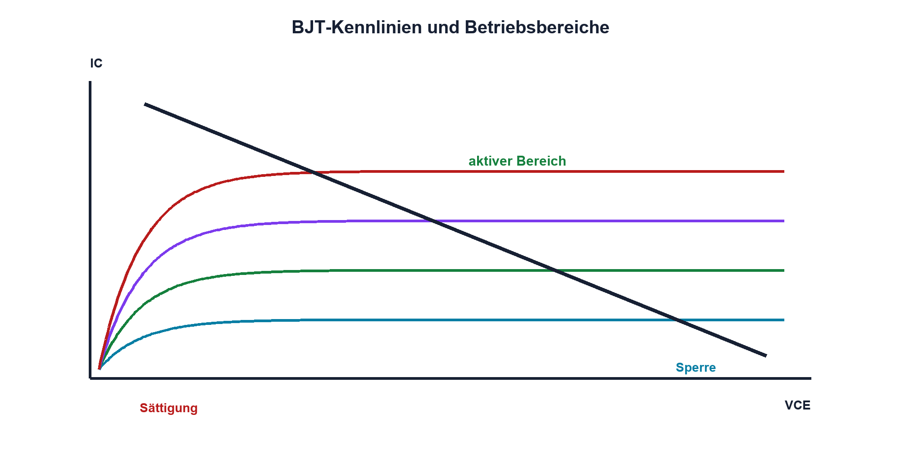

# 10.3 – Kennlinien und Betriebsbereiche

[← Zurück](02-transistorstroeme-und-stromverstaerkung.md) · [Modulübersicht](README.md) · [Kursübersicht](../README.md) · [Weiter →](04-arbeitspunkt-und-dimensionierung.md)

## Lernziele

Nach dieser Lektion kannst du:

- Sperr aktiven und Sättigungsbereich unterscheiden
- Ausgangskennlinien lesen
- sicheren Arbeitsbereich berücksichtigen

## Warum ist das wichtig?

Derselbe Transistor kann gesperrt, linear verstärkend oder gesättigt arbeiten. Nur wenn der Betriebsbereich bewusst gewählt wird, stimmen Verstärkung, Verlustleistung und Schaltgeschwindigkeit. Kennlinien zeigen, wo das vereinfachte Modell endet.

## Theorie

### Drei Hauptbereiche

Im Sperrbereich ist IB nahezu null und IC klein. Im aktiven Bereich steuert IB den Kollektorstrom; VCE bleibt gross genug, damit der Kollektor-Basis-Übergang sperrt. In Sättigung sind beide Übergänge vorwärts gepolt und VCE wird klein, aber nicht null.

Ausgangskennlinien zeigen IC über VCE für mehrere Basisströme. Die Lastgerade der äusseren Schaltung schneidet diese Kurven. Ihre Achsenschnittpunkte sind `IC = UQ/RC` bei ideal VCE = 0 und VCE = UQ bei IC = 0.

### Grenzen

Maximalwerte für VCEO, IC, Verlustleistung und Sperrschichttemperatur gelten gemeinsam mit dem Safe Operating Area. Bei linearem Betrieb kann Secondary Breakdown den zulässigen Bereich zusätzlich einschränken. Ein Bauteil innerhalb einzelner Maximalwerte ist nicht automatisch sicher.

## Anschauliches Beispiel

Ein Fahrzeug besitzt Parken, kontrollierte Fahrt und Anschlag am Ende des Pedalwegs. Die Stellung allein sagt nicht, ob Motor, Reifen und Kühlung die Kombination aus Kraft und Geschwindigkeit aushalten.

## Berechnungsbeispiel

UQ = 12 V und RC = 120 Ω ergeben Lastgeradenpunkte 100 mA bei VCE = 0 sowie 12 V bei IC = 0. Im Mittelpunkt wären etwa 6 V und 50 mA, also 0,30 W Transistorleistung.

## Praxisbezug

Verändere IB nur in einem strom- und leistungsbegrenzten Aufbau. Miss IC und VCE und trage Arbeitspunkte in die Kennlinie ein. Temperaturgrenze und Abbruchkriterium werden vorab festgelegt.

## 🔗 Hardware ↔ Firmware

Langsame GPIO-Flanken oder zu kleiner Basisstrom können Q1 länger im verlustreichen Übergang halten. PWM-Frequenz und Treiber bestimmen, wie oft dieser Bereich durchlaufen wird.

## Merksatz

> Betriebsbereich und SOA werden durch Strom und Spannung gemeinsam bestimmt.

## Häufige Fehler und Missverständnisse

- VCE(sat) als exakt null setzen
- nur IC max prüfen
- linearen Betrieb ausserhalb SOA planen
- Lastgerade mit Transistorkennlinie verwechseln

## Zusammenfassung

Sperre, aktiver Bereich und Sättigung erfüllen unterschiedliche Aufgaben. Lastgerade und Kennlinien liefern den realen Arbeitspunkt.

## Übungsfragen

1. Was kennzeichnet Sättigung?
2. Zeichne die Lastgerade für 9 V und 180 Ω. Warum reicht PD max allein nicht?
3. Wie beeinflusst PWM den Übergangsbereich?

Weitere Aufgaben: [Übungen zu Modul 10](../uebungen/modul-10.md).

## Bezug Bildungsplan 2026

- Handlungskompetenzen: `b1-LK02–04`, `b4-LK01–08`, `b5`
- Nachweise: Kennlinien- und Lastgeradenanalyse; [Kompetenzmatrix](../bildungsplan-2026/kompetenzmatrix.md)
