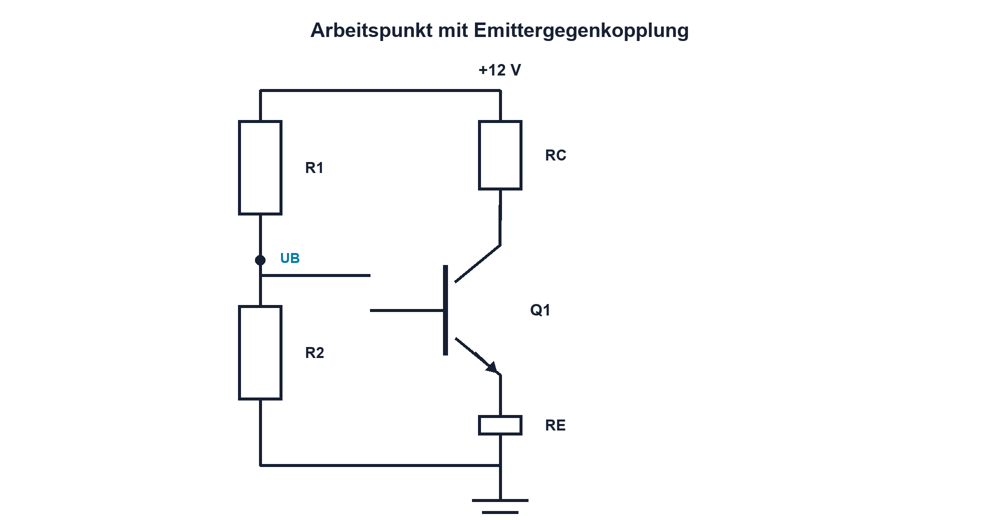

# 10.4 – Arbeitspunkt und Dimensionierung

[← Zurück](03-kennlinien-und-betriebsbereiche.md) · [Modulübersicht](README.md) · [Kursübersicht](../README.md) · [Weiter →](05-bjt-als-schalter.md)

## Lernziele

Nach dieser Lektion kannst du:

- linearen Arbeitspunkt festlegen
- Spannungsteilerbias mit Emitterwiderstand erklären
- Temperatur- und β-Abhängigkeit reduzieren

## Einleitung

Ein Verstärker benötigt Spielraum nach oben und unten. Ein schlecht stabilisierter Arbeitspunkt wandert mit β und Temperatur, verzerrt früh oder überhitzt. Emitterwiderstand und steifer Bias erzeugen Gegenkopplung bereits im Gleichstrombetrieb.

<!-- context-expansion-2026 -->
Bipolartransistoren verbinden einen steuernden Basis-Emitter-Kreis mit einem Kollektor-Emitter-Lastpfad. Je nach Arbeitspunkt arbeiten sie als Schalter, Verstärker oder Stromquelle. Anschlussbelegung, Stromrichtung und thermische Rückwirkung gehören deshalb von Beginn an zur Betrachtung.

Beim Thema **Arbeitspunkt und Dimensionierung** geht es deshalb nicht nur um eine einzelne Formel oder Definition. Entscheidend ist, wie sich das Prinzip im Schema erkennen, im Datenblatt beurteilen, im Aufbau messen und bei einer Abweichung systematisch überprüfen lässt.

## Theorie

<!-- theory-expansion-2026 -->
### Einordnung und Grundidee

Beim BJT werden Basis-, Kollektor- und Emitterkreis getrennt verfolgt und anschliessend über den Arbeitspunkt verbunden. Der Steuerstrom stammt aus einer realen Quelle, der Laststrom aus einem eigenen Energiepfad. Verstärkung und Sättigung sind Betriebszustände, keine unveränderlichen Bauteilkonstanten.

### Ziel des Arbeitspunkts

Ohne Eingangssignal sollen IC und VCE so liegen, dass das Ausgangssignal möglichst symmetrisch schwingen kann. Bei einer einfachen Emitterschaltung wird VCE häufig grob in die Mitte des nutzbaren Bereichs gelegt.

Der Basisspannungsteiler stellt UB ein. Näherungsweise gilt `UE ≈ UB − UBE` und `IE ≈ UE/RE`. Diese Näherung setzt voraus, dass der Teiler durch IB nicht stark belastet wird. Ein vollständiges Modell ersetzt ihn durch seine Théveninquelle.

### Stabilisierung

Steigt IC durch Temperatur, steigt UE am Emitterwiderstand. Dadurch sinkt UBE bei nahezu fester UB und die Stromzunahme wird gebremst. Diese Gegenkopplung kostet Spannungsreserve, verbessert aber Robustheit. Bauteiltoleranzen und minimale β werden im Worst Case geprüft.

## Anwendungsfall

Typische elektronische Anwendungen und Baugruppen für dieses Thema sind:

- Vorspannung analoger Verstärker
- Stabiler Ruhestrom über Temperatur
- Auslegung gegen Toleranz und Bauteilstreuung

In einer konkreten Entwicklung wird nicht nur geprüft, ob die gewünschte Funktion grundsätzlich entsteht. Ebenso wichtig sind zulässige Grenzwerte, Toleranzen, Temperatur, Messbarkeit und das Verhalten bei Unterbruch, Kurzschluss oder falscher Ansteuerung.

## Anschauliches Beispiel

Der Arbeitspunkt ist die Mittelstellung einer Federung. Liegt sie schon am Anschlag, kann eine Bodenwelle nur noch in eine Richtung abgefangen werden. Der Emitterwiderstand wirkt wie eine rückstellende Feder.

## Berechnungsbeispiel

UB = 1,7 V, UBE näherungsweise 0,7 V und RE = 1 kΩ ergeben `IE ≈ 1 mA`. Bei RC = 4,7 kΩ und 12 V fällt am Kollektorwiderstand etwa 4,7 V ab; der verbleibende VCE-Spielraum wird gegen das Entwurfsziel geprüft.

## Praxisbezug

Miss UB, UE, UC und berechne IE sowie IC. Erwärme Q1 nur vorsichtig und beobachte die Stabilisierung. Vergleiche mit einer Variante ohne Emitterwiderstand nur unter strenger Strombegrenzung.

## 🔗 Hardware ↔ Firmware

Ein ADC misst den Ausgang relativ zu GND. Der analoge Arbeitspunkt muss im ADC-Bereich liegen; Firmware kann Offset rechnerisch entfernen, aber abgeschnittene Signalspitzen nicht wiederherstellen.

## Merksatz

> Ein stabiler Arbeitspunkt entsteht durch geplante Spannungsreserve und Gegenkopplung, nicht durch typisches β.

## Häufige Fehler und Missverständnisse

- Spannungsteiler unbelastet annehmen
- UBE exakt setzen
- Emitterwiderstand ohne Headroom planen
- Clipping per Firmware korrigieren wollen

## Zusammenfassung

Biasnetzwerk und Emitterwiderstand legen den Gleichstromarbeitspunkt fest und reduzieren β- sowie Temperaturabhängigkeit.

## Übungsfragen

1. Warum liegt der Arbeitspunkt nicht am Rand?
2. Wie stabilisiert RE?
3. Wann ist die Teiler-Näherung gültig?
4. Welche Spannungen misst du zuerst?

Weitere Aufgaben: [Übungen zu Modul 10](../uebungen/modul-10.md).

## Bezug Bildungsplan 2026

- Handlungskompetenzen: `b1-LK02–06`, `b4-LK01–10`, `c1`
- Nachweise: dimensionierter und vermessener DC-Arbeitspunkt; [Kompetenzmatrix](../bildungsplan-2026/kompetenzmatrix.md)
