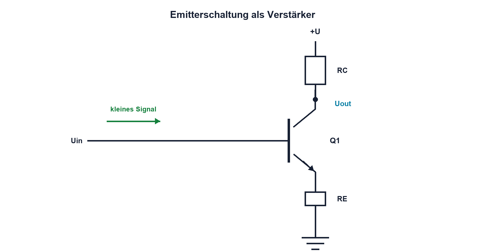

# 10.6 – BJT als Verstärker

[← Zurück](05-bjt-als-schalter.md) · [Modulübersicht](README.md) · [Kursübersicht](../README.md) · [Weiter →](07-verlustleistung-und-thermische-grenzen.md)

## Lernziele

Nach dieser Lektion kannst du:

- Emitterschaltung als Kleinsignalverstärker erklären
- Spannungsverstärkung und Phasendrehung abschätzen
- Kopplungs- und Bypasskondensatoren beurteilen

## Warum ist das wichtig?

Auch wenn integrierte Verstärker dominieren, erklärt die Emitterschaltung Arbeitspunkt, Kleinsignal, Gegenkopplung und Verzerrung besonders anschaulich. Diese Begriffe kehren in Operationsverstärkern, Sensorstufen und analogen ICs wieder.

## Theorie

### Gleichstrom und Wechselstrom trennen

Biasnetzwerk, RC und RE legen den DC-Arbeitspunkt fest. Ein kleines Eingangssignal verändert IC um diesen Punkt. Steigt IC, wächst der Spannungsabfall an RC und UC sinkt: Die Ausgangsspannung ist um 180° phasenverschoben.

Ohne vollständig überbrückten RE ist die Verstärkung näherungsweise durch Widerstandsverhältnisse und Last bestimmt; Emittergegenkopplung reduziert Verstärkung, aber verbessert Linearität. Ein Bypasskondensator kann RE für bestimmte Frequenzen teilweise kurzschliessen und macht die Verstärkung frequenzabhängig.

### Grenzen

Zu grosses Eingangssignal treibt Q1 in Sperre oder Sättigung und erzeugt Clipping. Koppelkondensatoren bilden mit Ein- und Ausgangswiderständen Hochpässe. Transistorkapazitäten begrenzen hohe Frequenzen.

## Anschauliches Beispiel

Ein Balancierbrett steht in seiner Mittelstellung. Kleine Bewegungen am Eingang werden am anderen Ende grösser und umgekehrt sichtbar. Liegt die Ausgangsseite bereits am Anschlag, wird die Bewegung abgeschnitten.

## Berechnungsbeispiel

Liegt der Arbeitspunkt bei UC = 6 V an 12 V und erlaubt die Schaltung etwa 1 V Reserve zu beiden Grenzen, sind ideal höchstens rund 5 V Spitzenauslenkung möglich. Eine gewünschte Verstärkung −10 benötigt dann weniger als 0,5 V Eingangsspitze; reale Linearität fordert zusätzliche Reserve.

## Praxisbezug

Miss zuerst alle DC-Knoten ohne Eingang. Speise danach einen kleinen Sinus ein und erhöhe ihn langsam bis zum Clipping. Dokumentiere Verstärkung, Phase und beide Clippinggrenzen.

## 🔗 Hardware ↔ Firmware

Ein ADC benötigt passenden Offset und Amplitude. Firmware kann einen bekannten Offset abziehen, aber analoge Verzerrung, Rauschen oder Bandbreitenverlust nicht rückgängig machen.

## Merksatz

> Der Verstärker arbeitet nur für kleine Änderungen um einen korrekt gewählten Arbeitspunkt linear.

## Häufige Fehler und Missverständnisse

- DC-Arbeitspunkt und AC-Verstärkung vermischen
- 180°-Drehung als Fehler deuten
- Last am Ausgang ignorieren
- Clipping digital korrigieren wollen

## Zusammenfassung

Die Emitterschaltung verstärkt und invertiert kleine Signale. Bias, Gegenkopplung, Last und Kondensatoren bestimmen die reale Übertragung.

## Übungsfragen

1. Warum ist das Ausgangssignal invertiert?
2. Welche Aufgabe hat RE?
3. Was bewirkt ein Bypasskondensator?
4. Wie erkennst du Clipping?

Weitere Aufgaben: [Übungen zu Modul 10](../uebungen/modul-10.md).

## Bezug Bildungsplan 2026

- Handlungskompetenzen: `b1-LK02–06`, `b4-LK01–10`, `c1–c2`
- Nachweise: DC- und AC-Messung einer Emitterschaltung; [Kompetenzmatrix](../bildungsplan-2026/kompetenzmatrix.md)
