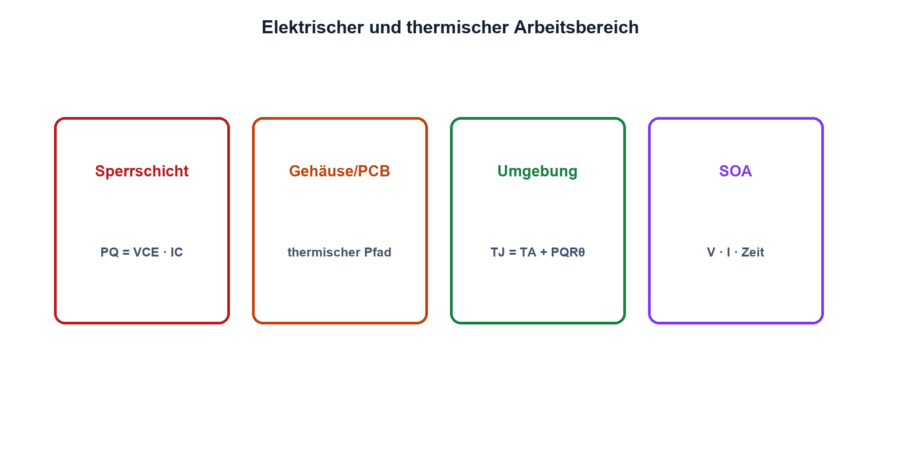

# 10.7 – Verlustleistung und thermische Grenzen

[← Zurück](06-bjt-als-verstaerker.md) · [Modulübersicht](README.md) · [Kursübersicht](../README.md) · [Weiter →](../11-mosfets/README.md)

## Lernziele

Nach dieser Lektion kannst du:

- BJT-Verlustleistung bestimmen
- thermisches Widerstandsmodell anwenden
- SOA und Secondary Breakdown berücksichtigen

## Warum ist das wichtig?

Ein elektrisch plausibler Arbeitspunkt kann thermisch unzulässig sein. Die Sperrschicht ist wärmer als das Gehäuse, und Wärme benötigt Zeit sowie einen Pfad zur Umgebung. Besonders lineare BJT-Anwendungen sind durch Secondary Breakdown gefährdet.

## Theorie

### Elektrische Verlustleistung

Näherungsweise gilt `PQ = VCE·IC + VBE·IB`. Häufig dominiert der erste Term. Im Schaltbetrieb entstehen zusätzlich Übergangsverluste; im linearen Betrieb liegt gleichzeitig nennenswerte Spannung und Strom an.

Die stationäre Temperaturabschätzung lautet `TJ = TA + PQ·RθJA`. `RθJA` ist der thermische Widerstand Sperrschicht-Umgebung in K/W und gilt nur für die angegebenen Leiterplatten- und Luftbedingungen.

### SOA und Stabilität

Das Safe-Operating-Area-Diagramm begrenzt Kombinationen aus VCE, IC und Pulsdauer. Secondary Breakdown kann den BJT bereits unter der einfachen Leistungshyperbel zerstören. Temperatur erhöht Leckstrom und kann ohne Gegenkopplung zu thermischem Durchgehen beitragen.

## Anschauliches Beispiel

Elektrische Leistung ist wie Wärme aus einem Herd, der thermische Widerstand wie die Dämmung bis zur Raumluft. Ein kleiner Topfboden kann innen sehr heiss sein, obwohl die Umgebung kühl bleibt.

## Berechnungsbeispiel

Q1 führt 200 mA bei VCE = 4 V: `PQ ≈ 0,8 W`. Bei TA = 40 °C und RθJA = 80 K/W ergäbe das idealisiert TJ ≈ 104 °C. SOA, Toleranz und reale Platine werden zusätzlich geprüft.

## Praxisbezug

Miss Spannung, Strom und Gehäusetemperatur bei mehreren sicheren Punkten. Temperaturmessung ersetzt keine TJ-Berechnung; nach jeder Änderung wird thermisches Einschwingen abgewartet.

## 🔗 Hardware ↔ Firmware

Firmware kann Strom, Temperatur oder Einschaltdauer begrenzen. Sie ist eine zusätzliche Schutzebene; Kurzschluss und schnelle Überlast benötigen hardwareseitige Grenzen.

## Merksatz

> Zulässig ist nur ein Arbeitspunkt, der elektrisch, thermisch und innerhalb der SOA sicher ist.

## Häufige Fehler und Missverständnisse

- Gehäusetemperatur mit TJ gleichsetzen
- RθJA ohne Layoutbedingungen verwenden
- SOA ignorieren
- Software als einzigen Überstromschutz einsetzen

## Zusammenfassung

Verlustleistung fliesst über thermische Widerstände zur Umgebung. SOA und Sperrschichttemperatur begrenzen reale BJT-Arbeitspunkte.

## Übungsfragen

1. Berechne PQ bei 0,3 A und 2 V. Was bedeutet RθJA?
2. Warum ist SOA mehr als PD max?
3. Welche Schutzaufgabe darf Firmware übernehmen?

Weitere Aufgaben: [Übungen zu Modul 10](../uebungen/modul-10.md).

## Bezug Bildungsplan 2026

- Handlungskompetenzen: `b1-LK01–04`, `b4-LK01–10`, `b5`, `c1`
- Nachweise: thermische Rechnung und sicherer Messnachweis; [Kompetenzmatrix](../bildungsplan-2026/kompetenzmatrix.md)
