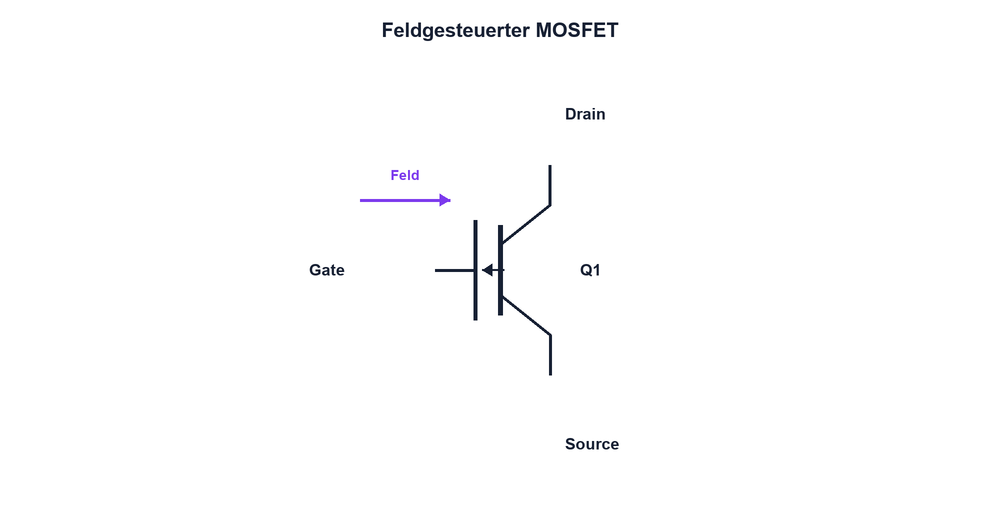

# 11.1 – MOSFET-Grundprinzip, Gate, Drain und Source

[← Zurück](../10-bipolartransistoren/07-verlustleistung-und-thermische-grenzen.md) · [Modulübersicht](README.md) · [Kursübersicht](../README.md) · [Weiter →](02-n-kanal-und-p-kanal-mosfet.md)

## Lernziele

Nach dieser Lektion kannst du:

- Gate Drain und Source funktional erklären
- feldgesteuerten Kanal beschreiben
- statischen Gate-Strom und dynamische Gate-Ladung unterscheiden

## Einleitung

MOSFETs schalten Motoren, Heizungen, LEDs und Schaltregler mit kleinem statischem Steuerstrom. Das Gate ist jedoch kein idealer Logikeingang: Es speichert Ladung, besitzt Spannungsgrenzen und wird immer relativ zur Source beurteilt.

<!-- context-expansion-2026 -->
MOSFETs steuern einen Drain-Source-Strompfad über die Gate-Source-Spannung. Sie sind zentrale Leistungsschalter in modernen Baugruppen, reagieren aber empfindlich auf Gate-Ladung, Überspannung, parasitäre Induktivitäten und Wärme. Statischer und dynamischer Betrieb müssen getrennt beurteilt werden.

Beim Thema **MOSFET-Grundprinzip, Gate, Drain und Source** geht es deshalb nicht nur um eine einzelne Formel oder Definition. Entscheidend ist, wie sich das Prinzip im Schema erkennen, im Datenblatt beurteilen, im Aufbau messen und bei einer Abweichung systematisch überprüfen lässt.

## Theorie

<!-- theory-expansion-2026 -->
### Einordnung und Grundidee

Beim MOSFET werden Gatekreis und Leistungspfad getrennt gezeichnet. VGS beschreibt die Ansteuerung relativ zur Source, VDS die Belastung des Leistungspfads. RDS(on), Gate Charge und SOA gelten jeweils nur unter den im Datenblatt genannten Bedingungen.

**Ein MOSFET besitzt mindestens Gate `G`, Drain `D` und Source `S`; Leistungstypen können zusätzlich einen herausgeführten Body- oder Kelvin-Source-Anschluss besitzen.** Das Gate steuert den Kanal elektrisch isoliert. Drain und Source bilden den Leistungspfad, sind wegen Body-Diode und interner Struktur aber nicht beliebig austauschbar. Im Schema trägt der MOSFET üblicherweise den Referenzbezeichner `Q`.

Vor dem Einschalten werden Pinout, maximale Gate-Source-Spannung, Body-Diodenrichtung und Source-Bezug geprüft. Gerade bei High-Side-Schaltungen bewegt sich die Source-Spannung; eine scheinbar hohe Gatespannung gegen GND kann deshalb eine zu kleine oder sogar negative VGS ergeben.

### Feldgesteuerter Kanal

Beim selbstsperrenden N-Kanal-MOSFET erzeugt eine positive Gate-Source-Spannung ein elektrisches Feld unter dem isolierten Gate. Ab ausreichender Ansteuerung entsteht ein leitfähiger Kanal zwischen Drain und Source. Das Gateoxid verhindert ideal einen Gleichstrom, ist aber elektrisch empfindlich.

### Drei Spannungen

`VGS = VG − VS` steuert den Kanal. `VDS = VD − VS` liegt am Leistungspfad. Beide Spannungen müssen mit festgelegter Polarität und gemeinsamem Bezug gemessen werden. Ein Gatepegel von 5 V sagt nichts aus, wenn die Source ebenfalls auf 5 V liegt.

### Gate als Ladungsspeicher

Im stationären Zustand fliesst fast kein Gate-Strom. Beim Ein- und Ausschalten muss die Gatekapazität jedoch geladen beziehungsweise entladen werden. Kurze hohe Treiberströme bestimmen die Schaltzeit. Ein Gate-Pulldown verhindert Schweben während Reset oder abgezogenem Treiber.

Die integrierte Body-Diode gehört zur Struktur. Sie kann Strom in einer Richtung führen, ersetzt aber nicht automatisch eine passend dimensionierte Freilaufdiode.

## Anwendungsfall

Typische elektronische Anwendungen und Baugruppen für dieses Thema sind:

- Schalten von Motor, Heizung und LED
- Synchrone Gleichrichtung
- Leistungsschalter in Buck- und Boost-Reglern

In einer konkreten Entwicklung wird nicht nur geprüft, ob die gewünschte Funktion grundsätzlich entsteht. Ebenso wichtig sind zulässige Grenzwerte, Toleranzen, Temperatur, Messbarkeit und das Verhalten bei Unterbruch, Kurzschluss oder falscher Ansteuerung.

## Anschauliches Beispiel

Das Gate ist wie eine isolierte Klappe, die durch elektrische Ladung verstellt wird. Zum Halten braucht sie ideal kaum Kraft, aber zum schnellen Bewegen muss Ladung zügig hinein- und hinausgebracht werden.

## Berechnungsbeispiel

Hat ein MOSFET für den betrachteten Übergang eine Gate-Ladung von 20 nC und liefert der Treiber im Mittel 100 mA, ergibt sich grob `t = QG/IG = 20 nC/0,1 A = 200 ns`. Nichtlineare Ladekurve und Miller-Plateau werden später genauer betrachtet.

## Praxisbezug

Miss Gate und Drain eines strombegrenzten Low-Side-Schalters. Verwende kurze Masseverbindungen und berühre ein ungeschütztes Gate nicht ohne ESD-Massnahmen.

## 🔗 Hardware ↔ Firmware

Firmware setzt den GPIO, doch der Treiber lädt das Gate. Pinmodus, Resetphase, PWM-Frequenz und Totzeit bestimmen gemeinsam, wann der reale Leistungspfad leitet.

## Merksatz

> Der MOSFET wird durch VGS gesteuert; das Gate braucht kaum Haltestrom, aber Ladestrom beim Umschalten.

## Häufige Fehler und Missverständnisse

- Gatepegel gegen GND statt gegen Source beurteilen
- Gate offen lassen
- Body-Diode als universellen Schutz ansehen
- fehlenden DC-Gatestrom mit fehlender Treiberleistung verwechseln

## Zusammenfassung

Das Gatefeld formt den Kanal. VGS steuert, VDS belastet und Gate-Ladung bestimmt die Dynamik.

## Übungsfragen

1. Welche Spannung steuert den Kanal?
2. Warum braucht das Gate einen Pulldown?
3. Was ist die Body-Diode?
4. Wovon hängt die Schaltzeit ab?

Weitere Aufgaben: [Übungen zu Modul 11](../uebungen/modul-11.md).

## Bezug Bildungsplan 2026

- Handlungskompetenzen: `b1-LK01–04`, `b4-LK01–10`, `c1`
- Nachweise: Gate- und Drainmessung am sicheren Low-Side-Aufbau; [Kompetenzmatrix](../bildungsplan-2026/kompetenzmatrix.md)
