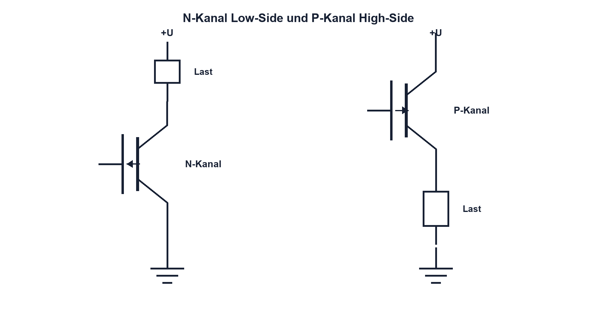

# 11.2 – N-Kanal- und P-Kanal-MOSFET

[← Zurück](01-mosfet-grundprinzip-gate-drain-und-source.md) · [Modulübersicht](README.md) · [Kursübersicht](../README.md) · [Weiter →](03-vgs-und-threshold-spannung-richtig-verstehen.md)

## Lernziele

Nach dieser Lektion kannst du:

- N- und P-Kanal-Symbole unterscheiden
- Body-Diodenrichtung bestimmen
- geeignete Low- und High-Side-Rollen wählen

## Warum ist das wichtig?

N- und P-Kanal-Typen ermöglichen Schalten gegen GND oder Versorgung. Die Wahl beeinflusst Treiberaufwand, Verluste und Verpolpfade. Besonders beim High-Side-Schalter muss das Gate relativ zur bewegten Source angesteuert werden.

## Theorie

### N-Kanal

Ein N-Kanal-MOSFET leitet bei positiver VGS. Als Low-Side-Schalter liegt die Source nahe GND, weshalb ein 3,3- oder 5-V-Treiber leicht einen definierten Bezug erzeugt. N-Kanal-Typen erreichen bei gleicher Chipfläche oft kleineren RDS(on) als P-Kanal-Typen.

### P-Kanal

Ein P-Kanal-MOSFET leitet bei negativer VGS. Als High-Side-Schalter liegt seine Source an Plus; zum Einschalten wird das Gate nach unten gezogen. Zum Ausschalten muss es auf Sourcepotential zurückkehren. Die maximal zulässige VGS darf auch bei hoher Versorgung nicht überschritten werden.

### Body-Diode und Rückspeisung

Die Body-Diode legt eine natürliche Stromrichtung fest. Bei Verpolschutz, Halbbrücken und mehreren Versorgungen kann sie unerwartete Rückspeisung zulassen. Ein ausgeschalteter MOSFET sperrt daher nicht grundsätzlich in beiden Richtungen; dafür sind Back-to-Back-MOSFETs nötig.

## Anschauliches Beispiel

N- und P-Kanal sind wie Türen mit entgegengesetzter Betätigungsrichtung. Beide können einen Gang öffnen, doch Griffseite, Scharnier und Notdurchgang – die Body-Diode – unterscheiden sich.

## Berechnungsbeispiel

Beim P-Kanal liegt VS = 12 V und das Gate wird auf 0 V gezogen. Dann wäre `VGS = −12 V`. Ist nur ±8 V erlaubt, ist die Schaltung unzulässig; Gateklemme oder anderer Treiber ist nötig.

## Praxisbezug

Bestimme mit Diodentest die Body-Diodenrichtung eines spannungsfreien Bauteils und gleiche Pinbelegung mit dem Datenblatt ab. Gehäusegleiche MOSFETs können unterschiedliche Pinouts besitzen.

## 🔗 Hardware ↔ Firmware

Ein High-Side-P-Kanal-Schalter wird oft Active-Low angesteuert. Firmwareabstraktion sollte `LOAD_ON` statt nur `PIN_LOW` ausdrücken und den sicheren Resetzustand prüfen.

## Merksatz

> Kanaltyp, Sourcepotential und Body-Diode bestimmen Ansteuerung und Strompfad.

## Häufige Fehler und Missverständnisse

- P-Kanal mit positiver VGS einschalten wollen
- Body-Diodenrichtung vergessen
- Pinout aus Gehäuseform ableiten
- ausgeschalteten MOSFET als bidirektional sperrend annehmen

## Zusammenfassung

N-Kanal eignet sich besonders für verlustarme Low-Side-Pfade, P-Kanal vereinfacht moderate High-Side-Anwendungen. Body-Diode und VGS-Grenze bleiben zentral.

## Übungsfragen

1. Warum ist N-Kanal Low-Side einfach?
2. Wie schaltet P-Kanal ein?
3. Wann braucht es Back-to-Back-MOSFETs?
4. Welche Firmwarelogik ist Active-Low?

Weitere Aufgaben: [Übungen zu Modul 11](../uebungen/modul-11.md).

## Bezug Bildungsplan 2026

- Handlungskompetenzen: `b1-LK01–06`, `b4-LK01–08`, `c1`
- Nachweise: korrekte Auswahl und Strompfadanalyse; [Kompetenzmatrix](../bildungsplan-2026/kompetenzmatrix.md)
