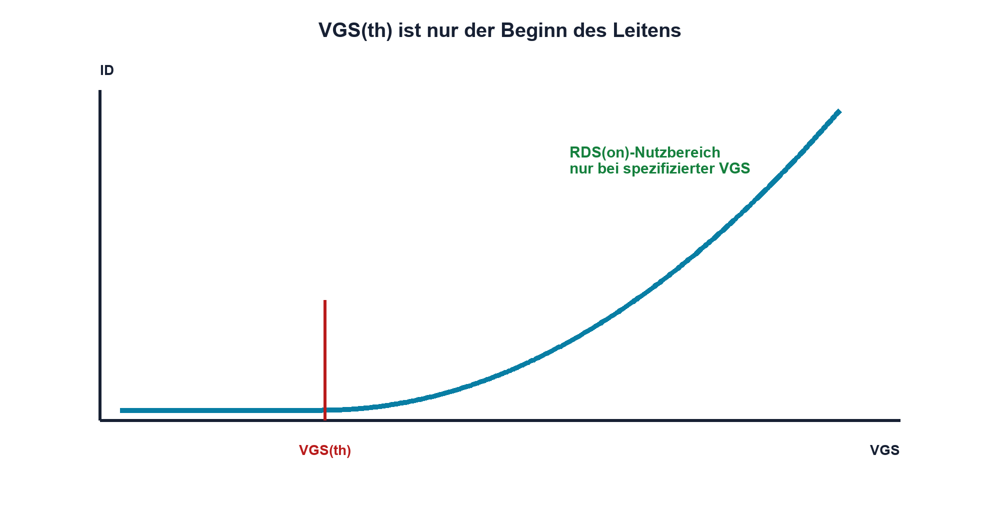

# 11.3 – VGS und Threshold-Spannung richtig verstehen

[← Zurück](02-n-kanal-und-p-kanal-mosfet.md) · [Modulübersicht](README.md) · [Kursübersicht](../README.md) · [Weiter →](04-rds-on-kennfelder-und-sichere-betriebsbereiche.md)

## Lernziele

Nach dieser Lektion kannst du:

- VGS(th) als Messbedingung erklären
- Logic-Level-Eignung aus RDS(on)-Bedingungen prüfen
- Temperatur- und Exemplarstreuung berücksichtigen

## Warum ist das wichtig?

VGS(th) wird häufig als «voll eingeschaltet» missverstanden. Tatsächlich beschreibt sie meist nur den Beginn eines sehr kleinen Prüfstroms. Ein Leistungs-MOSFET kann bei VGS(th) noch fast seine gesamte Lastspannung tragen und überhitzen.

## Theorie

### Definition im Datenblatt

VGS(th) wird bei einem kleinen festgelegten Drainstrom und bestimmtem VDS gemessen. Min/Max-Werte zeigen starke Streuung. Die Grösse eignet sich zum Abschätzen des Ausschaltbereichs, nicht zur Verlustdimensionierung im Ein-Zustand.

### Was «Logic Level» beweist

Entscheidend ist ein garantierter RDS(on) bei der tatsächlich verfügbaren VGS, beispielsweise 2,5 V, 4,5 V oder 10 V. Fehlt eine Spezifikation bei 3,3 V, beweist ein typischer Kennlinienpunkt keine sichere 3,3-V-Ansteuerung. Gateabfall im MCU und Sourceanhebung werden berücksichtigt.

### Temperatur

VGS(th) sinkt häufig mit Temperatur, während RDS(on) steigt. Das erleichtert nicht automatisch das Schalten: Für Leitverlust zählt der heisse RDS(on)-Wert. Transferkennlinien sind typische, keine garantierten Kurven.

## Anschauliches Beispiel

VGS(th) ist wie der Punkt, an dem ein Wasserhahn gerade zu tropfen beginnt. Daraus folgt nicht, dass er genügend geöffnet ist, um einen Eimer schnell zu füllen.

## Berechnungsbeispiel

Ein MOSFET ist bei VGS = 4,5 V mit maximal 40 mΩ spezifiziert, nicht aber bei 3,3 V. Bei 5 A wären selbst 40 mΩ bereits `Pcond = I²·R = 1,0 W`; für 3,3 V fehlt eine garantierte Grundlage. Ein anderer Typ oder Treiber wird gewählt.

## Praxisbezug

Messe ID und VDS bei mehreren sicheren VGS-Werten mit Strombegrenzung. Die Messung charakterisiert nur dieses Exemplar und ersetzt keine garantierte Datenblattangabe.

## 🔗 Hardware ↔ Firmware

Ein GPIO-High kann unter Last kleiner als die Versorgung sein. Open-Drain, Reset und Bootloader können das Gate anders treiben als die Anwendung. Diese Zustände gehören zur Hardwarefreigabe.

## Merksatz

> VGS(th) bedeutet Beginn des Leitens – vollständig eingeschaltet belegt nur RDS(on) bei der realen Gate-Spannung.

## Häufige Fehler und Missverständnisse

- VGS(th) als Ansteuerspannung wählen
- typische Kurve als Garantie lesen
- RDS(on)-Temperaturanstieg ignorieren
- GPIO-High mit idealer Versorgung gleichsetzen

## Zusammenfassung

Threshold und voll leitender Zustand sind getrennt. Garantierter RDS(on), Temperatur und reale VGS entscheiden.

## Übungsfragen

1. Wie wird VGS(th) gemessen?
2. Woran erkennst du 3,3-V-Eignung?
3. Warum steigt Leitverlust warm?
4. Was misst du am GPIO unter Last?

Weitere Aufgaben: [Übungen zu Modul 11](../uebungen/modul-11.md).

## Bezug Bildungsplan 2026

- Handlungskompetenzen: `b1-LK01–04`, `b4-LK01–08`, `c1`
- Nachweise: korrekte Datenblattinterpretation ohne Threshold-Fehlschluss; [Kompetenzmatrix](../bildungsplan-2026/kompetenzmatrix.md)
