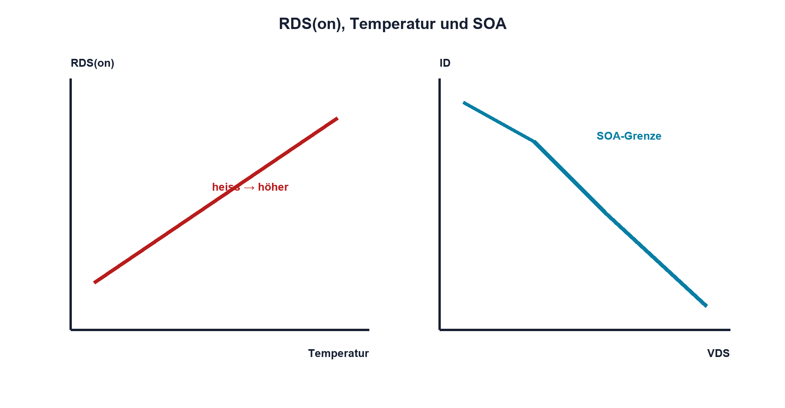

# 11.4 – RDS(on), Kennfelder und sichere Betriebsbereiche

[← Zurück](03-vgs-und-threshold-spannung-richtig-verstehen.md) · [Modulübersicht](README.md) · [Kursübersicht](../README.md) · [Weiter →](05-gate-kapazitaet-gate-charge-und-treiber.md)

## Lernziele

Nach dieser Lektion kannst du:

- Leitverluste mit RDS(on) berechnen
- Kennfelder und Maximalwerte unterscheiden
- MOSFET-SOA für linear und gepulst prüfen

## Warum ist das wichtig?

Ein kleiner RDS(on) reduziert Leitverluste, sagt aber nicht alles über Schaltbetrieb, Kühlung oder linearen Betrieb. Datenblattwerte gelten bei definierter VGS und Temperatur; die Sperrschicht kann während eines Pulses viel heisser werden als das Gehäuse.

## Theorie

### Leitender Kanal

Im ohmschen Bereich gilt näherungsweise `VDS = ID·RDS(on)` und `Pcond = IDrms²·RDS(on)`. Für Worst Case wird der maximale heisse Widerstand verwendet, nicht der typische 25-°C-Wert.

### Kennfelder

Ausgangskennlinien zeigen ID über VDS für verschiedene VGS; Transferkurven ID über VGS. Sie erklären Verhalten, sind aber meist typisch. Absolute-Maximum-Ströme gelten nur unter thermischen Bedingungen, die kleine Gehäuse in realen Leiterplatten selten erreichen.

### Safe Operating Area

Die SOA begrenzt Kombinationen aus VDS, ID und Pulsdauer. Viele Schalt-MOSFETs sind für linearen Betrieb nur eingeschränkt geeignet. Repetitive Avalanche darf nur verwendet werden, wenn Datenblatt, Energie, Temperatur und Lebensdauer sie ausdrücklich abdecken.

## Anschauliches Beispiel

Der niedrige Rollwiderstand eines Reifens sagt nichts darüber, wie viel Last er bei hoher Geschwindigkeit und Hitze sicher trägt. RDS(on), SOA und Kühlung beantworten verschiedene Fragen.

## Berechnungsbeispiel

IDrms = 8 A und heisser `RDS(on) = 25 mΩ` ergeben `Pcond = 8²·0,025 = 1,6 W`. Bei 10 A wären es bereits 2,5 W. Leiterplatte und thermischer Pfad müssen diese Wärme abführen.

## Praxisbezug

Miss VDS im Ein-Zustand mit differenzieller oder korrekt referenzierter Methode und bestimme den effektiven Widerstand. Kleine Spannungen verlangen kurze Leitungen und möglichst Kelvin-nahe Messpunkte.

## 🔗 Hardware ↔ Firmware

Tastgrad beeinflusst Irms und Erwärmung; Stromspitzen beeinflussen SOA. Eine Software-Strombegrenzung benötigt Messlatenz und Hardwareabschaltung für schnelle Kurzschlüsse.

## Merksatz

> RDS(on) bestimmt Leitverlust nur innerhalb einer thermisch und durch SOA zulässigen Anwendung.

## Häufige Fehler und Missverständnisse

- typischen kalten RDS(on) verwenden
- ID max ohne Gehäusebedingungen übernehmen
- SOA bei linearem Betrieb ignorieren
- Drainspannung mit langer Masseschleife messen

## Zusammenfassung

Leitverlust, Temperatur und SOA werden gemeinsam geprüft. Kennlinien erklären, garantierte Tabellenwerte dimensionieren.

## Übungsfragen

1. Berechne Pcond für 6 A und 30 mΩ. Warum nutzt du den heissen Maximalwert?
2. Was zeigt die SOA?
3. Wozu dienen Kelvin-Messpunkte?

Weitere Aufgaben: [Übungen zu Modul 11](../uebungen/modul-11.md).

## Bezug Bildungsplan 2026

- Handlungskompetenzen: `b1-LK01–04`, `b4-LK01–10`, `b5`, `c1`
- Nachweise: Leitverlust- und SOA-Nachweis; [Kompetenzmatrix](../bildungsplan-2026/kompetenzmatrix.md)
