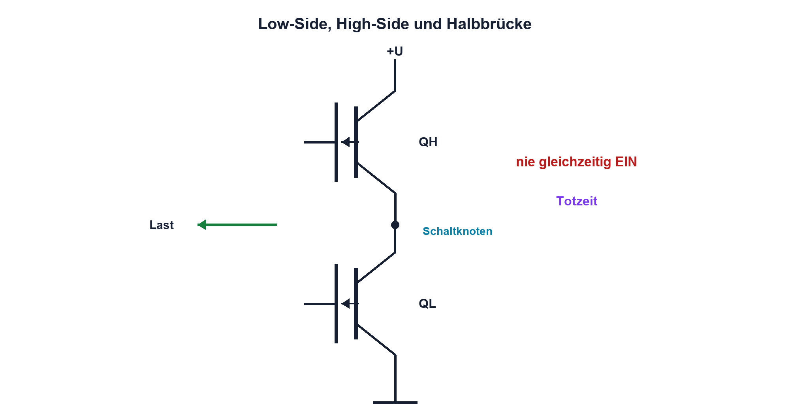

# 11.6 – Low-Side- und High-Side-Schalter

[← Zurück](05-gate-kapazitaet-gate-charge-und-treiber.md) · [Modulübersicht](README.md) · [Kursübersicht](../README.md) · [Weiter →](07-schaltverluste-thermik-und-datenblattwahl.md)

## Lernziele

Nach dieser Lektion kannst du:

- Low- und High-Side-Strompfade analysieren
- N-Kanal-High-Side-Treiber erklären
- Halbbrücke mit Totzeit sicher beurteilen

## Einleitung

Der Einbauort des Schalters bestimmt Bezugspotential, Diagnose und Treiber. Eine Halbbrücke benötigt zwei komplementäre Schalter, darf sie aber nie gleichzeitig einschalten. Schon wenige Nanosekunden falscher Überlappung können einen hohen Quer-strom erzeugen.

<!-- context-expansion-2026 -->
MOSFETs steuern einen Drain-Source-Strompfad über die Gate-Source-Spannung. Sie sind zentrale Leistungsschalter in modernen Baugruppen, reagieren aber empfindlich auf Gate-Ladung, Überspannung, parasitäre Induktivitäten und Wärme. Statischer und dynamischer Betrieb müssen getrennt beurteilt werden.

Beim Thema **Low-Side- und High-Side-Schalter** geht es deshalb nicht nur um eine einzelne Formel oder Definition. Entscheidend ist, wie sich das Prinzip im Schema erkennen, im Datenblatt beurteilen, im Aufbau messen und bei einer Abweichung systematisch überprüfen lässt.

## Theorie

<!-- theory-expansion-2026 -->
### Einordnung und Grundidee

Beim MOSFET werden Gatekreis und Leistungspfad getrennt gezeichnet. VGS beschreibt die Ansteuerung relativ zur Source, VDS die Belastung des Leistungspfads. RDS(on), Gate Charge und SOA gelten jeweils nur unter den im Datenblatt genannten Bedingungen.

### Low-Side

Beim N-Kanal-Low-Side liegt Source nahe GND. Ansteuerung und Messung sind einfach, aber die Last ist im Aus-Zustand nicht zwingend auf GND bezogen. Fehler nach Plus können unbemerkt Strom liefern.

### High-Side

Ein P-Kanal vereinfacht moderate High-Side-Pfade, besitzt aber oft höheren RDS(on). Ein N-Kanal benötigt Gate-Spannung oberhalb der Source. Bootstrap-Treiber erzeugen diese Spannung nur bei ausreichender Umschaltung und sind nicht für beliebige 100-%-Einschaltdauer geeignet.

### Halbbrücke

High- und Low-Side dürfen nicht gleichzeitig leiten. Totzeit verhindert Shoot-through, erzeugt aber Body-Diodenleitung und zusätzliche Verluste. Parasitäres Miller-Einschalten wird durch Treiberimpedanz, Layout und gegebenenfalls Miller-Clamp reduziert.

## Anwendungsfall

Typische elektronische Anwendungen und Baugruppen für dieses Thema sind:

- Ansteuerung massebezogener Lasten
- Schalten positiver Versorgungspfade
- Treiberwahl für Halbbrücken und schwebende Sources

In einer konkreten Entwicklung wird nicht nur geprüft, ob die gewünschte Funktion grundsätzlich entsteht. Ebenso wichtig sind zulässige Grenzwerte, Toleranzen, Temperatur, Messbarkeit und das Verhalten bei Unterbruch, Kurzschluss oder falscher Ansteuerung.

## Anschauliches Beispiel

Zwei Schleusentore verbinden ein Becken abwechselnd mit oben und unten. Öffnen beide gleichzeitig, entsteht ein unkontrollierter Kurzschlusskanal. Eine kurze Sicherheitswartezeit verhindert dies.

## Berechnungsbeispiel

Bei 24 V und insgesamt 50 mΩ Querpfad wären im idealisierten gleichzeitigen Einschalten `I = 24/0,05 = 480 A`. Reale Induktivität begrenzt den Anstieg, doch die Zahl zeigt, warum Totzeit und Hardwareverriegelung kritisch sind.

## Praxisbezug

Beginne mit einem einzelnen Low-Side-Schalter. Halbbrücken werden nur auf freigegebener Platine mit Strombegrenzung, isolierter/differenzieller Messung und Totzeit untersucht.

## 🔗 Hardware ↔ Firmware

Timer erzeugen komplementäre PWM und Deadtime. Ausgänge müssen bei Break-Ereignis, Reset und Debug-Halt in einen sicheren Zustand wechseln. Registerkonfiguration wird am Gate gemessen, nicht nur im Code geprüft.

## Merksatz

> High-Side-Ansteuerung folgt der Source; Halbbrücken benötigen garantierte Totzeit und sicheren Fehlerzustand.

## Häufige Fehler und Missverständnisse

- N-Kanal-High-Side mit festem GPIO treiben
- Bootstrap bei 100 % Tastgrad voraussetzen
- Totzeit nur im Mittelwert betrachten
- normale Masseklemme am schwebenden Knoten verwenden

## Zusammenfassung

Topologie bestimmt Treiber, Messung und Fehlerpfad. Halbbrücken verbinden Hardwareverriegelung, Totzeit und sorgfältiges Layout.

## Übungsfragen

1. Warum ist Low-Side einfach?
2. Was braucht ein N-Kanal-High-Side?
3. Was ist Shoot-through?
4. Wie prüfst du Totzeit?

Weitere Aufgaben: [Übungen zu Modul 11](../uebungen/modul-11.md).

## Bezug Bildungsplan 2026

- Handlungskompetenzen: `b1-LK01–06`, `b4-LK01–10`, `c1–c2`
- Nachweise: Strompfadanalyse und gemessene sichere Schaltfolge; [Kompetenzmatrix](../bildungsplan-2026/kompetenzmatrix.md)
