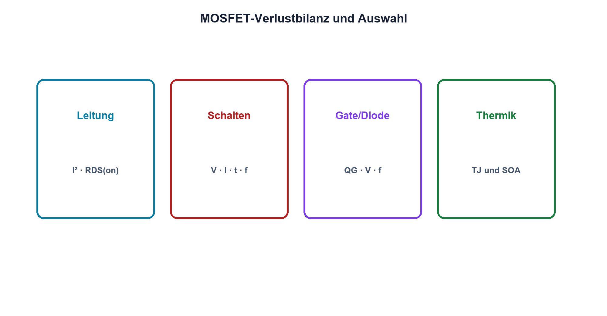

# 11.7 – Schaltverluste, Thermik und Datenblattwahl

[← Zurück](06-low-side-und-high-side-schalter.md) · [Modulübersicht](README.md) · [Kursübersicht](../README.md) · [Weiter →](../12-operationsverstaerker/README.md)

## Lernziele

Nach dieser Lektion kannst du:

- Leit- und Schaltverluste abschätzen
- thermischen Pfad dimensionieren
- MOSFET anhand eines vollständigen Datenblatt-Workflows auswählen

## Einleitung

Der MOSFET mit dem kleinsten RDS(on) ist nicht automatisch der beste. Grosse Chips besitzen oft mehr Gate-Ladung; geringe Leitverluste können höhere Schaltverluste und stärkeren Treiberbedarf bedeuten. Auswahl ist ein Systemkompromiss.

<!-- context-expansion-2026 -->
MOSFETs steuern einen Drain-Source-Strompfad über die Gate-Source-Spannung. Sie sind zentrale Leistungsschalter in modernen Baugruppen, reagieren aber empfindlich auf Gate-Ladung, Überspannung, parasitäre Induktivitäten und Wärme. Statischer und dynamischer Betrieb müssen getrennt beurteilt werden.

Beim Thema **Schaltverluste, Thermik und Datenblattwahl** geht es deshalb nicht nur um eine einzelne Formel oder Definition. Entscheidend ist, wie sich das Prinzip im Schema erkennen, im Datenblatt beurteilen, im Aufbau messen und bei einer Abweichung systematisch überprüfen lässt.

## Theorie

<!-- theory-expansion-2026 -->
### Einordnung und Grundidee

Beim MOSFET werden Gatekreis und Leistungspfad getrennt gezeichnet. VGS beschreibt die Ansteuerung relativ zur Source, VDS die Belastung des Leistungspfads. RDS(on), Gate Charge und SOA gelten jeweils nur unter den im Datenblatt genannten Bedingungen.

### Verlustanteile

Leitverlust ist `Pcond = IDrms²·RDS(on)`. Eine grobe Schaltverlustabschätzung lautet `Psw ≈ 1/2·VDS·ID·(tr + tf)·fs`. `tr` und `tf` sind Anstiegs- und Abfallzeit des Übergangs. Zusätzlich wirken Gateverlust, Body-Diode, Ausgangskapazität und Reverse-Recovery des Gegenpfads.

### Auswahlworkflow

Zuerst werden VDS mit Transientenreserve, ID, SOA und Gehäuse festgelegt. Danach folgen RDS(on) bei realer VGS und Temperatur, QG, Coss, Diodendaten, Avalancheangaben und thermische Widerstände. Layoutflächen und Kühlkörperbedingungen müssen zum Datenblattmodell passen.

### Verifikation

Rechnung liefert eine Erwartung. Gemessen werden VGS, VDS, Strom, Schaltzeiten und Temperatur im ungünstigen Betriebspunkt. Ringing und Überspannung dürfen Maximalwerte nicht ausnutzen. Messfehler durch Tastkopfschleife werden ausgeschlossen.

## Anwendungsfall

Typische elektronische Anwendungen und Baugruppen für dieses Thema sind:

- Wirkungsgrad und Temperatur einer Leistungsstufe
- Datenblattvergleich mehrerer Typen
- Freigabe gegen Überschwingen, SOA und Kühlung

In einer konkreten Entwicklung wird nicht nur geprüft, ob die gewünschte Funktion grundsätzlich entsteht. Ebenso wichtig sind zulässige Grenzwerte, Toleranzen, Temperatur, Messbarkeit und das Verhalten bei Unterbruch, Kurzschluss oder falscher Ansteuerung.

## Anschauliches Beispiel

Ein Lastwagen mit sehr niedrigem Rollwiderstand kann schwer und langsam zu beschleunigen sein. Ebenso tauscht ein grosser MOSFET oft kleinen RDS(on) gegen hohe Gate- und Ausgangsladung.

## Berechnungsbeispiel

24 V, 5 A, tr + tf = 100 ns und 50 kHz ergeben `Psw ≈ 0,5·24·5·100 ns·50 kHz = 0,30 W`. Bei 20 mΩ und 5 A RMS kommen 0,50 W Leitverlust hinzu; weitere Anteile fehlen noch.

## Praxisbezug

Erstelle für zwei Kandidaten eine Vergleichstabelle. Baue nur den freigegebenen Typ auf und gleiche Verlustabschätzung mit Temperatur und Oszillogrammen ab.

## 🔗 Hardware ↔ Firmware

Frequenz, Tastgrad, Stromgrenze und Betriebsmodi stammen aus Firmware. Jede Änderung kann Verlustbilanz und SOA verändern und benötigt einen Regressionstest der Hardware.

## Merksatz

> MOSFET-Auswahl ist die gemeinsame Optimierung von Spannung, Strom, SOA, RDS(on), Ladung, Treiber und Wärme.

## Häufige Fehler und Missverständnisse

- nur RDS(on) vergleichen
- typische Werte als Garantie nutzen
- Übergangszeit aus idealer PWM ableiten
- Temperatur ohne Worst Case messen

## Zusammenfassung

Leit- und Schaltverluste ergänzen sich. Datenblattwahl, Layout, Treiber, Firmware und Messung bilden eine Einheit.

## Übungsfragen

1. Welche zwei Hauptverluste gibt es?
2. Berechne Psw bei verdoppelter fs. Warum kann kleiner RDS(on) mehr QG bedeuten?
3. Welche Messungen schliessen die Auswahl ab?

Weitere Aufgaben: [Übungen zu Modul 11](../uebungen/modul-11.md).

## Bezug Bildungsplan 2026

- Handlungskompetenzen: `b1-LK01–04`, `b4-LK01–10`, `b5`, `c1–c2`
- Nachweise: vollständiger MOSFET-Datenblattvergleich und Verlustnachweis; [Kompetenzmatrix](../bildungsplan-2026/kompetenzmatrix.md)
