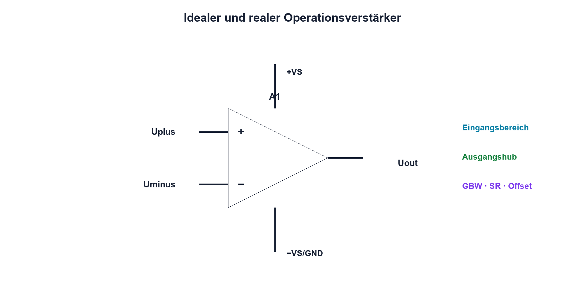

# 12.1 – Grundprinzip, idealer und realer OPV

[← Zurück](../11-mosfets/07-schaltverluste-thermik-und-datenblattwahl.md) · [Modulübersicht](README.md) · [Kursübersicht](../README.md) · [Weiter →](02-gegenkopplung-und-spannungsfolger.md)

## Lernziele

Nach dieser Lektion kannst du:

- Differenzeingang und Ausgang erklären
- ideales Modell sinnvoll anwenden
- Eingangs- und Ausgangsgrenzen realer OPVs erkennen

## Warum ist das wichtig?

Operationsverstärker verstärken, filtern, puffern und vergleichen Sensorsignale. Ihr Symbol wirkt einfach, doch die Ausgangsspannung hängt von Versorgung, Gegenkopplung, Eingangsbereich, Last und Geschwindigkeit ab. Das ideale Modell ist nützlich, solange seine Voraussetzungen geprüft werden.

## Theorie

### Differenzverstärker mit hoher Leerlaufverstärkung

Ein OPV erzeugt grundsätzlich `Uout = A0·(Uplus − Uminus)`. A0 ist sehr gross und frequenzabhängig. Ohne Gegenkopplung genügt eine winzige Differenz, um den Ausgang an eine Versorgunggrenze zu treiben.

Im idealen Modell gilt unendliche Leerlaufverstärkung, unendlicher Eingangswiderstand, null Ausgangswiderstand und unbegrenzte Bandbreite. Daraus folgt bei stabiler negativer Gegenkopplung näherungsweise `Uplus ≈ Uminus` und nahezu kein Eingangsstrom. Diese «goldenen Regeln» sind Ergebnisse eines funktionierenden Regelkreises, keine universellen Bauteilgesetze.

### Reale Grenzen

Common-Mode-Eingangsbereich, Ausgangshub, Kurzschlussstrom, Versorgungsspannung, Verstärkungs-Bandbreiten-Produkt, Offset und Biasströme begrenzen die Schaltung. Ein OPV kann am Eingang ausserhalb seines zulässigen Bereichs liegen, obwohl die Ausgangsspannung rechnerisch plausibel erscheint.

## Anschauliches Beispiel

Ein sehr empfindlicher Steuermann vergleicht Soll- und Istkurs und bewegt das Ruder stark. Nur mit Rückmeldung hält er den Kurs; ohne sie fährt das Ruder rasch an einen Anschlag.

## Berechnungsbeispiel

Bei A0 = 100000 würden bereits 100 µV Differenz ideal 10 V Ausgang verlangen. An einer 5-V-Versorgung kann das nicht entstehen; der Ausgang sättigt. Die Rechnung zeigt, warum Gegenkopplung nötig ist.

## Praxisbezug

Prüfe Versorgungspins und Ruhestrom, bevor Signale angelegt werden. Vergleiche einen für Single-Supply geeigneten OPV mit einem Typ, dessen Eingangsbereich GND nicht einschliesst – ausschliesslich innerhalb der Datenblattgrenzen.

## 🔗 Hardware ↔ Firmware

Der ADC sieht nur den realen Ausgang. Firmware kann Sättigung als plausiblen Maximalcode missverstehen. Diagnosegrenzen sollten Offset, Versorgung und erlaubten Ausgangshub berücksichtigen.

## Merksatz

> Das ideale OPV-Modell gilt nur innerhalb von Versorgung, Eingangsbereich, Ausgangshub, Bandbreite und stabiler Gegenkopplung.

## Häufige Fehler und Missverständnisse

- Uplus gleich Uminus ohne Gegenkopplung annehmen
- Versorgungspins im Schema vergessen
- Rail-to-Rail ungeprüft voraussetzen
- Sättigung als gültiges Messsignal behandeln

## Zusammenfassung

Der OPV verstärkt Eingangsdifferenz sehr stark. Gegenkopplung macht daraus eine definierte Funktion; reale Grenzen müssen vor jeder Rechnung geprüft werden.

## Übungsfragen

1. Was verstärkt der OPV?
2. Wann gilt Uplus ungefähr Uminus?
3. Welche vier Grenzen prüfst du?
4. Wie erkennt Firmware Sättigung?

Weitere Aufgaben: [Übungen zu Modul 12](../uebungen/modul-12.md).

## Bezug Bildungsplan 2026

- Handlungskompetenzen: `b1-LK01–06`, `b4-LK01–08`, `c1`
- Nachweise: Grenzprüfung am realen OPV-Datenblatt; [Kompetenzmatrix](../bildungsplan-2026/kompetenzmatrix.md)
