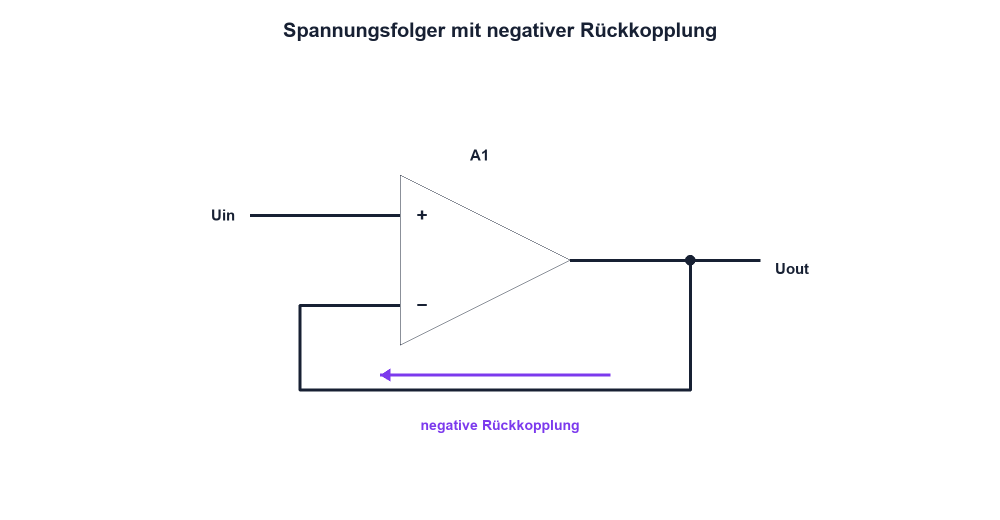

# 12.2 – Gegenkopplung und Spannungsfolger

[← Zurück](01-grundprinzip-idealer-und-realer-opv.md) · [Modulübersicht](README.md) · [Kursübersicht](../README.md) · [Weiter →](03-nichtinvertierender-verstaerker.md)

## Lernziele

Nach dieser Lektion kannst du:

- negative Gegenkopplung als Regelkreis erklären
- Spannungsfolger analysieren
- Stabilität und kapazitive Last beurteilen

## Einleitung

Der Spannungsfolger verstärkt die Spannung nicht, aber er entkoppelt eine hochohmige Quelle von einer Last. Gleichzeitig zeigt er am klarsten, wie der OPV seinen Ausgang so nachführt, dass die Eingangsdifferenz klein wird.

<!-- context-expansion-2026 -->
Operationsverstärker formen analoge Signale mithilfe sehr hoher Leerlaufverstärkung und gezielter Rückkopplung. Das Schaltbild legt die gewünschte Funktion fest; Versorgung, Eingangsbereich, Ausgangshub und Bandbreite bestimmen, ob der reale Baustein diese Funktion auch erfüllen kann.

Beim Thema **Gegenkopplung und Spannungsfolger** geht es deshalb nicht nur um eine einzelne Formel oder Definition. Entscheidend ist, wie sich das Prinzip im Schema erkennen, im Datenblatt beurteilen, im Aufbau messen und bei einer Abweichung systematisch überprüfen lässt.

## Theorie

<!-- theory-expansion-2026 -->
### Einordnung und Grundidee

Ein OPV wird als Regelkreis gelesen: Der Ausgang verändert über die Rückkopplung die Eingangsdifferenz. Zuerst wird die gewünschte Wirkung des Rückkopplungsnetzes bestimmt, danach werden Common Mode, Ausgangshub, Stabilität und Dynamik des realen Bausteins geprüft.

### Geschlossener Regelkreis

Beim Spannungsfolger liegt Uout direkt am invertierenden Eingang; das Signal treibt den nichtinvertierenden Eingang. Ist Uout zu klein, wird Uplus − Uminus positiv und der Ausgang steigt. Ist er zu gross, sinkt er. Negative Rückkopplung korrigiert die Abweichung.

Ideal gilt `Uout = Uin`. Der Eingang belastet die Quelle kaum, der Ausgang liefert den Laststrom. Real bleiben Offset, Biasstrom, Ausgangsstromgrenze, Ausgangswiderstand und Bandbreite.

### Stabilität

Nicht jeder OPV ist bei Verstärkung 1 stabil. Kapazitive Last erzeugt zusätzliche Phase und kann Überschwingen oder Oszillation verursachen. Datenblattangaben zu Unity-Gain-Stabilität, Lastkapazität und empfohlenem Serienwiderstand sind verbindlich. Versorgung erhält lokale Abblockkondensatoren mit kurzem Rückweg.

## Anwendungsfall

Typische elektronische Anwendungen und Baugruppen für dieses Thema sind:

- Impedanzwandlung vor einem ADC
- Entkopplung hochohmiger Sensoren
- Rückkopplung in Regel- und Verstärkerstufen

In einer konkreten Entwicklung wird nicht nur geprüft, ob die gewünschte Funktion grundsätzlich entsteht. Ebenso wichtig sind zulässige Grenzwerte, Toleranzen, Temperatur, Messbarkeit und das Verhalten bei Unterbruch, Kurzschluss oder falscher Ansteuerung.

## Anschauliches Beispiel

Ein Tempomat vergleicht Soll- und Istgeschwindigkeit. Er liefert die nötige Motorleistung, damit die Geschwindigkeit folgt, ohne dass der Bedienknopf selbst Leistung liefern muss.

## Berechnungsbeispiel

Eine 100-kΩ-Quelle wird direkt von einer 10-kΩ-Last belastet; der ideale Teiler liefert nur 9,1 % der Quellenspannung. Ein geeigneter Spannungsfolger dazwischen entlastet die Quelle, sofern Ausgangsstrom und Bereiche eingehalten werden.

## Praxisbezug

Vergleiche Quellenspannung mit und ohne Last sowie mit Puffer. Prüfe Sprungantwort zunächst ohne, dann mit kleiner freigegebener Kapazität und beobachte Überschwingen.

## 🔗 Hardware ↔ Firmware

Vor einem ADC senkt der Puffer die Quellimpedanz und lädt die Sample-and-Hold-Kapazität schneller. Einschwingzeit nach Kanalwechsel und OPV-Stabilität bleiben messbare Hardwaregrössen.

## Merksatz

> Der Spannungsfolger liefert Stromverstärkung und Entkopplung; Stabilität bei Verstärkung 1 muss im Datenblatt bestätigt sein.

## Häufige Fehler und Missverständnisse

- keinen Nutzen bei Verstärkung 1 sehen
- kapazitive Last beliebig erhöhen
- Unity-Gain-Stabilität voraussetzen
- Versorgung nicht lokal entkoppeln

## Zusammenfassung

Negative Gegenkopplung zwingt Uout zur Nachführung. Der Puffer schützt die Quelle, benötigt aber Ausgangsreserve und Stabilität.

## Übungsfragen

1. Wie wirkt negative Rückkopplung?
2. Was entkoppelt der Puffer?
3. Warum kann CLast schwingen?
4. Was verbessert er vor einem ADC?

Weitere Aufgaben: [Übungen zu Modul 12](../uebungen/modul-12.md).

## Bezug Bildungsplan 2026

- Handlungskompetenzen: `b1-LK01–06`, `b4-LK01–10`, `c1–c2`
- Nachweise: Belastungs- und Sprungantwortvergleich; [Kompetenzmatrix](../bildungsplan-2026/kompetenzmatrix.md)
