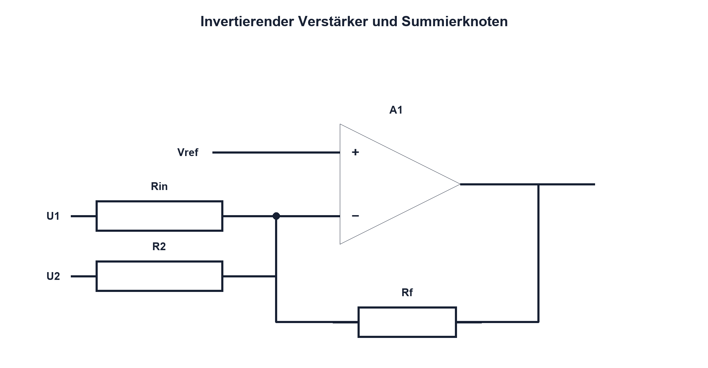

# 12.4 – Invertierender Verstärker und Summierer

[← Zurück](03-nichtinvertierender-verstaerker.md) · [Modulübersicht](README.md) · [Kursübersicht](../README.md) · [Weiter →](05-differenzverstaerker.md)

## Lernziele

Nach dieser Lektion kannst du:

- invertierende Verstärkung herleiten
- virtuellen Bezug korrekt erklären
- mehrere Eingangssignale gewichtet summieren

## Warum ist das wichtig?

Die invertierende Schaltung ermöglicht präzise Widerstandsverhältnisse, Stromsummierung und Offsetaddition. Der Eingang liegt jedoch nicht hochohmig am Signal; R1 bestimmt die Last. Der «virtuelle Massepunkt» darf niemals als reale Stromsenke missverstanden werden.

## Theorie

### Virtueller Bezug

Der nichtinvertierende Eingang liegt auf Vref. Negative Gegenkopplung hält den invertierenden Eingang näherungsweise ebenfalls auf Vref. Da fast kein Strom in den Eingang fliesst, muss der Strom durch Rin über Rf zum Ausgang weiterfliessen.

Für Vref = 0 gilt `Av = −Rf/Rin`. Das Minuszeichen beschreibt die Phasendrehung. Für mehrere Eingänge gilt ideal `Uout = −Rf·(U1/R1 + U2/R2 + ...)`, bezogen auf die gewählte Referenz.

### Reale Grenzen

Rin ist zugleich Eingangswiderstand. Quellenwiderstand verändert die Verstärkung. Grosse Widerstände erhöhen Bias- und Rauschfehler; kleine belasten Quelle und Ausgang. Alle Summensignale müssen innerhalb des Ausgangshubs bleiben.

## Anschauliches Beispiel

Mehrere Zuflüsse treffen an einem Knoten ein. Weil am Eingang des OPV nichts verschwinden darf, muss der Ausgang über den Rückkopplungsweg genau den Gegenstrom liefern. Der Knoten bleibt dadurch nahezu auf Referenzpegel.

## Berechnungsbeispiel

Rin = 10 kΩ und Rf = 47 kΩ ergeben Av = −4,7. Bei Uin = 0,4 V wären ideal −1,88 V nötig. Eine reine 0/3,3-V-Versorgung kann das ohne angehobene Referenz nicht ausgeben.

## Praxisbezug

Verwende bei Single Supply eine stabile Mittelreferenz. Miss Knoten, Ausgang und zwei Eingangssignale einzeln sowie gemeinsam. Prüfe, dass die Quelle durch Rin nicht unzulässig belastet wird.

## 🔗 Hardware ↔ Firmware

Ein DAC oder PWM-Tiefpass kann einen Offset in den Summierknoten einspeisen. Firmwarewerte und analoge Gewichtung müssen so begrenzt werden, dass Uout nicht sättigt.

## Merksatz

> Am virtuellen Knoten fliesst nahezu kein OPV-Eingangsstrom; die Rückkopplung erzwingt die Strombilanz.

## Häufige Fehler und Missverständnisse

- virtuelle Masse als echte Masse belasten
- Minuszeichen vergessen
- Quellenwiderstand ignorieren
- negative Ausgangsspannung bei Single Supply verlangen

## Zusammenfassung

Invertierer und Summierer wandeln Eingangsspannungen über Widerstände in Ströme und am Ausgang zurück in eine gewichtete Spannung.

## Übungsfragen

1. Was bedeutet virtueller Bezug?
2. Berechne Av für 22 kΩ und 100 kΩ. Wie wird summiert?
3. Warum braucht Single Supply oft Vref?

Weitere Aufgaben: [Übungen zu Modul 12](../uebungen/modul-12.md).

## Bezug Bildungsplan 2026

- Handlungskompetenzen: `a3`, `b1-LK02–06`, `b4-LK01–10`, `c1–c2`
- Nachweise: invertierende und summierende Messung mit Bereichsprüfung; [Kompetenzmatrix](../bildungsplan-2026/kompetenzmatrix.md)
