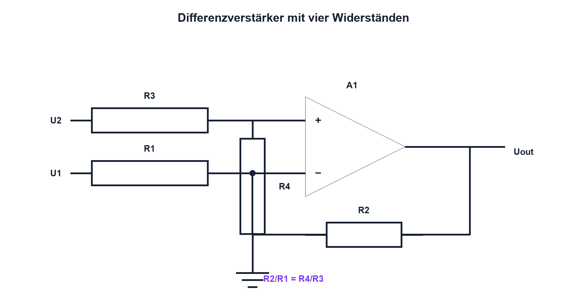

# 12.5 – Differenzverstärker

[← Zurück](04-invertierender-verstaerker-und-summierer.md) · [Modulübersicht](README.md) · [Kursübersicht](../README.md) · [Weiter →](06-komparator-und-schmitt-trigger.md)

## Lernziele

Nach dieser Lektion kannst du:

- Differenz- und Gleichtaktsignal unterscheiden
- Widerstandsverhältnisse für Differenzverstärkung dimensionieren
- CMRR und Common-Mode-Bereich prüfen

## Warum ist das wichtig?

Ein Shunt oder eine Brücke liefert eine kleine Differenz auf einem möglicherweise grossen gemeinsamen Pegel. Der Differenzverstärker soll die Differenz verstärken und den Gleichtakt unterdrücken. Schon kleine Widerstandsfehler können diese Unterdrückung stark verschlechtern.

## Theorie

### Differenz und Gleichtakt

`Udiff = U2 − U1` ist das Nutzsignal; `Ucm = (U1 + U2)/2` beschreibt den gemeinsamen Pegel. Bei paarweise gleichen Widerstandsverhältnissen gilt ideal `Uout = (R2/R1)·(U2 − U1)`.

| Zeichen | Bedeutung | Einheit |
|---|---|---|
| `Udiff` | Eingangsdifferenz | V |
| `Ucm` | Gleichtaktspannung | V |
| `CMRR` | Gleichtaktunterdrückung | dB |

### Widerstandspaarung und OPV-Grenzen

Nicht nur Einzelwerttoleranz, sondern Übereinstimmung der Verhältnisse entscheidet. Widerstandsnetzwerke verbessern Tracking. Zusätzlich müssen beide OPV-Eingänge innerhalb des Common-Mode-Bereichs bleiben; auch ein kleiner Udiff hilft nicht, wenn Ucm unzulässig ist. Für hohe Präzision und grossen Gleichtaktbereich wird ein Instrumentenverstärker geprüft.

## Anschauliches Beispiel

Zwei Personen stehen auf demselben fahrenden Lift. Gesucht ist ihr Höhenunterschied, nicht die Höhe des Lifts. Ungleiche Massstäbe lassen die Liftbewegung fälschlich als Differenz erscheinen.

## Berechnungsbeispiel

U1 = 1,20 V, U2 = 1,25 V und Verstärkung 20 ergeben ideal `Uout = 20·0,05 V = 1,0 V`. Ucm = 1,225 V muss im erlaubten Eingangsbereich liegen.

## Praxisbezug

Halte Udiff konstant und verändere Ucm innerhalb sicherer Grenzen. Miss den unerwünschten Ausgangsfehler und vergleiche Einzelwiderstände mit einem gematchten Netzwerk.

## 🔗 Hardware ↔ Firmware

ADC und Firmware können einen konstanten Offset kalibrieren. Gleichtaktabhängige, temperaturveränderliche Fehler oder Sättigung lassen sich nicht mit einem einzigen Korrekturwert beheben.

## Merksatz

> Gute Differenzmessung verlangt passende Widerstandsverhältnisse und zulässigen Gleichtaktbereich.

## Häufige Fehler und Missverständnisse

- Udiff ohne Vorzeichen definieren
- CMRR nur dem OPV zuschreiben
- Common Mode ausserhalb Bereich betreiben
- Einzelwiderstände statt Verhältnis prüfen

## Zusammenfassung

Der Differenzverstärker verstärkt U2 − U1 und unterdrückt Ucm. Widerstandstracking und OPV-Eingangsbereich bestimmen die reale Qualität.

## Übungsfragen

1. Wie berechnest du Ucm?
2. Warum sind Verhältnisfehler kritisch?
3. Wann ist ein Instrumentenverstärker besser?
4. Was kann Kalibrierung nicht lösen?

Weitere Aufgaben: [Übungen zu Modul 12](../uebungen/modul-12.md).

## Bezug Bildungsplan 2026

- Handlungskompetenzen: `a3`, `b1-LK01–06`, `b4-LK01–10`, `c1–c2`
- Nachweise: Gleichtakt- und Differenzmessung mit Fehleranalyse; [Kompetenzmatrix](../bildungsplan-2026/kompetenzmatrix.md)
