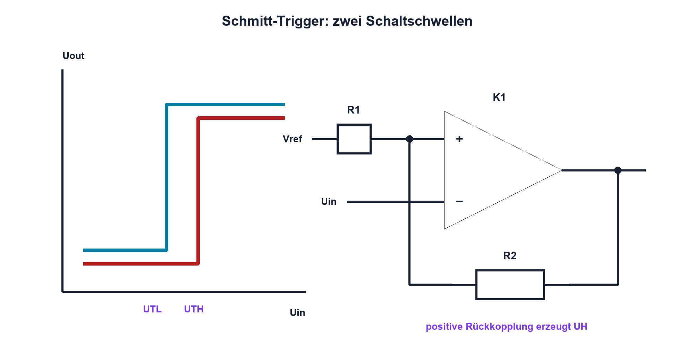

# 12.6 – Komparator und Schmitt-Trigger

[← Zurück](05-differenzverstaerker.md) · [Modulübersicht](README.md) · [Kursübersicht](../README.md) · [Weiter →](07-offset-bias-slew-rate-rail-to-rail-und-versorgung.md)

## Lernziele

Nach dieser Lektion kannst du:

- Komparator und OPV unterscheiden
- Hysterese als zwei Schaltschwellen erklären
- Pull-up und Ausgangstyp korrekt beschalten

## Einleitung

Langsam oder verrauscht durchlaufene Schwellen erzeugen ohne Hysterese viele Übergänge. Ein Schmitt-Trigger schafft getrennte Ein- und Ausschaltschwellen. Komparatoren sind dafür gebaut; ein beliebiger OPV kann in Sättigung langsam oder ausserhalb seiner Eingangsgrenzen reagieren.

<!-- context-expansion-2026 -->
Operationsverstärker formen analoge Signale mithilfe sehr hoher Leerlaufverstärkung und gezielter Rückkopplung. Das Schaltbild legt die gewünschte Funktion fest; Versorgung, Eingangsbereich, Ausgangshub und Bandbreite bestimmen, ob der reale Baustein diese Funktion auch erfüllen kann.

Beim Thema **Komparator und Schmitt-Trigger** geht es deshalb nicht nur um eine einzelne Formel oder Definition. Entscheidend ist, wie sich das Prinzip im Schema erkennen, im Datenblatt beurteilen, im Aufbau messen und bei einer Abweichung systematisch überprüfen lässt.

## Theorie

<!-- theory-expansion-2026 -->
### Einordnung und Grundidee

Ein OPV wird als Regelkreis gelesen: Der Ausgang verändert über die Rückkopplung die Eingangsdifferenz. Zuerst wird die gewünschte Wirkung des Rückkopplungsnetzes bestimmt, danach werden Common Mode, Ausgangshub, Stabilität und Dynamik des realen Bausteins geprüft.

### Offener Regelkreis

Der Komparator vergleicht Uplus und Uminus und schaltet seinen Ausgang in einen definierten Zustand. Viele Typen besitzen Open-Collector oder Open-Drain und benötigen einen Pull-up. Ausgangshigh entspricht dann der Pull-up-Spannung innerhalb der zulässigen Grenzen.

### Positive Rückkopplung

Beim Schmitt-Trigger wird ein Teil des Ausgangs auf den Vergleichseingang zurückgeführt. Dadurch entstehen obere Schwelle UTH und untere Schwelle UTL. Ihre Differenz `UH = UTH − UTL` ist die Hysterese.

Die genaue Formel hängt von Topologie, Referenz und Ausgangspegeln ab. Diese Pegel sind real und oft asymmetrisch. Widerstände werden deshalb mit den garantierten VOH/VOL- beziehungsweise Pull-up-Bedingungen berechnet.

### Dynamik

Propagationszeit, Eingangsoverdrive und Ausgangslast bestimmen Schaltzeit. Langsame Eingangsrampen können trotz Hysterese Jitter zeigen; interne Eingangsschutzstrukturen und Common Mode bleiben einzuhalten.

## Anwendungsfall

Typische elektronische Anwendungen und Baugruppen für dieses Thema sind:

- Schwellwertüberwachung und Power Good
- Taster- und Sensorsignalaufbereitung
- Erzeugen störfester Schaltpunkte mit Hysterese

In einer konkreten Entwicklung wird nicht nur geprüft, ob die gewünschte Funktion grundsätzlich entsteht. Ebenso wichtig sind zulässige Grenzwerte, Toleranzen, Temperatur, Messbarkeit und das Verhalten bei Unterbruch, Kurzschluss oder falscher Ansteuerung.

## Anschauliches Beispiel

Ein Thermostat schaltet die Heizung bei 19 °C ein und erst bei 21 °C wieder aus. Zwei Schwellen verhindern hektisches Ein- und Ausschalten um genau 20 °C.

## Berechnungsbeispiel

Ein Eingang rauscht um eine Schwelle mit ±20 mV. Eine geplante Hysterese von 100 mV bietet Reserve. Liegen die Schwellen bei 1,45 V und 1,55 V, gilt `UH = 100 mV`; ihre absolute Genauigkeit hängt von Referenz, Ausgangspegeln und Widerständen ab.

## Praxisbezug

Speise eine langsame Dreieckspannung ein und miss Ein- sowie Ausschaltschwelle. Überlagere begrenztes Rauschen und vergleiche ohne und mit Hysterese.

## 🔗 Hardware ↔ Firmware

Ein Timer-Input oder Interrupt sieht die bereinigten Flanken. Firmware-Entprellung ergänzt, aber ersetzt keine Hardwarehysterese bei schnellen Störungen oder unzulässigen Zwischenpegeln.

## Merksatz

> Hysterese schafft zwei Schwellen und verhindert Mehrfachschalten durch Rauschen nahe dem Umschaltpunkt.

## Häufige Fehler und Missverständnisse

- beliebigen OPV als schnellen Komparator nutzen
- Open-Drain ohne Pull-up betreiben
- Ausgangspegel ideal annehmen
- Hysterese und Firmwareentprellung verwechseln

## Zusammenfassung

Komparatoren entscheiden Pegel; positive Rückkopplung erzeugt robuste getrennte Schwellen. Ausgangstyp und Dynamik gehören zur Dimensionierung.

## Übungsfragen

1. Was ist UH?
2. Warum braucht Open-Drain einen Pull-up?
3. Wie misst du beide Schwellen?
4. Was ergänzt Firmware?

Weitere Aufgaben: [Übungen zu Modul 12](../uebungen/modul-12.md).

## Bezug Bildungsplan 2026

- Handlungskompetenzen: `b1-LK01–06`, `b4-LK01–10`, `c1–c2`
- Nachweise: gemessene Hysteresekennlinie und digitale Flankenprüfung; [Kompetenzmatrix](../bildungsplan-2026/kompetenzmatrix.md)
