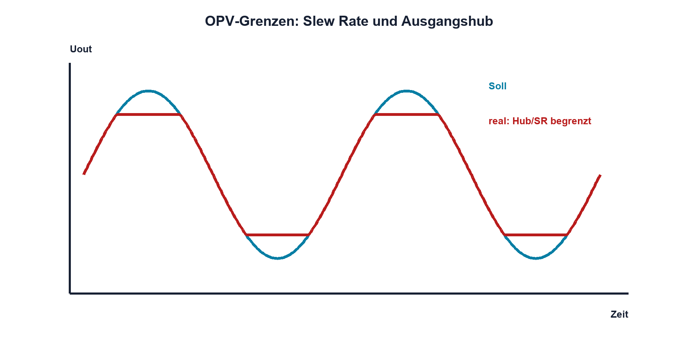

# 12.7 – Offset, Bias, Slew Rate, Rail-to-Rail und Versorgung

[← Zurück](06-komparator-und-schmitt-trigger.md) · [Modulübersicht](README.md) · [Kursübersicht](../README.md) · [Weiter →](../13-analoge-signalaufbereitung/README.md)

## Lernziele

Nach dieser Lektion kannst du:

- Offset- und Biasfehler abschätzen
- Slew Rate und GBW unterscheiden
- Rail-to-Rail-Angaben und Versorgung korrekt prüfen

## Warum ist das wichtig?

Eine OPV-Schaltung kann die ideale Verstärkung erfüllen und trotzdem falsche DC-Werte, verzerrte Flanken oder begrenzten Ausgang zeigen. Diese Abweichungen sind systematisch im Datenblatt beschrieben und entscheiden bei kleinen Sensorsignalen über die Messqualität.

## Theorie

### DC-Fehler

Eingangs-Offsetspannung VOS wirkt wie eine kleine Differenzspannung und wird mit der Noise Gain verstärkt. Biasströme erzeugen an Quell- und Rückkopplungswiderständen zusätzliche Spannungsfehler. Drift beschreibt die Änderung mit Temperatur.

### Geschwindigkeit

GBW begrenzt kleine Signale in Abhängigkeit von der Verstärkung. Slew Rate `SR = max|dUout/dt|` begrenzt grosse schnelle Signale. Für einen Sinus gilt näherungsweise `SRneeded = 2πfÛ`. Beide Bedingungen müssen erfüllt sein.

### Rail-to-Rail und Versorgung

Rail-to-Rail Input und Output sind getrennte Eigenschaften und gelten nur unter spezifizierten Lasten und Versorgungen. Der Ausgang erreicht die Schiene meist nicht exakt. Manche Eingangsstufen zeigen am Übergang erhöhte Verzerrung. Abblockkondensatoren liegen nahe an jedem Versorgungspin; Rückstrompfad und Analogmasse werden geplant.

### Auswahl

Geprüft werden Versorgung, Eingangsbereich, Ausgangshub bei Last, Offset und Drift, Bias, Rauschen, GBW, SR, Stabilität, Ruhestrom, Gehäuse und Temperaturbereich.

## Anschauliches Beispiel

Ein Aufzug kann sehr genau positionieren, aber nur innerhalb seines Schachts und mit begrenzter Geschwindigkeit. «Bis zum obersten Stock» bedeutet nicht, dass die Kabine über die Schiene hinausfahren kann.

## Berechnungsbeispiel

Ein 20-kHz-Sinus mit 4 V Spitze benötigt `SR = 2π·20 kHz·4 V ≈ 0,503 V/µs`. Ein OPV mit garantierten 0,3 V/µs verzerrt, auch wenn sein GBW rechnerisch genügen würde.

## Praxisbezug

Miss DC-Offset bei kurzgeschlossenem Eingang in korrekter Gegenkopplung, danach die Sinusantwort bei wachsender Frequenz und Amplitude. Versorgung und Ausgangshub werden gleichzeitig beobachtet.

## 🔗 Hardware ↔ Firmware

Kalibrierung kann einen stabilen Offset reduzieren. Drift, Clipping, Slew-Verzerrung und Rauschen benötigen Hardwarereserve, Temperaturmodell oder Diagnose. ADC-Referenz und OPV-Versorgung müssen gemeinsam betrachtet werden.

## Merksatz

> Ein OPV ist nur innerhalb seiner DC-, Dynamik-, Eingangs-, Ausgangs- und Versorgungsgrenzen präzise.

## Häufige Fehler und Missverständnisse

- GBW und Slew Rate gleichsetzen
- Rail-to-Rail als exakt bis zur Schiene lesen
- Biasfehler bei hohen Widerständen ignorieren
- Offsetkalibrierung gegen Clipping einsetzen

## Zusammenfassung

Offset und Bias bestimmen DC-Genauigkeit, GBW und SR die Dynamik, Eingangs- und Ausgangsbereiche den nutzbaren Spannungsraum.

## Übungsfragen

1. Was verstärkt VOS?
2. Wie unterscheidet sich SR von GBW?
3. Berechne SR für 10 kHz und 5 V Spitze. Welche Rail-to-Rail-Angabe brauchst du?

Weitere Aufgaben: [Übungen zu Modul 12](../uebungen/modul-12.md).

## Bezug Bildungsplan 2026

- Handlungskompetenzen: `a3`, `b1-LK01–04`, `b4-LK01–10`, `b5`, `c1–c2`
- Nachweise: Datenblattwahl sowie Offset- und Grosssignalmessung; [Kompetenzmatrix](../bildungsplan-2026/kompetenzmatrix.md)
