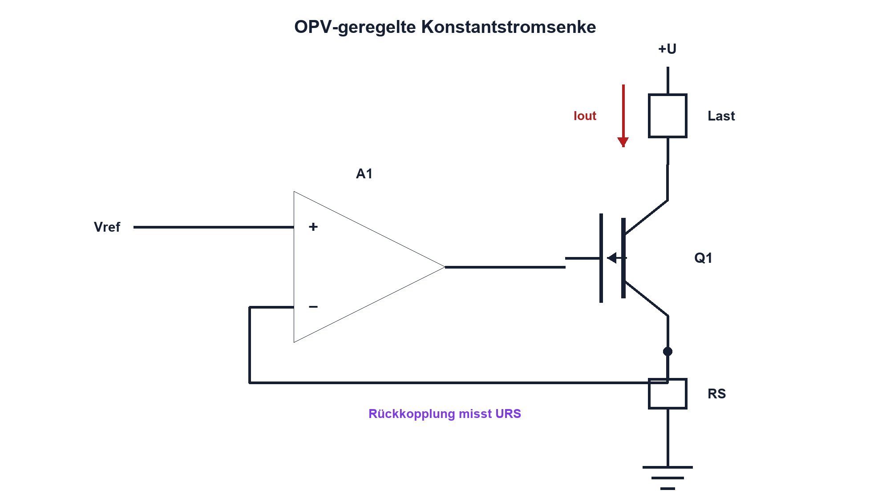

# 13.1 – Konstantstromquellen

[← Zurück](../12-operationsverstaerker/07-offset-bias-slew-rate-rail-to-rail-und-versorgung.md) · [Modulübersicht](README.md) · [Kursübersicht](../README.md) · [Weiter →](02-referenzspannungen.md)

## Lernziele

Nach dieser Lektion kannst du:

- Konstantstrom und Konstantspannung unterscheiden
- Sollstrom, Bürde und Verlustleistung dimensionieren
- eine OPV-Stromsenke samt Grenzen beurteilen

## Einleitung

Widerstandssensoren, LEDs, 4–20-mA-Schleifen und Messbrücken benötigen oft einen definierten Strom. Eine Konstantstromquelle hält diesen Strom trotz wechselnder Last möglichst stabil. Sie kann das aber nur innerhalb ihres zulässigen Spannungs- und Leistungsbereichs.

<!-- context-expansion-2026 -->
Eine analoge Messkette übersetzt eine physikalische Grösse schrittweise in einen belastbaren ADC-Code. Erregung, Bezug, Verstärkung, Filter, Schutz und Abtastung beeinflussen sich gegenseitig. Deshalb wird jede Stufe zusammen mit ihren Grenzwerten und Messpunkten betrachtet.

Beim Thema **Konstantstromquellen** geht es deshalb nicht nur um eine einzelne Formel oder Definition. Entscheidend ist, wie sich das Prinzip im Schema erkennen, im Datenblatt beurteilen, im Aufbau messen und bei einer Abweichung systematisch überprüfen lässt.

## Theorie

<!-- theory-expansion-2026 -->
### Einordnung und Grundidee

Eine Messkette wird an ihren Schnittstellen beschrieben. Für jeden Knoten werden Signalbereich, Bezug, Quellimpedanz, Last, Bandbreite, Fehlerzustand und geeigneter Messpunkt festgelegt. Dadurch bleibt nachvollziehbar, wo Verstärkung, Filterung oder Abweichung entsteht.

### Regelung statt idealer Quelle

Eine reale Konstantstromquelle misst indirekt den Strom über einen Shunt RS und regelt ein Stellglied nach. Liegt am Shunt die Referenzspannung Vref, gilt näherungsweise `Iout = Vref/RS`. Iout ist der geregelte Ausgangsstrom in Ampere, Vref die Referenzspannung in Volt und RS der Messwiderstand in Ohm.

Der OPV vergleicht die Shuntspannung mit Vref und steuert Q1. Der Strom fliesst von der Versorgung durch die Last, Q1 und RS nach GND. Der Eingangsstrom des OPV ist dabei nicht der Laststrom.

### Bürde und Verlustleistung

Die Schaltung benötigt eine Mindestspannung über Q1, RS und Leitungen. Diese Reserve heisst Compliance oder Bürdenreserve. Wird die Lastspannung zu gross, erreicht der OPV seinen Ausgangsanschlag oder Q1 verlässt den Regelbereich; der Strom sinkt. Für Q1 gilt `PQ = VDS·Iout`, für den Shunt `PRS = Iout²·RS`. Temperaturkoeffizient, Offset und Referenzfehler bestimmen die Genauigkeit.

Stromspiegel sind kompakt, hängen aber stärker von Transistorpaarung und Temperatur ab. Präzisionsquellen verwenden deshalb Rückkopplung, geeignete Referenzen und Kelvin-Anschlüsse am Shunt.

## Anwendungsfall

Typische elektronische Anwendungen und Baugruppen für dieses Thema sind:

- Erregung resistiver Sensoren
- LED- und Diodenprüfung
- 4–20-mA- und präzise Bias-Schaltungen

In einer konkreten Entwicklung wird nicht nur geprüft, ob die gewünschte Funktion grundsätzlich entsteht. Ebenso wichtig sind zulässige Grenzwerte, Toleranzen, Temperatur, Messbarkeit und das Verhalten bei Unterbruch, Kurzschluss oder falscher Ansteuerung.

## Anschauliches Beispiel

Eine Pumpe mit Durchflussregler hält Liter pro Minute konstant. Wird der Schlauch jedoch zu stark zugedrückt, reicht der Pumpendruck nicht mehr aus – genau das entspricht fehlender Bürdenreserve.

## Berechnungsbeispiel

Für 5,00 mA und Vref = 0,500 V folgt `RS = 0,500 V/0,005 A = 100 Ω`. Bei 12 V Versorgung und 1,2 kΩ Last fallen 6 V an der Last und 0,5 V am Shunt ab. Q1 muss ungefähr 5,5 V übernehmen; `PQ ≈ 27,5 mW`. Die Spannungsreserve ist plausibel.

## Praxisbezug

Variiere den Lastwiderstand und miss Iout, Shuntspannung, OPV-Ausgang und Q1-Spannung. Markiere den Punkt, an dem die Regelung die Bürdenreserve verliert.

## 🔗 Hardware ↔ Firmware

Ein DAC oder PWM-Tiefpass kann Vref vorgeben. Firmware setzt damit den Sollstrom, muss aber Maximalstrom, Einschaltzustand und Fehler wie offenen Shunt hardwareseitig absichern. Ein ADC kann die Shuntspannung überwachen.

## Merksatz

> Eine Konstantstromquelle regelt den Spannungsabfall am Shunt; ohne ausreichende Bürdenreserve kann sie den Sollstrom nicht halten.

## Häufige Fehler und Missverständnisse

- Compliance mit maximaler Versorgungsspannung verwechseln
- Q1-Verlustleistung bei kleiner Lastspannung vergessen
- OPV-Ausgangshub und Common Mode nicht prüfen
- Shunt-Leitungsabfälle als Messsignal mit erfassen

## Zusammenfassung

Der Sollstrom entsteht aus Referenz und Shunt. Lastbereich, OPV-Grenzen, Stellglied und Thermik entscheiden über den nutzbaren Regelbereich.

## Übungsfragen

1. Welche Spannung regelt der OPV?
2. Dimensioniere RS für 2 mA bei 250 mV Referenz.
3. Wann bricht der Ausgangsstrom ein?
4. Welche Fehler muss Firmware unabhängig abschalten?

Weitere Aufgaben: [Übungen zu Modul 13](../uebungen/modul-13.md).

## Bezug Bildungsplan 2026

- Handlungskompetenzen: `a2–a3`, `b1-LK01–06`, `b4-LK01–10`, `c1–c2`
- Nachweise: dimensionierte und vermessene Stromquelle mit Bürdenprüfung; [Kompetenzmatrix](../bildungsplan-2026/kompetenzmatrix.md)
