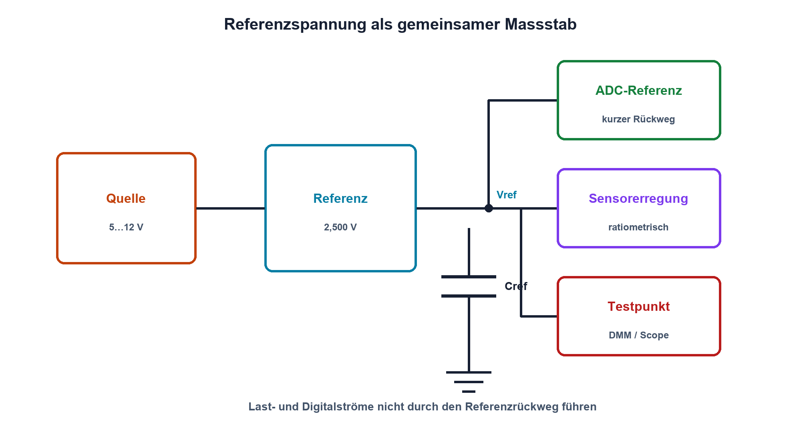

# 13.2 – Referenzspannungen

[← Zurück](01-konstantstromquellen.md) · [Modulübersicht](README.md) · [Kursübersicht](../README.md) · [Weiter →](03-brueckenschaltungen-und-wheatstone-bruecke.md)

## Lernziele

Nach dieser Lektion kannst du:

- Referenz, Versorgung und Massebezug unterscheiden
- Initialfehler, Drift, Rauschen und Lastfehler einordnen
- eine ADC-Referenz fachgerecht beschalten

## Warum ist das wichtig?

Jede Messung braucht einen Massstab. Beim ADC ist die Referenzspannung dieser Massstab: Ändert sie sich, ändern sich die Digitalwerte auch bei unverändertem Eingang. Eine saubere Referenz ist deshalb kein beliebiger Versorgungspin.

## Theorie

### Referenz als elektrischer Massstab

Eine Spannungsreferenz liefert eine möglichst stabile Spannung gegenüber einem definierten Bezug. Serienreferenzen liegen im Energiepfad zur Last; Shuntreferenzen arbeiten ähnlich einer präzisen Z-Diode und benötigen einen Vorwiderstand oder eine Stromquelle.

Wichtige Daten sind Initialtoleranz, Temperaturkoeffizient in ppm/K, Langzeitdrift, Rauschen, Mindest- und Maximalstrom, Ausgangsimpedanz und Stabilität mit Kondensatoren. Ein Temperaturkoeffizient von 10 ppm/K bedeutet pro Kelvin eine relative Änderung von `10·10⁻⁶`.

### Verteilung und Rückstrom

Referenz- und Masseleitungen führen kleine, empfindliche Ströme. Last- oder Digitalschaltströme dürfen nicht denselben Leiterabschnitt als gemeinsamen Spannungsabfall nutzen. Der Abblockkondensator liegt am Referenzpin; Typ, Wert und ESR müssen zum Datenblatt passen.

Bei ratiometrischen Messungen werden Sensor und ADC aus derselben Referenz gespeist. Eine gemeinsame Änderung kürzt sich dann weitgehend heraus. Das funktioniert nur, wenn Signal und Referenz tatsächlich proportional sind.

## Anschauliches Beispiel

Ein Lineal kann sehr fein unterteilt sein; dehnt es sich mit der Temperatur, werden alle Messwerte gemeinsam falsch. Eine Referenz ist das elektrische Lineal des Wandlers.

## Berechnungsbeispiel

Eine 2,500-V-Referenz mit 20 ppm/K erwärmt sich um 30 K. Die Driftabschätzung lautet `ΔU = 2,500 V·20·10⁻⁶/K·30 K = 1,5 mV`. Bei einem 12-Bit-ADC mit 2,5 V entspricht ein LSB rund 0,610 mV; die Drift umfasst etwa 2,5 LSB.

## Praxisbezug

Miss Referenzspannung im Leerlauf und unter zwei Lasten. Beobachte Rauschen mit kurzer Massefeder und begrenzter Bandbreite. Erwärme nur kontrolliert und dokumentiere Temperatur sowie Einschwingzeit.

## 🔗 Hardware ↔ Firmware

ADC-Berechnungen müssen die tatsächlich verwendete Vref kennen. Interne Referenzkanäle können Versorgungsschwankungen abschätzen; sie ersetzen keine schlechte Leiterführung. Kalibrierung reduziert stabile Fehler, nicht zufälliges Rauschen oder Drift ohne Temperaturinformation.

## Merksatz

> Die Referenz bestimmt den Massstab der Messung; ihre Fehler erscheinen direkt im Ergebnis.

## Häufige Fehler und Missverständnisse

- Versorgung und Präzisionsreferenz gleichsetzen
- ppm ohne Temperaturbereich verwenden
- beliebigen Ausgangskondensator einsetzen
- digitale Rückströme durch den Referenzbezug führen

## Zusammenfassung

Referenzen werden nach Genauigkeit, Drift, Rauschen, Lastbereich und Stabilität ausgewählt. Ratiometrie und saubere Rückstrompfade können Systemfehler stark reduzieren.

## Übungsfragen

1. Was bedeutet 15 ppm/K?
2. Wann hilft eine ratiometrische Messung?
3. Warum kann ein Kondensator eine Referenz destabilisieren?
4. Welche Referenz verwendet die Firmwareformel?

Weitere Aufgaben: [Übungen zu Modul 13](../uebungen/modul-13.md).

## Bezug Bildungsplan 2026

- Handlungskompetenzen: `a3`, `b1-LK01–04`, `b4-LK01–10`, `c1–c2`
- Nachweise: Drift- und Lastabschätzung einer ADC-Referenz; [Kompetenzmatrix](../bildungsplan-2026/kompetenzmatrix.md)
