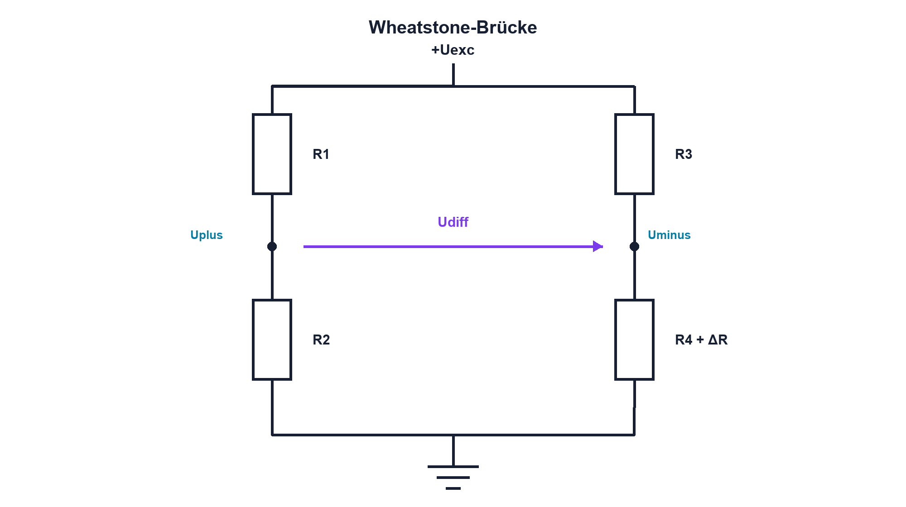

# 13.3 – Brückenschaltungen und Wheatstone-Brücke

[← Zurück](02-referenzspannungen.md) · [Modulübersicht](README.md) · [Kursübersicht](../README.md) · [Weiter →](04-sensorsignalaufbereitung.md)

## Lernziele

Nach dieser Lektion kannst du:

- Brückenausgang und Common-Mode-Pegel bestimmen
- Viertel-, Halb- und Vollbrücke unterscheiden
- kleine Widerstandsänderungen differenziell messen

## Warum ist das wichtig?

Dehnungsmessstreifen, Drucksensoren und präzise Widerstandssensoren ändern ihren Widerstand oft nur sehr wenig. Die Wheatstone-Brücke wandelt diese kleine Änderung in eine differentielle Spannung und kann gemeinsame Einflüsse teilweise kompensieren.

## Theorie

### Zwei Spannungsteiler im Vergleich

Vier Widerstände bilden zwei Spannungsteiler an der Erregerspannung Uexc. Der Ausgang ist die Differenz der beiden Mittelpunkte: `Udiff = Uplus − Uminus`. Im abgeglichenen Zustand mit gleichen Verhältnissen ist Udiff ideal null, während beide Knoten ungefähr bei Uexc/2 liegen.

Der Verstärker muss deshalb nicht nur Millivolt Differenz auflösen, sondern auch den gemeinsamen Pegel Ucm vertragen. `Ucm = (Uplus + Uminus)/2` ist der Common-Mode-Pegel.

### Sensoranordnung

Bei der Viertelbrücke ändert sich ein Widerstand, bei der Halbbrücke zwei und bei der Vollbrücke vier. Geeignete Anordnung erhöht Empfindlichkeit und kompensiert Temperatur oder unerwünschte Belastungsrichtungen. Leitungswiderstand kann mit Drei- oder Vierleitertechnik reduziert werden.

Für eine kleine Änderung ΔR an einem Widerstand gilt bei der Viertelbrücke näherungsweise `Udiff ≈ Uexc·ΔR/(4R)`. Die Näherung setzt `|ΔR| ≪ R` voraus.

## Anschauliches Beispiel

Eine Balkenwaage vergleicht zwei Seiten. Ein grosses gemeinsames Gewicht hebt sich im Vergleich auf; eine kleine Differenz kippt die Waage sichtbar.

## Berechnungsbeispiel

R = 350 Ω, ΔR = 0,35 Ω und Uexc = 5 V. Dann ist `ΔR/R = 0,001` und `Udiff ≈ 5 V·0,001/4 = 1,25 mV`. Beide Brückenknoten liegen trotzdem nahe 2,5 V – entscheidend für den Eingangsbereich des Verstärkers.

## Praxisbezug

Gleiche eine Widerstandsbrücke ab, ändere einen Zweig kontrolliert und miss beide Knoten gegen GND sowie Udiff differentiell. Vergleiche exakte Teilerrechnung und Näherung.

## 🔗 Hardware ↔ Firmware

Der ADC misst nach Verstärkung und Filterung. Firmware kann Nullpunkt und Empfindlichkeit kalibrieren, muss aber Übersteuerung, Brückenunterbruch und Common-Mode-Verletzung als Hardwarefehler erkennen.

## Merksatz

> Eine Brücke macht kleine Widerstandsänderungen als Differenz sichtbar, während ein grosser gemeinsamer Pegel bestehen bleibt.

## Häufige Fehler und Missverständnisse

- nur Udiff und nicht beide Knoten gegen GND prüfen
- Näherung für grosse ΔR verwenden
- Leitungswiderstand und Selbsterwärmung ignorieren
- Brückenpolarität nach der Montage vertauschen

## Zusammenfassung

Die Wheatstone-Brücke vergleicht zwei Teiler. Sensoranordnung, Erregung, Common Mode, Leitungsfehler und Verstärkerbereich bestimmen die nutzbare Genauigkeit.

## Übungsfragen

1. Wann ist eine Brücke abgeglichen?
2. Berechne Udiff für ΔR/R = 0,002 und Uexc = 3,3 V.
3. Warum ist Ucm wichtig?
4. Welche Fehler erkennt ein Plausibilitätstest beider Knoten?

Weitere Aufgaben: [Übungen zu Modul 13](../uebungen/modul-13.md).

## Bezug Bildungsplan 2026

- Handlungskompetenzen: `a2–a3`, `b1-LK01–06`, `b4-LK01–10`, `c1–c2`
- Nachweise: berechnete und vermessene Viertelbrücke; [Kompetenzmatrix](../bildungsplan-2026/kompetenzmatrix.md)
