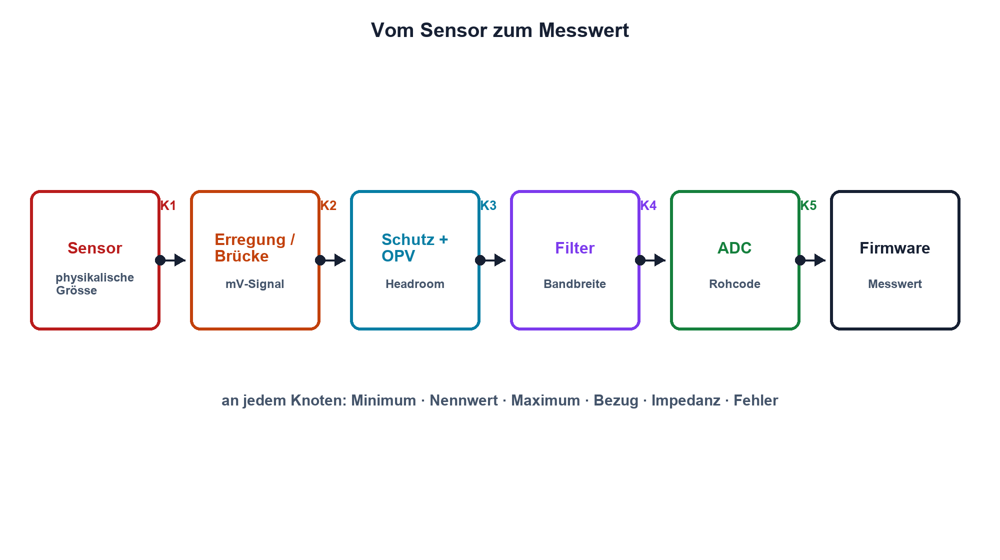

# 13.4 – Sensorsignalaufbereitung

[← Zurück](03-brueckenschaltungen-und-wheatstone-bruecke.md) · [Modulübersicht](README.md) · [Kursübersicht](../README.md) · [Weiter →](05-aktive-filter.md)

## Lernziele

Nach dieser Lektion kannst du:

- eine vollständige analoge Messkette strukturieren
- Verstärkung und Headroom aus Signalgrenzen ableiten
- ein einfaches Fehlerbudget erstellen

## Einleitung

Ein Sensor liefert selten direkt ein ideales 0–3,3-V-Signal. Er benötigt Erregung, Schutz, Verstärkung, Filterung und einen definierten ADC-Anschluss. Gute Signalaufbereitung beginnt deshalb mit Signal- und Fehlergrenzen, nicht mit einem zufälligen OPV.

<!-- context-expansion-2026 -->
Eine analoge Messkette übersetzt eine physikalische Grösse schrittweise in einen belastbaren ADC-Code. Erregung, Bezug, Verstärkung, Filter, Schutz und Abtastung beeinflussen sich gegenseitig. Deshalb wird jede Stufe zusammen mit ihren Grenzwerten und Messpunkten betrachtet.

Beim Thema **Sensorsignalaufbereitung** geht es deshalb nicht nur um eine einzelne Formel oder Definition. Entscheidend ist, wie sich das Prinzip im Schema erkennen, im Datenblatt beurteilen, im Aufbau messen und bei einer Abweichung systematisch überprüfen lässt.

## Theorie

<!-- theory-expansion-2026 -->
### Einordnung und Grundidee

Eine Messkette wird an ihren Schnittstellen beschrieben. Für jeden Knoten werden Signalbereich, Bezug, Quellimpedanz, Last, Bandbreite, Fehlerzustand und geeigneter Messpunkt festgelegt. Dadurch bleibt nachvollziehbar, wo Verstärkung, Filterung oder Abweichung entsteht.

### Von der Messgrösse zum ADC-Code

Die Kette besteht aus Sensor, Erregung, Eingangsschutz, Verstärker, Filter, Pegelanpassung, ADC-Treiber und Referenz. An jeder Schnittstelle werden Minimal-, Nenn- und Maximalwert sowie Bezugspotential festgelegt.

Die Verstärkung wird aus dem nutzbaren Eingangshub bestimmt. Reserve bleibt für Sensortoleranz, Offset, Drift, Überschwingen und Diagnosezustände. Ein Signal von 20 bis 80 mV darf daher nicht blind so verstärkt werden, dass 80 mV exakt Vollaussteuerung ergeben.

### Fehlerbudget und Schnittstellen

Offsetfehler addieren sich bezogen auf denselben Punkt; Verstärkungsfehler wirken proportional. Rauschen wird bei unabhängigen Quellen häufig quadratisch kombiniert. Für eine erste Worst-Case-Betrachtung ist eine lineare Summe konservativ und leicht nachvollziehbar.

Quellimpedanz und ADC-Sample-and-Hold-Kondensator bestimmen die Einschwingzeit. Schutzwiderstand, Filter und ADC-Treiber bilden gemeinsam ein dynamisches Netzwerk. Masseführung und Referenz gehören deshalb in dasselbe Blockdiagramm.

## Anwendungsfall

Typische elektronische Anwendungen und Baugruppen für dieses Thema sind:

- Temperatur-, Druck- und Wegmessketten
- Anpassung analoger Sensoren an 0–3,3 V
- Diagnosefähige industrielle Eingänge

In einer konkreten Entwicklung wird nicht nur geprüft, ob die gewünschte Funktion grundsätzlich entsteht. Ebenso wichtig sind zulässige Grenzwerte, Toleranzen, Temperatur, Messbarkeit und das Verhalten bei Unterbruch, Kurzschluss oder falscher Ansteuerung.

## Anschauliches Beispiel

Eine Übersetzungskette übergibt eine Botschaft von Person zu Person. Jeder Schritt kann verstärken, filtern oder verfälschen; erst ein Plan aller Übergaben zeigt, wo der Fehler entsteht.

## Berechnungsbeispiel

Ein Sensor liefert 0,10 bis 0,60 V. Für einen ADC-Bereich bis 3,3 V werden 0,20 V obere Reserve und 0,10 V Offset vorgesehen. Der nutzbare Ausgangshub ist 3,0 V; über 0,50 V Eingangsspanne ergibt sich `Av = 6`. Der Ausgang reicht ideal von 0,10 bis 3,10 V. Alle Toleranzen müssen innerhalb der Reserve bleiben.

## Praxisbezug

Erstelle vor dem Aufbau eine Tabelle für jeden Knoten: Sollbereich, Grenzbereich, Quelle, Last, Bezug und Messpunkt. Miss anschliessend in derselben Reihenfolge vom Sensor zum ADC.

## 🔗 Hardware ↔ Firmware

Die Firmware wandelt Codes mit Verstärkung, Offset und Referenz zurück in die physikalische Grösse. Rohwerte, Kalibrierparameter und Diagnosegrenzen müssen getrennt bleiben, damit Hardwarefehler nicht durch Software verdeckt werden.

## Merksatz

> Eine Messkette wird an ihren Schnittstellen entworfen: Signalbereich, Bezug, Impedanz, Fehler und Reserve müssen an jedem Knoten bekannt sein.

## Häufige Fehler und Missverständnisse

- ADC-Vollbereich ohne Reserve ausnutzen
- nur typische Sensorwerte betrachten
- Schutz und Filter getrennt vom ADC-Treiber dimensionieren
- Firmwarekalibrierung als Ersatz für ein Fehlerbudget verwenden

## Zusammenfassung

Signalaufbereitung übersetzt einen realen Sensor sicher und nachvollziehbar in den ADC-Bereich. Blockdiagramm, Knotentabelle und Fehlerbudget verbinden Theorie, Aufbau und Diagnose.

## Übungsfragen

1. Welche Blöcke gehören vor den ADC?
2. Warum braucht der Signalbereich Reserve?
3. Was steht in einer Knotentabelle?
4. Welche Daten muss Firmware unverändert protokollieren?

Weitere Aufgaben: [Übungen zu Modul 13](../uebungen/modul-13.md).

## Bezug Bildungsplan 2026

- Handlungskompetenzen: `a1–a3`, `b1-LK01–06`, `b4`, `b5`, `c1–c2`
- Nachweise: dokumentiertes Blockdiagramm mit Signal- und Fehlerbudget; [Kompetenzmatrix](../bildungsplan-2026/kompetenzmatrix.md)
