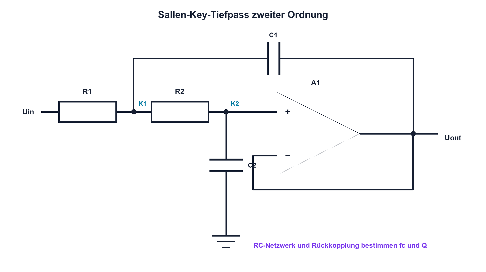

# 13.5 – Aktive Filter

[← Zurück](04-sensorsignalaufbereitung.md) · [Modulübersicht](README.md) · [Kursübersicht](../README.md) · [Weiter →](06-pegelanpassung-und-schutz.md)

## Lernziele

Nach dieser Lektion kannst du:

- aktive und passive Filter unterscheiden
- Grenzfrequenz und Güte eines aktiven Tiefpasses einordnen
- OPV-Bandbreite und Stabilität mitprüfen

## Warum ist das wichtig?

Ein passiver RC-Filter dämpft, belastet die Quelle und kann den ADC nur begrenzt treiben. Ein aktiver Filter kombiniert Frequenzselektion mit Pufferung oder Verstärkung. Dafür kommen OPV-Grenzen und Stabilität als zusätzliche Entwurfsbedingungen hinzu.

## Theorie

### Filterordnung und Polstellen

Jede Polstelle erhöht die asymptotische Dämpfung um 20 dB pro Dekade. Ein Filter zweiter Ordnung erreicht 40 dB pro Dekade. Die Güte Q bestimmt, ob der Übergang flach, überhöht oder stark gedämpft ist.

Beim Sallen-Key-Tiefpass bilden R1, R2, C1 und C2 das frequenzabhängige Netzwerk; der OPV puffert beziehungsweise verstärkt. Für gleiche Widerstände R und gleiche Kondensatoren C gilt als Grössenordnung `fc = 1/(2πRC)`. Die genaue Übertragungsfunktion und Q hängen von Topologie und Verstärkung ab.

### Reale Auslegung

Widerstands- und Kondensatortoleranzen verschieben fc und Q. Der OPV benötigt genügend GBW, Slew Rate, Eingangs- und Ausgangsbereich. Hohe Q macht die Schaltung empfindlicher und kann Überschwingen erzeugen. Vor einem ADC muss zusätzlich die Einschwingzeit nach Abtastimpulsen geprüft werden.

## Anschauliches Beispiel

Ein aktiver Filter ist wie ein Türsteher mit Verstärkeranlage: Er entscheidet, welche Frequenzen passieren, und kann die zugelassenen Signale zugleich kräftig weitergeben.

## Berechnungsbeispiel

Mit R = 10 kΩ und C = 10 nF ergibt sich als Grundfrequenz `fc ≈ 1/(2π·10 kΩ·10 nF) ≈ 1,59 kHz`. Bei ±5 % Kondensatoren muss die reale Grenzfrequenz entsprechend abweichen; Q benötigt eine separate Toleranzprüfung.

## Praxisbezug

Speise Sinuswerte unterhalb, nahe und oberhalb fc ein. Miss Verstärkung und Phase, prüfe die Sprungantwort und vergleiche Bauteiltoleranzen mit der gemessenen Resonanzüberhöhung.

## 🔗 Hardware ↔ Firmware

Das Analogfilter begrenzt Aliasanteile vor dem ADC. Eine digitale Filterung nach dem Abtasten kann bereits gefaltete Frequenzen nicht entfernen. Abtastrate, analoges Filter und gewünschte Bandbreite werden gemeinsam festgelegt.

## Merksatz

> Ein aktives Filter benötigt neben R und C auch einen OPV, der die geforderte Übertragungsfunktion real liefern kann.

## Häufige Fehler und Missverständnisse

- nur fc und nicht Q betrachten
- idealen OPV in der Simulation belassen
- digitale Filterung als vollständigen Alias-Schutz ansehen
- ADC-Einschwingimpulse ignorieren

## Zusammenfassung

Aktive Filter liefern höhere Ordnung, Pufferung und mögliche Verstärkung. Bauteiltoleranzen, Q und OPV-Dynamik bestimmen den realen Frequenzgang.

## Übungsfragen

1. Welche Dämpfung besitzt ein Filter zweiter Ordnung?
2. Berechne fc für 4,7 kΩ und 22 nF.
3. Wie beeinflusst Q die Sprungantwort?
4. Warum bleibt ein Analogfilter vor dem ADC nötig?

Weitere Aufgaben: [Übungen zu Modul 13](../uebungen/modul-13.md).

## Bezug Bildungsplan 2026

- Handlungskompetenzen: `a2–a3`, `b1-LK01–06`, `b4-LK01–10`, `c1–c2`
- Nachweise: berechneter und gemessener aktiver Frequenzgang; [Kompetenzmatrix](../bildungsplan-2026/kompetenzmatrix.md)
