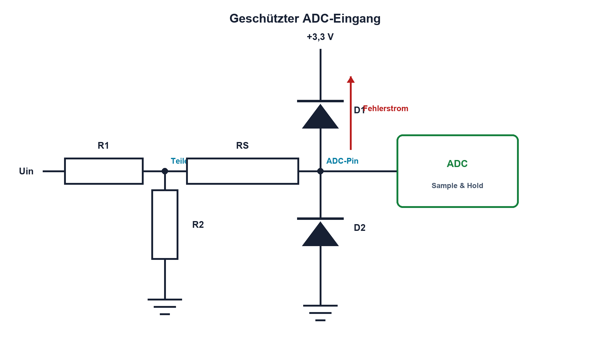

# 13.6 – Pegelanpassung und Schutz

[← Zurück](05-aktive-filter.md) · [Modulübersicht](README.md) · [Kursübersicht](../README.md) · [Weiter →](07-analogschalter-und-vollstaendige-messkette.md)

## Lernziele

Nach dieser Lektion kannst du:

- analoge Pegel sicher in einen ADC-Bereich übersetzen
- Serienwiderstand und Klemmpfade dimensionieren
- Normalbetrieb und Fehlerfall getrennt prüfen

## Warum ist das wichtig?

Sensorsignale können negativ werden, Versorgungsspitzen enthalten oder bei ausgeschaltetem Mikrocontroller anliegen. Der ADC-Pin ist kein ideal geschützter Eingang. Pegelanpassung muss das Nutzsignal erhalten und Fehlerenergie begrenzen.

## Theorie

### Skalieren, verschieben, begrenzen

Ein Widerstandsteiler skaliert, ein OPV kann zusätzlich verschieben und puffern. Serienwiderstand RS begrenzt Fehlerstrom. Externe Schottky- oder TVS-Klemmen führen Energie zu definierten Schienen oder Massepfaden ab; die internen MCU-Schutzdioden sind keine beliebigen Betriebsstrompfade.

Im Normalbetrieb werden Teilerfehler, Quellimpedanz, Filterwirkung und ADC-Einschwingen geprüft. Im Fehlerfall zählen maximale Eingangsspannung, Klemmspannung, Strom durch RS, Leistung und Rückspeisung in die Versorgung.

Bei ausgeschaltetem MCU kann ein Eingang über die Schutzdiode VDD anheben. Ein definierter Abschaltpfad, ein geeignetes Schutzbauteil oder galvanische Trennung kann nötig sein. Die zulässigen Injection Currents stehen im Datenblatt.

## Anschauliches Beispiel

Eine Schleuse passt den Wasserstand an und besitzt zugleich ein Überlaufwehr. Die Schleuse verarbeitet den Normalbetrieb; das Wehr begrenzt seltene, energiereiche Fehler.

## Berechnungsbeispiel

Ein Fehlerpegel von 12 V wird extern bei 3,6 V geklemmt. Soll der Fehlerstrom höchstens 2 mA sein, gilt `RS ≥ (12 V − 3,6 V)/2 mA = 4,2 kΩ`; gewählt werden mindestens 4,7 kΩ. Danach ist zu prüfen, ob RS mit ADC-Eingangskapazität noch schnell genug einschwingt.

## Praxisbezug

Prüfe die Übertragungskennlinie zuerst im Normalbereich. Simuliere Fehler nur strombegrenzt und unterhalb freigegebener Energie. Miss Pinspannung, Klemmstrom und Versorgung; teste auch MCU ausgeschaltet.

## 🔗 Hardware ↔ Firmware

Firmware erkennt Grenzcodes, festhängende Werte und unplausible Sprünge. Sie kann den Schutzstrom nicht begrenzen, wenn der Kern ausgeschaltet oder abgestürzt ist. Sichere Grenzen gehören daher in die Hardware.

## Merksatz

> Pegelanpassung behandelt das Nutzsignal; Schutz begrenzt Energie in vorhersehbaren Fehlerfällen.

## Häufige Fehler und Missverständnisse

- absolute Maximum Ratings als Betriebsbereich verwenden
- Injection Current nicht prüfen
- Serienwiderstand ohne ADC-Einschwingzeit wählen
- Rückspeisung bei ausgeschalteter Versorgung übersehen

## Zusammenfassung

Teiler, Puffer, Serienwiderstand und Klemmen werden für Normalbetrieb und Fehlerfall getrennt dimensioniert. Der reale Rückstrompfad entscheidet über die Sicherheit.

## Übungsfragen

1. Was begrenzt RS?
2. Dimensioniere RS für 24 V, 3,6 V und 1 mA.
3. Was bedeutet Injection Current?
4. Warum muss der ausgeschaltete Zustand geprüft werden?

Weitere Aufgaben: [Übungen zu Modul 13](../uebungen/modul-13.md).

## Bezug Bildungsplan 2026

- Handlungskompetenzen: `a3`, `b1-LK01–06`, `b4-LK01–10`, `b5`, `c1–c2`
- Nachweise: Schutzstrom- und Einschwingnachweis eines ADC-Eingangs; [Kompetenzmatrix](../bildungsplan-2026/kompetenzmatrix.md)
