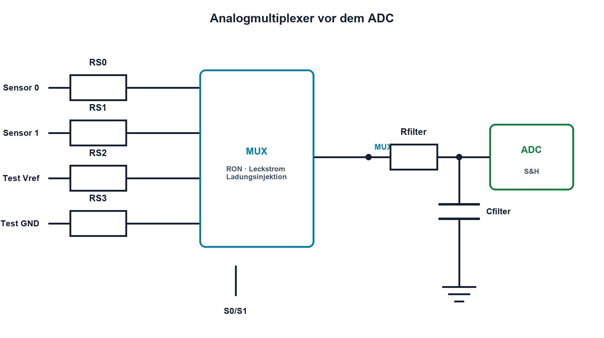

# 13.7 – Analogschalter und vollständige Messkette

[← Zurück](06-pegelanpassung-und-schutz.md) · [Modulübersicht](README.md) · [Kursübersicht](../README.md) · [Weiter →](../14-digitaltechnik/README.md)

## Lernziele

Nach dieser Lektion kannst du:

- Analogschalter und Multiplexer elektrisch beurteilen
- Einschwingzeit nach einem Kanalwechsel bestimmen
- eine Messkette mit Diagnosezuständen verifizieren

## Einleitung

Mehrere Sensoren teilen sich häufig Verstärker oder ADC. Ein Analogmultiplexer spart Hardware, verbindet aber nacheinander sehr unterschiedliche Quellen mit einem gemeinsamen Knoten. Leckstrom, Einschaltwiderstand und Ladungsinjektion werden damit Teil der Messung.

<!-- context-expansion-2026 -->
Eine analoge Messkette übersetzt eine physikalische Grösse schrittweise in einen belastbaren ADC-Code. Erregung, Bezug, Verstärkung, Filter, Schutz und Abtastung beeinflussen sich gegenseitig. Deshalb wird jede Stufe zusammen mit ihren Grenzwerten und Messpunkten betrachtet.

Beim Thema **Analogschalter und vollständige Messkette** geht es deshalb nicht nur um eine einzelne Formel oder Definition. Entscheidend ist, wie sich das Prinzip im Schema erkennen, im Datenblatt beurteilen, im Aufbau messen und bei einer Abweichung systematisch überprüfen lässt.

## Theorie

<!-- theory-expansion-2026 -->
### Einordnung und Grundidee

Eine Messkette wird an ihren Schnittstellen beschrieben. Für jeden Knoten werden Signalbereich, Bezug, Quellimpedanz, Last, Bandbreite, Fehlerzustand und geeigneter Messpunkt festgelegt. Dadurch bleibt nachvollziehbar, wo Verstärkung, Filterung oder Abweichung entsteht.

### Der Schalter ist nicht ideal

Ein eingeschalteter Kanal besitzt RON, einen signalabhängigen Widerstand. Ausgeschaltete Kanäle besitzen Leckströme und Kapazitäten. Beim Umschalten wird Ladung in den Signalknoten eingespritzt. Break-before-make verhindert meist, dass zwei Quellen kurzzeitig verbunden werden.

RON bildet mit Quell- und Lastwiderstand einen Fehler. Nach jedem Kanalwechsel müssen MUX-Ausgang, Filter, OPV und ADC-Sample-and-Hold einschwingen. Hochohmige Quellen reagieren langsamer und stärker auf Leckstrom.

### Vollständige Verifikation

Für jeden Kanal werden erlaubter Signalbereich, Common Mode, Fehlerzustand, Einschwingzeit und Kalibrierung definiert. Offene Sensoren können über einen schwachen Diagnose-Pull erkannt werden. Ein Testkanal mit GND oder Referenz trennt Fehler im Sensorpfad von ADC- und Firmwarefehlern.

## Anwendungsfall

Typische elektronische Anwendungen und Baugruppen für dieses Thema sind:

- Mehrkanal-Datenerfassung
- Selbsttest mit GND- und Referenzkanälen
- Gemeinsame ADC- und Verstärkerpfade für mehrere Sensoren

In einer konkreten Entwicklung wird nicht nur geprüft, ob die gewünschte Funktion grundsätzlich entsteht. Ebenso wichtig sind zulässige Grenzwerte, Toleranzen, Temperatur, Messbarkeit und das Verhalten bei Unterbruch, Kurzschluss oder falscher Ansteuerung.

## Anschauliches Beispiel

Ein einziges Thermometer wird nacheinander in verschiedene Flüssigkeiten getaucht. Vor jedem Ablesen muss es den alten Wert vergessen und die neue Temperatur annehmen.

## Berechnungsbeispiel

Rsource = 47 kΩ, RON = 150 Ω und der wirksame Knoten besitzt 10 nF. Näherungsweise ist `τ = (Rsource + RON)·C ≈ 471,5 µs`. Für rund 0,7 % Restfehler sind etwa 5τ beziehungsweise 2,36 ms zu warten; höhere Genauigkeit benötigt mehr Zeit.

## Praxisbezug

Schalte abwechselnd zwischen zwei deutlich verschiedenen, sicheren Spannungen. Miss den MUX-Ausgang und den ADC-Knoten. Bestimme die nötige Wartezeit und vergleiche ersten sowie späteren ADC-Sample.

## 🔗 Hardware ↔ Firmware

Firmware setzt Adressleitungen, wartet die berechnete Einschwingzeit und verwirft bei Bedarf die erste Wandlung. Testkanäle, Grenzwerte und Rohcodeprotokollierung machen die Kette diagnostizierbar.

## Merksatz

> Nach jedem Kanalwechsel muss die gesamte analoge Kette neu einschwingen, nicht nur der digitale Multiplexerzustand.

## Häufige Fehler und Missverständnisse

- RON als konstant und null behandeln
- sofort nach dem Umschalten messen
- nicht versorgte Eingangssignale zulassen
- Testkanäle und offene Sensoren nicht vorsehen

## Zusammenfassung

Analogschalter sparen Hardware, fügen aber Widerstand, Leckstrom, Ladung und Umschaltzeit hinzu. Eine vollständige Messkette benötigt elektrische und firmwareseitige Diagnose.

## Übungsfragen

1. Welche vier Nichtidealitäten besitzt ein Analogschalter?
2. Warum beeinflusst Rsource die Wartezeit?
3. Was prüft ein interner Referenzkanal?
4. Wann wird die erste ADC-Wandlung verworfen?

Weitere Aufgaben: [Übungen zu Modul 13](../uebungen/modul-13.md).

## Bezug Bildungsplan 2026

- Handlungskompetenzen: `a1–a3`, `b1-LK01–06`, `b4`, `b5`, `c1–c2`
- Nachweise: verifizierte Mehrkanal-Messkette mit Einschwing- und Diagnosenachweis; [Kompetenzmatrix](../bildungsplan-2026/kompetenzmatrix.md)
