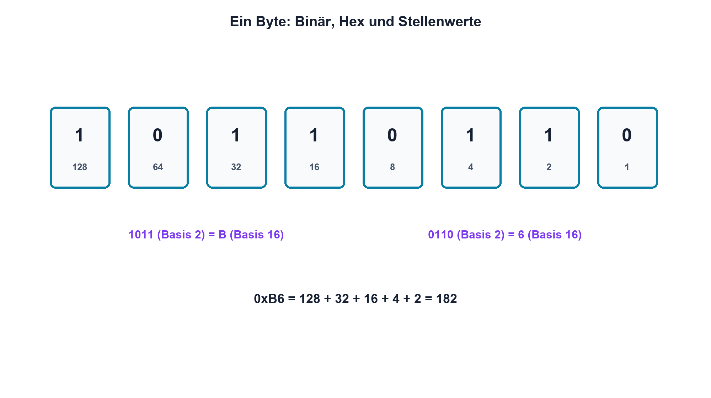

# 14.1 – Binär- und Hexadezimalsystem

[← Zurück](../13-analoge-signalaufbereitung/07-analogschalter-und-vollstaendige-messkette.md) · [Modulübersicht](README.md) · [Kursübersicht](../README.md) · [Weiter →](02-logikpegel-ttl-und-cmos.md)

## Lernziele

Nach dieser Lektion kannst du:

- Binär-, Dezimal- und Hexadezimalzahlen umrechnen
- Bitgewicht, Nibble und Byte erklären
- Bitmasken auf Register und Messdaten anwenden

## Einleitung

Digitale Hardware arbeitet mit zwei logischen Zuständen, Datenblätter und Registerbeschreibungen verwenden jedoch häufig Hexadezimalzahlen. Wer Stellenwerte sicher liest, erkennt gesetzte Bits, Buswerte und Messfehler ohne Rätselraten.

<!-- context-expansion-2026 -->
Digitale Zustände werden elektrisch durch Spannungsbereiche und zeitlich durch Flanken dargestellt. Logische Funktion, Störreserve, Laufzeit und Startzustand gehören zusammen. Ein korrekter Wahrheitswert allein beweist noch keine robuste Hardware.

Beim Thema **Binär- und Hexadezimalsystem** geht es deshalb nicht nur um eine einzelne Formel oder Definition. Entscheidend ist, wie sich das Prinzip im Schema erkennen, im Datenblatt beurteilen, im Aufbau messen und bei einer Abweichung systematisch überprüfen lässt.

## Theorie

<!-- theory-expansion-2026 -->
### Einordnung und Grundidee

Digitale Schaltungen werden in drei Ebenen untersucht: Boolesche Funktion, elektrischer Pegel und zeitliches Verhalten. Wahrheitstabelle, Datenblattgrenzen und Zeitdiagramm beantworten unterschiedliche Fragen und müssen für eine belastbare Freigabe zusammenpassen.

### Stellenwerte mit Basis 2 und 16

Im Binärsystem besitzt jede Stelle das Gewicht `2ⁿ`. Von rechts beginnen die Gewichte mit 1, 2, 4, 8 und 16. Vier Bits bilden ein Nibble und lassen sich kompakt als eine Hexadezimalziffer 0 bis F schreiben.

`10110110₂` entspricht `0xB6`: Das obere Nibble 1011 ist B, das untere 0110 ist 6. Dezimal ergibt die Summe 128 + 32 + 16 + 4 + 2 = 182.

### Bitoperationen und Darstellung

Eine Maske wählt bestimmte Bits. AND prüft oder löscht Bits, OR setzt Bits, XOR kippt Bits. Eine Zahl besitzt ohne Kontext keine Bedeutung: Sie kann unsigned, Zweierkomplement, Festkomma, ADC-Code oder Statuswort sein. Wortbreite und Bitreihenfolge gehören immer zur Angabe.

Bei serieller Übertragung unterscheidet man zusätzlich Bitreihenfolge und Byte-Reihenfolge. MSB first beschreibt das zuerst gesendete höchstwertige Bit; Endianness beschreibt die Reihenfolge mehrerer Bytes im Speicher oder Protokoll.

## Anwendungsfall

Typische elektronische Anwendungen und Baugruppen für dieses Thema sind:

- Lesen von Register- und Buswerten
- Auswertung von ADC- und Statuswörtern
- Dokumentation von Pin- und Bitmasken

In einer konkreten Entwicklung wird nicht nur geprüft, ob die gewünschte Funktion grundsätzlich entsteht. Ebenso wichtig sind zulässige Grenzwerte, Toleranzen, Temperatur, Messbarkeit und das Verhalten bei Unterbruch, Kurzschluss oder falscher Ansteuerung.

## Anschauliches Beispiel

Binärstellen sind Schalter mit verschieden grossen Lampen: Der rechte Schalter zählt 1, der nächste 2, dann 4. Hexadezimal fasst jeweils vier Schalter zu einem gut lesbaren Etikett zusammen.

## Berechnungsbeispiel

`0x35 = 3·16 + 5 = 53`. Binär lautet der Wert `0011 0101`. Die Maske `0x0C = 0000 1100₂` prüft Bit 3 und Bit 2; `0x35 AND 0x0C = 0x04`.

## Praxisbezug

Stelle acht LEDs oder Logic-Analyzer-Kanäle als Byte dar. Erzeuge mehrere Muster, notiere Binär-, Hex- und Dezimalwert und prüfe die Zuordnung physisch am Stecker.

## 🔗 Hardware ↔ Firmware

Register werden mit Masken geändert, ohne Nachbarbits zu zerstören. Detaillierte C-Operationen gehören in den STM32-Kurs; hier wird geprüft, welcher elektrische Pinzustand tatsächlich zu einem Bit gehört.

## Merksatz

> Hexadezimal ist eine kompakte Schreibweise für Binärwerte; Bedeutung entsteht erst durch Wortbreite, Vorzeichen und Zuordnung.

## Häufige Fehler und Missverständnisse

- führende Nullen und Wortbreite weglassen
- Bitnummer mit Bitgewicht verwechseln
- Hexwert als Dezimalzahl lesen
- Endianness und Bitreihenfolge gleichsetzen

## Zusammenfassung

Stellenwerte verbinden Binär, Hex und Dezimal. Masken machen einzelne Hardwarefunktionen in Daten- und Registerwörtern sichtbar.

## Übungsfragen

1. Wandle 0xA7 in Binär und Dezimal um.
2. Welches Gewicht besitzt Bit 5?
3. Was ergibt 0xB6 AND 0x0F?
4. Warum braucht ein Zahlenwert Kontext?

Weitere Aufgaben: [Übungen zu Modul 14](../uebungen/modul-14.md).

## Bezug Bildungsplan 2026

- Handlungskompetenzen: `b1-LK06`, `b4-LK01–10`, `c1`, `c5`
- Nachweise: korrekte Interpretation eines achtbitigen Hardwarezustands; [Kompetenzmatrix](../bildungsplan-2026/kompetenzmatrix.md)
