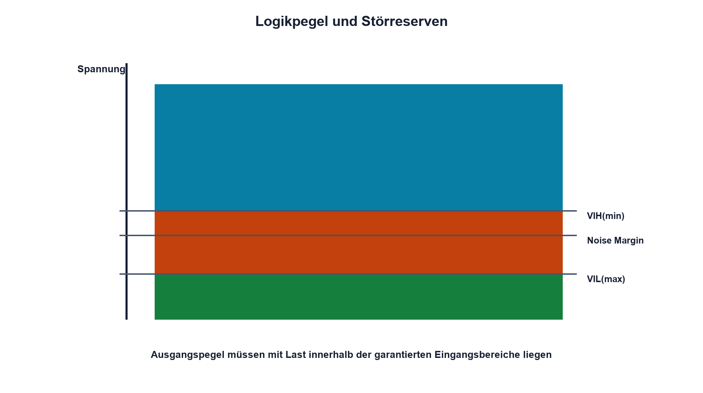

# 14.2 – Logikpegel, TTL und CMOS

[← Zurück](01-binaer-und-hexadezimalsystem.md) · [Modulübersicht](README.md) · [Kursübersicht](../README.md) · [Weiter →](03-gatter-und-wahrheitstabellen.md)

## Lernziele

Nach dieser Lektion kannst du:

- Spannungsbereiche für Low, undefiniert und High unterscheiden
- Noise Margins aus Datenblattgrenzen bestimmen
- TTL- und CMOS-Familien kompatibel verbinden

## Einleitung

Logisch 0 und 1 sind elektrische Spannungsbereiche, keine idealen Zahlen. Zwei Bausteine funktionieren nur zuverlässig zusammen, wenn garantierte Ausgangspegel zu den garantierten Eingangsschwellen passen – auch bei Last, Temperatur und Störungen.

<!-- context-expansion-2026 -->
Digitale Zustände werden elektrisch durch Spannungsbereiche und zeitlich durch Flanken dargestellt. Logische Funktion, Störreserve, Laufzeit und Startzustand gehören zusammen. Ein korrekter Wahrheitswert allein beweist noch keine robuste Hardware.

Beim Thema **Logikpegel, TTL und CMOS** geht es deshalb nicht nur um eine einzelne Formel oder Definition. Entscheidend ist, wie sich das Prinzip im Schema erkennen, im Datenblatt beurteilen, im Aufbau messen und bei einer Abweichung systematisch überprüfen lässt.

## Theorie

<!-- theory-expansion-2026 -->
### Einordnung und Grundidee

Digitale Schaltungen werden in drei Ebenen untersucht: Boolesche Funktion, elektrischer Pegel und zeitliches Verhalten. Wahrheitstabelle, Datenblattgrenzen und Zeitdiagramm beantworten unterschiedliche Fragen und müssen für eine belastbare Freigabe zusammenpassen.

### Garantierte Bereiche

Ein Eingang garantiert Low bis VIL(max) und High ab VIH(min). Dazwischen liegt der undefinierte Bereich. Ein Ausgang garantiert bei festgelegtem Strom höchstens VOL(max) für Low und mindestens VOH(min) für High.

Die Low-Störreserve ist `NML = VIL(max) − VOL(max)`, die High-Störreserve `NMH = VOH(min) − VIH(min)`. Spannungen zwischen den Schwellen dürfen nicht als stabiler Logikzustand geplant werden.

### Logikfamilien und Versorgung

Klassisches TTL und moderne CMOS-Familien besitzen unterschiedliche Schwellen und Ausgangsströme. Namen wie HC, HCT, LVC oder echte 5-V-Toleranz sind nicht austauschbar. Absolute Maximum Ratings geben Überlebensgrenzen an, nicht gültige Logikpegel.

CMOS-Eingänge sind hochohmig und dürfen nicht offen bleiben. Langsame Flanken erhöhen die Zeit im undefinierten Bereich und können Querstrom oder Mehrfachschalten verursachen. Schmitt-Trigger-Eingänge verbessern langsame oder verrauschte Signale.

## Anwendungsfall

Typische elektronische Anwendungen und Baugruppen für dieses Thema sind:

- Verbindung von MCU, Sensor und Logik-IC
- Bewertung von 3,3-V-/5-V-Kompatibilität
- Festlegen von Störreserve und Pegelwandler

In einer konkreten Entwicklung wird nicht nur geprüft, ob die gewünschte Funktion grundsätzlich entsteht. Ebenso wichtig sind zulässige Grenzwerte, Toleranzen, Temperatur, Messbarkeit und das Verhalten bei Unterbruch, Kurzschluss oder falscher Ansteuerung.

## Anschauliches Beispiel

Eine Ampel besitzt klar Rot und Grün; ein Zwischenzustand mit beiden Lampen halbhell ist keine gültige Verkehrsregel. Die Störreserve ist der Abstand zur missverständlichen Zone.

## Berechnungsbeispiel

Ein Ausgang garantiert VOH(min) = 2,9 V, der Eingang fordert VIH(min) = 2,0 V. Dann ist `NMH = 0,9 V`. Für Low seien VIL(max) = 0,8 V und VOL(max) = 0,4 V; `NML = 0,4 V`.

## Praxisbezug

Belaste einen Logikausgang innerhalb der Datenblattgrenzen und miss VOH sowie VOL. Fahre einen Schmitt-Eingang langsam mit dem Generator durch beide Schwellen und beobachte die Hysterese.

## 🔗 Hardware ↔ Firmware

Die GPIO-Konfiguration wählt Eingang, Ausgang, Pull und oft Flankengeschwindigkeit. Sie ändert keine absolute Spannungsverträglichkeit. Ein gelesener Bitwert beweist nicht, dass der Pegel genügend Störreserve besitzt.

## Merksatz

> Logikkompatibilität wird mit garantierten Ausgangspegeln, Eingangsschwellen und Störreserven nachgewiesen.

## Häufige Fehler und Missverständnisse

- halbe Versorgung als universelle Schwelle annehmen
- typische statt garantierte Werte vergleichen
- 5-V-Toleranz für jeden Pinzustand voraussetzen
- offene CMOS-Eingänge zulassen

## Zusammenfassung

Digitale Zustände sind Spannungsbereiche. Familie, Versorgung, Last, Temperatur und Flankengeschwindigkeit bestimmen die sichere Verbindung.

## Übungsfragen

1. Was liegt zwischen VIL(max) und VIH(min)?
2. Berechne NMH für 2,7 V und 2,0 V.
3. Warum ist Absolute Maximum kein Logikpegel?
4. Was konfiguriert Firmware – und was nicht?

Weitere Aufgaben: [Übungen zu Modul 14](../uebungen/modul-14.md).

## Bezug Bildungsplan 2026

- Handlungskompetenzen: `b1-LK01–06`, `b4-LK01–08`, `c1`, `c5`
- Nachweise: Kompatibilitäts- und Noise-Margin-Nachweis zweier Bausteine; [Kompetenzmatrix](../bildungsplan-2026/kompetenzmatrix.md)
