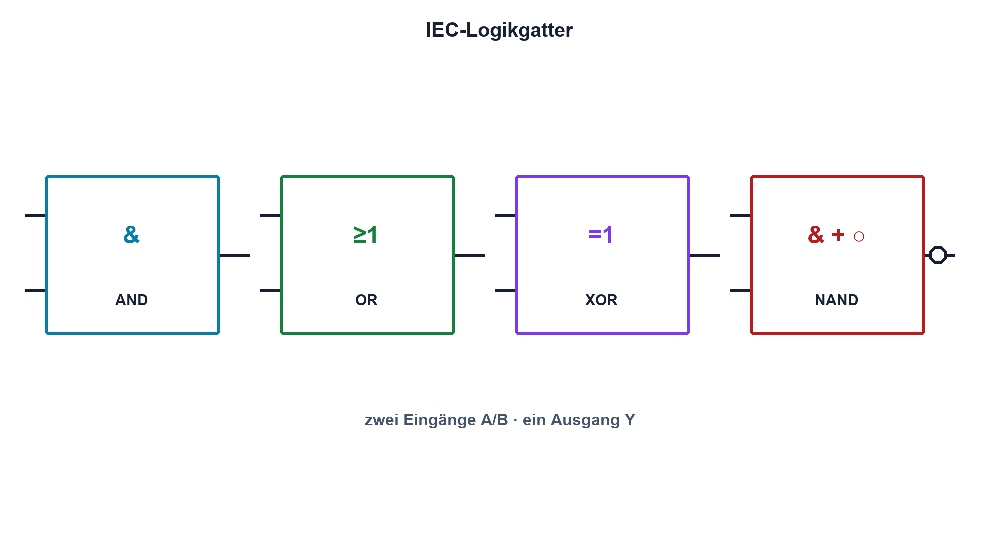

# 14.3 – Gatter und Wahrheitstabellen

[← Zurück](02-logikpegel-ttl-und-cmos.md) · [Modulübersicht](README.md) · [Kursübersicht](../README.md) · [Weiter →](04-boolesche-algebra.md)

## Lernziele

Nach dieser Lektion kannst du:

- AND, OR, NOT, NAND, NOR und XOR erklären
- Wahrheitstabellen systematisch erstellen
- Logikfunktion und reales Gatter verbinden

## Warum ist das wichtig?

Gatter verknüpfen Bedingungen zu Freigaben, Verriegelungen und Fehlerausgängen. Eine Wahrheitstabelle zwingt dazu, alle Eingangskombinationen zu prüfen – nicht nur den gewünschten Normalfall.

## Theorie

### Grundfunktionen

AND wird nur 1, wenn alle Eingänge 1 sind. OR wird 1, wenn mindestens ein Eingang 1 ist. NOT kehrt um. NAND und NOR sind negierte Funktionen; aus jeweils nur NAND- oder nur NOR-Gattern lassen sich alle Booleschen Funktionen aufbauen. XOR ist 1, wenn die Eingänge verschieden sind.

Eine Wahrheitstabelle mit n Eingängen besitzt `2ⁿ` Zeilen. Für zwei Eingänge A und B werden 00, 01, 10 und 11 vollständig ausgewertet. Negationskreise am Symbol bedeuten logische Invertierung, nicht automatisch einen anderen elektrischen Pegelstandard.

### Reale Gatter

Ein reales Gatter besitzt Laufzeit, begrenzten Ausgangsstrom, Eingangsleckstrom und Versorgung. Bei gleichzeitig wechselnden Eingängen können wegen unterschiedlicher Laufzeiten kurze Glitches entstehen. Unbenutzte Eingänge erhalten definierte Pegel.

## Anschauliches Beispiel

Eine Sicherheitsfreigabe kann zwei Schlüssel gleichzeitig verlangen – das ist AND. Ein Alarm kann auf Rauch oder Hitze reagieren – das ist OR. XOR entspricht einer Wechselschaltung: genau einer von zwei Zuständen ist aktiv.

## Berechnungsbeispiel

Für `Y = (A AND B) OR C` gibt es acht Zeilen. Bei A=1, B=0, C=1 wird zuerst A AND B = 0, danach Y = 0 OR 1 = 1. Die Zwischenspalte verhindert Denkfehler.

## Praxisbezug

Baue eine Funktion mit Tastern, definierten Pull-Widerständen und LED-Ausgang auf. Prüfe jede Tabellenzeile und beobachte schnelle Übergänge mit dem Logic Analyzer.

## 🔗 Hardware ↔ Firmware

Dieselbe Funktion kann in Software, FPGA oder externen Gattern umgesetzt werden. Externe Hardware reagiert auch während Reset oder Firmwarestillstand; sicherheitsrelevante Verriegelungen dürfen nicht unkritisch verlagert werden.

## Merksatz

> Eine Wahrheitstabelle beschreibt die vollständige Logikfunktion; das reale Gatter ergänzt Pegel, Laufzeit und Stromgrenzen.

## Häufige Fehler und Missverständnisse

- OR mit XOR verwechseln
- nicht alle Eingangskombinationen prüfen
- unbenutzte Eingänge offen lassen
- Laufzeit und Glitches ignorieren

## Zusammenfassung

Gatter setzen Boolesche Funktionen elektrisch um. Wahrheitstabellen prüfen Vollständigkeit, Messungen zeigen reale Pegel und zeitliche Effekte.

## Übungsfragen

1. Wann ist XOR gleich 1?
2. Wie viele Zeilen hat eine Tabelle mit vier Eingängen?
3. Erstelle Y = NAND(A,B).
4. Warum kann Hardwarelogik während Reset wichtig sein?

Weitere Aufgaben: [Übungen zu Modul 14](../uebungen/modul-14.md).

## Bezug Bildungsplan 2026

- Handlungskompetenzen: `b1-LK06`, `b4-LK01–10`, `c1`, `c5`
- Nachweise: vollständig geprüfte Wahrheitstabelle an realer Gatterhardware; [Kompetenzmatrix](../bildungsplan-2026/kompetenzmatrix.md)
