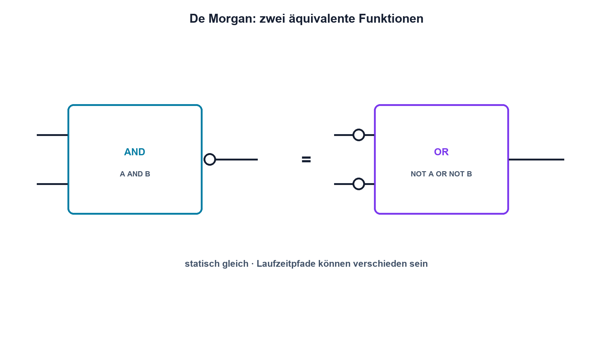

# 14.4 – Boolesche Algebra

[← Zurück](03-gatter-und-wahrheitstabellen.md) · [Modulübersicht](README.md) · [Kursübersicht](../README.md) · [Weiter →](05-flip-flops-zaehler-und-zustaende.md)

## Lernziele

Nach dieser Lektion kannst du:

- Boolesche Ausdrücke vereinfachen
- De-Morgan-Regeln anwenden
- logische Äquivalenz mit Tabellen prüfen

## Warum ist das wichtig?

Dieselbe Funktion kann mit vielen oder wenigen Gattern aufgebaut werden. Vereinfachung reduziert Bauteile, Strom und Verzögerung. Sie darf aber keine Eingangskombination verändern und zeitliche Glitches müssen separat betrachtet werden.

## Theorie

### Rechenregeln für Zustände

Boolesche Variablen besitzen 0 oder 1. Wichtige Regeln sind `A AND A = A`, `A OR A = A`, `A AND 1 = A`, `A OR 0 = A` und `A OR (A AND B) = A`.

De Morgan lautet: NOT(A AND B) = NOT A OR NOT B sowie NOT(A OR B) = NOT A AND NOT B. Damit werden NAND- und NOR-Strukturen systematisch umgeformt.

### Funktional gleich, zeitlich nicht zwingend gleich

Zwei Ausdrücke sind logisch äquivalent, wenn alle Zeilen ihrer Wahrheitstabellen übereinstimmen. Unterschiedliche Gatterpfade besitzen jedoch andere Laufzeiten. Bei Eingangssprüngen kann eine vereinfachte oder mehrstufige Schaltung kurz einen falschen Zustand zeigen. Synchrone Systeme übernehmen deshalb Signale an definierten Taktflanken.

## Anschauliches Beispiel

«Nicht beide Türen sind geschlossen» bedeutet dasselbe wie «Tür A ist offen oder Tür B ist offen». Die Formulierung ändert sich, die Aussage bleibt gleich – das ist De Morgan.

## Berechnungsbeispiel

`Y = (A AND B) OR (A AND NOT B)` lässt sich ausklammern: `Y = A AND (B OR NOT B) = A AND 1 = A`. Die ursprüngliche Schaltung benötigt mehrere Gatter, die vereinfachte Funktion nur eine Verbindung beziehungsweise einen Puffer.

## Praxisbezug

Implementiere Original und Vereinfachung parallel. Vergleiche alle statischen Zustände und trigger den Logic Analyzer auf einen kurzen Unterschied während gleichzeitiger Eingangsänderungen.

## 🔗 Hardware ↔ Firmware

Compiler und FPGA-Werkzeuge optimieren Logik, doch elektrische Eingänge können asynchron und verrauscht sein. Synchronisation und Entprellung sind nicht durch algebraische Vereinfachung ersetzt.

## Merksatz

> Boolesche Algebra beweist statische Gleichheit; Laufzeiten und asynchrone Übergänge bleiben reale Hardwarethemen.

## Häufige Fehler und Missverständnisse

- normale Algebra unverändert übertragen
- Negation bei De Morgan nicht auf alle Terme anwenden
- Vereinfachung ohne Wahrheitstabelle freigeben
- logische Gleichheit mit gleichem Zeitverhalten verwechseln

## Zusammenfassung

Rechenregeln vereinfachen Logikfunktionen. Wahrheitstabellen beweisen die Funktion, Zeitmessungen prüfen Glitches und Laufzeitpfade.

## Übungsfragen

1. Forme NOT(A OR B) um.
2. Vereinfache A OR (A AND B).
3. Wie beweist du Äquivalenz?
4. Warum können äquivalente Schaltungen verschiedene Glitches zeigen?

Weitere Aufgaben: [Übungen zu Modul 14](../uebungen/modul-14.md).

## Bezug Bildungsplan 2026

- Handlungskompetenzen: `b1-LK06`, `b4-LK07`, `c1`, `c5`
- Nachweise: algebraisch und messtechnisch geprüfte Logikäquivalenz; [Kompetenzmatrix](../bildungsplan-2026/kompetenzmatrix.md)
