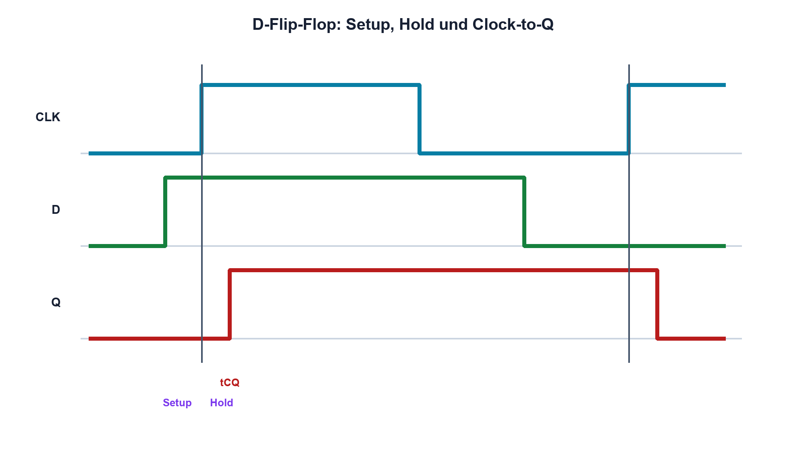

# 14.5 – Flip-Flops, Zähler und Zustände

[← Zurück](04-boolesche-algebra.md) · [Modulübersicht](README.md) · [Kursübersicht](../README.md) · [Weiter →](06-multiplexer-und-schieberegister.md)

## Lernziele

Nach dieser Lektion kannst du:

- kombinatorische und sequenzielle Logik unterscheiden
- D-Flip-Flop und Zähler zeitlich erklären
- Setup, Hold und Metastabilität einordnen

## Einleitung

Ein Flip-Flop merkt sich einen Zustand. Damit entstehen Zähler, Zustandsautomaten und synchronisierte Eingänge. Entscheidend ist nicht nur der Pegel, sondern der Zeitpunkt relativ zur Taktflanke.

<!-- context-expansion-2026 -->
Digitale Zustände werden elektrisch durch Spannungsbereiche und zeitlich durch Flanken dargestellt. Logische Funktion, Störreserve, Laufzeit und Startzustand gehören zusammen. Ein korrekter Wahrheitswert allein beweist noch keine robuste Hardware.

Beim Thema **Flip-Flops, Zähler und Zustände** geht es deshalb nicht nur um eine einzelne Formel oder Definition. Entscheidend ist, wie sich das Prinzip im Schema erkennen, im Datenblatt beurteilen, im Aufbau messen und bei einer Abweichung systematisch überprüfen lässt.

## Theorie

<!-- theory-expansion-2026 -->
### Einordnung und Grundidee

Digitale Schaltungen werden in drei Ebenen untersucht: Boolesche Funktion, elektrischer Pegel und zeitliches Verhalten. Wahrheitstabelle, Datenblattgrenzen und Zeitdiagramm beantworten unterschiedliche Fragen und müssen für eine belastbare Freigabe zusammenpassen.

### Ein Bit mit Takt

Ein flankengetriggertes D-Flip-Flop übernimmt D an der aktiven Taktflanke nach Q und hält den Wert bis zur nächsten Flanke. Setup-Zeit fordert einen stabilen Eingang vor, Hold-Zeit nach der Flanke. Clock-to-Q beschreibt die Ausgangsverzögerung.

Wird das Zeitfenster verletzt, kann Metastabilität auftreten: Q ist vorübergehend weder garantiert Low noch High. Ein Synchronisierer aus zwei Flip-Flops reduziert die Wahrscheinlichkeit, beseitigt sie aber mathematisch nie vollständig.

### Zähler und Zustände

Zählerketten speichern eine Binärzahl. Synchrone Zähler ändern Bits zur gemeinsamen Taktflanke; Ripple-Zähler leiten den Takt weiter und zeigen Zwischenzustände. Reset und Preset können synchron oder asynchron sein und benötigen definierte Freigabezeiten.

## Anwendungsfall

Typische elektronische Anwendungen und Baugruppen für dieses Thema sind:

- Zähler, Timer und Zustandsautomaten
- Synchronisierung asynchroner Eingänge
- Speichern von Status- und Steuersignalen

In einer konkreten Entwicklung wird nicht nur geprüft, ob die gewünschte Funktion grundsätzlich entsteht. Ebenso wichtig sind zulässige Grenzwerte, Toleranzen, Temperatur, Messbarkeit und das Verhalten bei Unterbruch, Kurzschluss oder falscher Ansteuerung.

## Anschauliches Beispiel

Ein Fotoapparat übernimmt genau den Zustand im Moment des Auslösens. Bewegt sich das Motiv während der Belichtung, wird das Bild unscharf – vergleichbar mit verletzter Setup- oder Hold-Zeit.

## Berechnungsbeispiel

Ein 8-Bit-Zähler besitzt 256 Zustände. Bei 1 MHz läuft er nach `256/1 MHz = 256 µs` über. Sein höchstes Bit wechselt mit 1 MHz/256 = 3,90625 kHz.

## Praxisbezug

Speise einen Takt ein, beobachte Q-Ausgänge und dekodiere den Zähler. Erzeuge einen asynchronen Eingang nahe der Taktflanke nur an dafür geeigneter Übungshardware und untersuche variable Verzögerungen.

## 🔗 Hardware ↔ Firmware

Timer und Register enthalten Flip-Flops. Firmware sieht nur stabil übernommene Zustände; externe asynchrone Signale benötigen Synchronisation, auch wenn der Code sie korrekt liest.

## Merksatz

> Sequenzielle Logik speichert Zustände an Taktflanken; Setup, Hold und Metastabilität verbinden Zeit und Logikpegel.

## Häufige Fehler und Missverständnisse

- Flip-Flop als transparenten Draht behandeln
- asynchronen Eingang direkt mehrfach verwenden
- Ripple-Zwischenzustände ignorieren
- Reset-Freigabe ohne Taktbezug planen

## Zusammenfassung

Flip-Flops speichern Bits, Zähler verbinden Zustände über Zeit. Timinganforderungen und Synchronisation sind für zuverlässige Hardware unverzichtbar.

## Übungsfragen

1. Wann übernimmt ein D-Flip-Flop D?
2. Was bedeuten Setup und Hold?
3. Wie lange zählt ein 10-Bit-Zähler bei 100 kHz?
4. Was leistet ein Zwei-Flip-Flop-Synchronisierer?

Weitere Aufgaben: [Übungen zu Modul 14](../uebungen/modul-14.md).

## Bezug Bildungsplan 2026

- Handlungskompetenzen: `b1-LK06`, `b4-LK01–10`, `c1–c2`, `c5`
- Nachweise: gemessenes Takt- und Zustandsdiagramm eines Zählers; [Kompetenzmatrix](../bildungsplan-2026/kompetenzmatrix.md)
