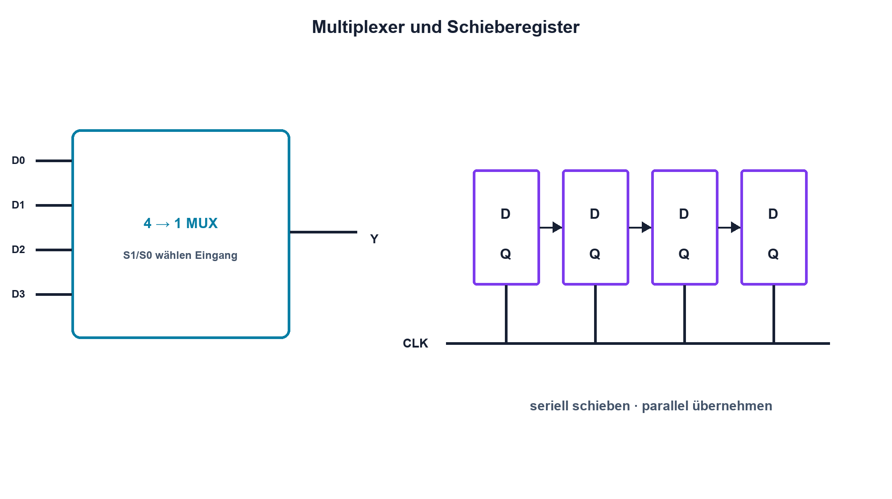

# 14.6 – Multiplexer und Schieberegister

[← Zurück](05-flip-flops-zaehler-und-zustaende.md) · [Modulübersicht](README.md) · [Kursübersicht](../README.md) · [Weiter →](07-open-collector-open-drain-pull-widerstaende-und-entprellung.md)

## Lernziele

Nach dieser Lektion kannst du:

- Multiplexer als digitalen Wahlschalter erklären
- serielle und parallele Datenwege unterscheiden
- Schieberegistersignale zeitlich zuordnen

## Einleitung

Multiplexer wählen Signale, Schieberegister erweitern Ein- und Ausgänge mit wenigen Leitungen. Beide sparen Pins, verlangen aber klare Adressen, Taktflanken und Freigabesignale.

<!-- context-expansion-2026 -->
Digitale Zustände werden elektrisch durch Spannungsbereiche und zeitlich durch Flanken dargestellt. Logische Funktion, Störreserve, Laufzeit und Startzustand gehören zusammen. Ein korrekter Wahrheitswert allein beweist noch keine robuste Hardware.

Beim Thema **Multiplexer und Schieberegister** geht es deshalb nicht nur um eine einzelne Formel oder Definition. Entscheidend ist, wie sich das Prinzip im Schema erkennen, im Datenblatt beurteilen, im Aufbau messen und bei einer Abweichung systematisch überprüfen lässt.

## Theorie

<!-- theory-expansion-2026 -->
### Einordnung und Grundidee

Digitale Schaltungen werden in drei Ebenen untersucht: Boolesche Funktion, elektrischer Pegel und zeitliches Verhalten. Wahrheitstabelle, Datenblattgrenzen und Zeitdiagramm beantworten unterschiedliche Fragen und müssen für eine belastbare Freigabe zusammenpassen.

### Auswahl und Verschiebung

Ein 4-zu-1-Multiplexer verbindet abhängig von zwei Adressbits einen Eingang mit dem Ausgang. `2ⁿ` Eingänge benötigen n Adressleitungen. Enable kann den Ausgang aktivieren oder in einen hochohmigen Zustand versetzen.

Ein Serial-In/Parallel-Out-Schieberegister übernimmt pro Takt ein Bit. Nach acht Takten liegen acht Bits intern; ein separater Latch übernimmt sie gleichzeitig an die Ausgänge. Dadurch flackern Ausgänge nicht während des Schiebens.

Setup, Hold, maximale Taktfrequenz und Ausgangsstrom gelten auch hier. Kaskadierte Register verlängern die Datenkette. Ein definierter Output Enable verhindert falsche Zustände beim Start.

## Anwendungsfall

Typische elektronische Anwendungen und Baugruppen für dieses Thema sind:

- Porterweiterung für LED und Taster
- Auswahl mehrerer Datenquellen
- Serielle Ausgabe paralleler Zustände

In einer konkreten Entwicklung wird nicht nur geprüft, ob die gewünschte Funktion grundsätzlich entsteht. Ebenso wichtig sind zulässige Grenzwerte, Toleranzen, Temperatur, Messbarkeit und das Verhalten bei Unterbruch, Kurzschluss oder falscher Ansteuerung.

## Anschauliches Beispiel

Ein Multiplexer ist ein Gleiswähler, der einen Zug auf genau ein Gleis lenkt. Ein Schieberegister ist eine Reihe von Personen, die bei jedem Takt einen Zettel weiterreichen und erst auf Kommando gleichzeitig zeigen.

## Berechnungsbeispiel

Drei kaskadierte 8-Bit-Register benötigen 24 Takte pro Aktualisierung. Bei 2 MHz dauert eine Taktperiode 0,5 µs und die reine Übertragung somit `24·0,5 µs = 12 µs`. Mit Latchimpuls und den geforderten Vor- und Nachzeiten bleibt die Aktualisierung in diesem Beispiel unter 20 µs.

## Praxisbezug

Sende bekannte Bitmuster und zeichne Data, Clock, Latch und einen Ausgang auf. Prüfe Bitreihenfolge, aktive Flanke und Startzustand. Belastungsstrom je Pin und Gesamtstrom bleiben innerhalb des Datenblatts.

## 🔗 Hardware ↔ Firmware

SPI kann das Schieben übernehmen; ein GPIO erzeugt Latch oder Enable. Die Hardwarelektion prüft reale Flanken, Reihenfolge und Ausgangspegel, der STM32-Kurs behandelt die Peripheriekonfiguration.

## Merksatz

> Multiplexer wählen einen Pfad; Schieberegister transportieren Zustände über Takt und übernehmen sie kontrolliert an die Ausgänge.

## Häufige Fehler und Missverständnisse

- Adressbits in falscher Reihenfolge verbinden
- Takt- und Latchflanke verwechseln
- Ausgangsstromsumme ignorieren
- Startzustand bei Reset nicht definieren

## Zusammenfassung

Auswahl- und Schiebeschaltungen reduzieren Leitungen. Ihr zuverlässiger Betrieb hängt von Timing, Freigaben, Pegeln und Lastgrenzen ab.

## Übungsfragen

1. Wie viele Adressbits braucht ein 16-zu-1-MUX?
2. Wozu dient das Ausgangslatch?
3. Wie lange dauern 32 Bits bei 4 MHz?
4. Welche Signale misst du am Logic Analyzer?

Weitere Aufgaben: [Übungen zu Modul 14](../uebungen/modul-14.md).

## Bezug Bildungsplan 2026

- Handlungskompetenzen: `b1-LK01–06`, `b4-LK01–10`, `c1–c2`, `c5`
- Nachweise: dekodierter serieller Transfer mit parallelem Ausgangsnachweis; [Kompetenzmatrix](../bildungsplan-2026/kompetenzmatrix.md)
