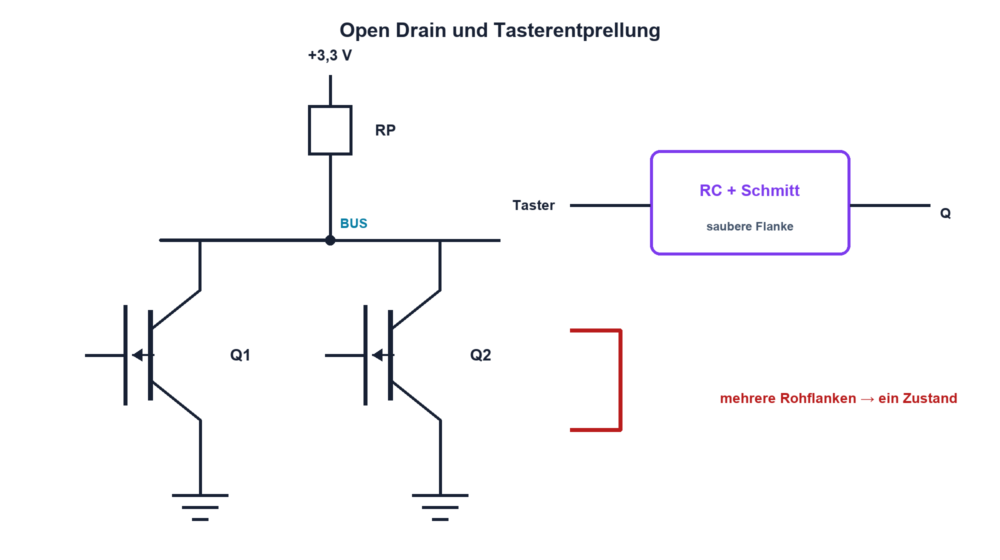

# 14.7 – Open Collector, Open Drain, Pull-Widerstände und Entprellung

[← Zurück](06-multiplexer-und-schieberegister.md) · [Modulübersicht](README.md) · [Kursübersicht](../README.md) · [Weiter →](../15-schnittstellen-busse/README.md)

## Lernziele

Nach dieser Lektion kannst du:

- Open-Drain-Ausgänge und Pull-up dimensionieren
- wired-AND-Verhalten elektrisch erklären
- mechanische Kontakte hardware- und softwareseitig entprellen

## Warum ist das wichtig?

Viele Teilnehmer teilen eine Leitung, indem jeder nur Low erzwingen kann. Der Pull-up erzeugt High. Dasselbe Prinzip steckt in I²C, Interruptleitungen und Fehlersammelsignalen. Mechanische Taster zeigen zusätzlich mehrere schnelle Übergänge statt einer sauberen Flanke.

## Theorie

### Gemeinsam Low ziehen

Ein Open-Drain- oder Open-Collector-Ausgang besitzt keinen aktiven High-Treiber. Ist Q1 aus, zieht RP die Leitung nach High; ist irgendein Teilnehmer ein, wird sie Low. Mehrere Ausgänge dürfen deshalb verbunden werden, sofern Spannungen und Ströme passen.

Der Low-Strom ist näherungsweise `IL = (VDD − VOL)/RP`. Die steigende Flanke entsteht aus RP und Buskapazität CB. Kleiner RP macht sie schneller, erhöht aber Low-Strom und Verlust. Interne Pulls sind oft schwach und stark toleriert.

### Entprellung

Ein mechanischer Kontakt kann während Millisekunden mehrfach öffnen und schliessen. RC plus Schmitt-Trigger erzeugt eine saubere Hardwareflanke. Software kann nach der ersten Änderung eine stabile Zeit fordern. Ein reines RC direkt an einem normalen CMOS-Eingang kann lange im undefinierten Bereich bleiben.

## Anschauliches Beispiel

Mehrere Personen halten ein federbelastetes Seil. Die Feder zieht es nach oben; jede Person kann es nach unten ziehen. Niemand drückt aktiv nach oben – so entsteht kein Kurzschluss zwischen Teilnehmern.

## Berechnungsbeispiel

VDD = 3,3 V, VOL(max) = 0,4 V und erlaubter Sinkstrom 2 mA. Dann gilt `RP ≥ (3,3 − 0,4)/2 mA = 1,45 kΩ`. Ein grösserer Wert reduziert Strom, verlangsamt aber mit CB die steigende Flanke.

## Praxisbezug

Miss eine Open-Drain-Leitung mit zwei RP-Werten und zusätzlicher Kapazität. Zeichne gleichzeitig einen ungefilterten Taster und den Ausgang eines Schmitt-Triggers auf.

## 🔗 Hardware ↔ Firmware

GPIO muss für Open Drain passend konfiguriert werden; «High schreiben» bedeutet Transistor aus. Softwareentprellung benötigt ein definiertes Zeitkriterium und darf kurze echte Fehlerimpulse nicht pauschal verschlucken.

## Merksatz

> Open Drain erzeugt nur Low; Pull-up und Kapazität bestimmen High-Pegel, Strom und Anstiegszeit.

## Häufige Fehler und Missverständnisse

- Push-Pull-Ausgänge zusammenschalten
- Pull-up nur nach Widerstand, nicht nach Zeit dimensionieren
- internen Pull ohne Toleranznachweis verwenden
- langsames RC-Signal ohne Schmitt-Eingang zuführen

## Zusammenfassung

Open-Drain-Netze erlauben gemeinsame Leitungen. Pull-up, Kapazität, Sinkstrom und Entprellung verbinden statische Logik mit realem Zeitverhalten.

## Übungsfragen

1. Wer erzeugt den High-Pegel?
2. Berechne den Low-Strom bei 4,7 kΩ und 3,3 V.
3. Warum wird eine grosse Buskapazität problematisch?
4. Was bedeutet High bei einem Open-Drain-GPIO?

Weitere Aufgaben: [Übungen zu Modul 14](../uebungen/modul-14.md).

## Bezug Bildungsplan 2026

- Handlungskompetenzen: `b1-LK01–06`, `b4`, `b5`, `c1–c2`, `c5`
- Nachweise: Strom- und Flankenmessung einer Open-Drain-Leitung; [Kompetenzmatrix](../bildungsplan-2026/kompetenzmatrix.md)
