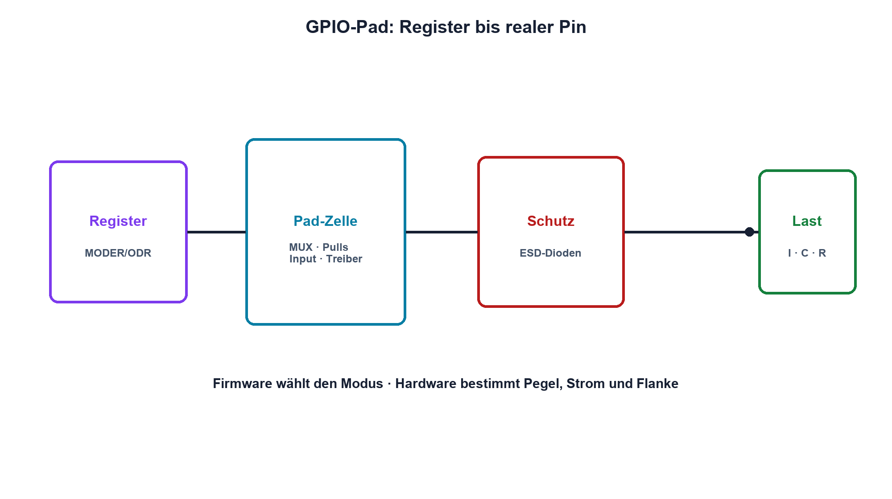

# 15.1 – GPIO als elektrische Schnittstelle

[← Zurück](../14-digitaltechnik/07-open-collector-open-drain-pull-widerstaende-und-entprellung.md) · [Modulübersicht](README.md) · [Kursübersicht](../README.md) · [Weiter →](02-uart-und-rs-232.md)

## Lernziele

Nach dieser Lektion kannst du:

- GPIO-Modi elektrisch erklären
- Pin-, Port- und Versorgungslimits unterscheiden
- Reset- und Fehlersituationen messtechnisch prüfen

## Warum ist das wichtig?

Ein GPIO ist die Grenze zwischen Register und realer Schaltung. Hinter einem geschriebenen Bit stehen Ausgangstransistoren, Schutzdioden, Pull-Widerstände und Stromgrenzen. Viele scheinbare Firmwarefehler entstehen an dieser elektrischen Schnittstelle.

## Theorie

### Aufbau eines Pins

Der Pad-Zellenblock enthält Eingangsbuffer, Push-Pull- oder Open-Drain-Treiber, optionale Pulls, Multiplexer zur Peripherie und ESD-Schutzstrukturen. Analogmodus trennt digitale Teile häufig ab, beseitigt aber keine absoluten Spannungsgrenzen.

Push Pull treibt High und Low aktiv. Open Drain treibt nur Low. Eingang und Alternate Function verbinden den Pin mit anderen internen Signalwegen. Die eingestellte Slew Rate begrenzt Flankengeschwindigkeit und reduziert bei Bedarf Störungen.

### Ströme und Startzustand

Datenblätter nennen Strom pro Pin, Summen pro Port oder Versorgungspin sowie garantierte VOH/VOL bei bestimmten Lasten. Absolute Maximalwerte sind keine Betriebswerte. Während Reset sind Pins meist hochohmig oder mit speziellen Bootfunktionen belegt. Externe Pulls sorgen für sichere Lastzustände.

Ein Signal ausserhalb der Versorgung kann über Schutzdioden Strom einspeisen. Serienwiderstand und Power-Sequencing werden deshalb schon im Schema betrachtet.

## Anschauliches Beispiel

Ein GPIO ist eine Tür mit mehreren Betriebsarten: Sie kann aktiv öffnen und schliessen, nur zuziehen oder lediglich beobachten. Das Register wählt den Mechanismus; die Tür bleibt aber mechanisch begrenzt.

## Berechnungsbeispiel

Ein Ausgang garantiert bei 8 mA mindestens 2,7 V. Eine Last von 220 Ω nach GND würde bei 3,3 V etwa 15 mA verlangen und ist damit nicht durch diese Angabe freigegeben. Ein Treibertransistor oder grösserer Widerstand ist nötig.

## Praxisbezug

Miss High und Low unbelastet sowie mit freigegebener Last. Beobachte Reset, Bootloader und Debug-Halt. Vergleiche Push Pull, Open Drain und zwei Slew-Rate-Einstellungen am Oszilloskop.

## 🔗 Hardware ↔ Firmware

Konfigurationsregister wählen Modus, Pull, Geschwindigkeit und Alternate Function. Der elektrische Nachweis erfolgt am Pin: Pegel, Flanke, Strom und Resetverhalten müssen zur Konfiguration passen. Vertiefung bietet der STM32-Programmierkurs.

## Merksatz

> Ein GPIO-Bit steuert eine reale Pad-Zelle; Pinspannung, Laststrom und Startzustand bleiben Hardwaregrössen.

## Häufige Fehler und Missverständnisse

- Pin und Registerzustand gleichsetzen
- Strom pro Pin ohne Portsumme betrachten
- Resetzustand nicht absichern
- 5-V-Toleranz auf jeden Modus übertragen

## Zusammenfassung

GPIO verbindet Firmware und Elektrik. Modus, Pegel, Last, Schutz und Reset müssen zusammen geprüft werden.

## Übungsfragen

1. Was unterscheidet Push Pull und Open Drain?
2. Warum zählt die Portstromsumme?
3. Welche Funktion hat die Slew-Rate-Einstellung?
4. Was misst du während Reset?

Weitere Aufgaben: [Übungen zu Modul 15](../uebungen/modul-15.md).

## Bezug Bildungsplan 2026

- Handlungskompetenzen: `b1-LK01–06`, `b4`, `b5`, `c1–c2`, `d9`
- Nachweise: Pinmessung über Betriebs- und Resetmodi; [Kompetenzmatrix](../bildungsplan-2026/kompetenzmatrix.md)
