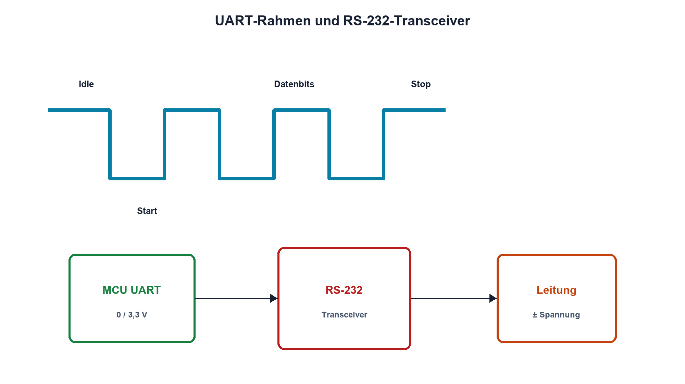

# 15.2 – UART und RS-232

[← Zurück](01-gpio-als-elektrische-schnittstelle.md) · [Modulübersicht](README.md) · [Kursübersicht](../README.md) · [Weiter →](03-i-c-open-drain-und-pull-up.md)

## Lernziele

Nach dieser Lektion kannst du:

- UART-Rahmen und Baudrate erklären
- UART-Logikpegel von RS-232 unterscheiden
- Signalrichtung und Massebezug korrekt verbinden

## Warum ist das wichtig?

UART ist ein digitales Zeichenformat am MCU-Pin; RS-232 ist ein elektrischer Leitungsstandard mit anderen Spannungen und invertierter Logik. Eine direkte Verbindung kann unzuverlässig sein oder Hardware beschädigen.

## Theorie

### Asynchroner Rahmen

Eine UART-Leitung ist im Ruhezustand High. Ein Startbit Low synchronisiert den Empfänger, danach folgen Datenbits, optional Parität und ein oder mehrere Stopbits High. Sender und Empfänger benötigen ausreichend ähnliche Baudraten.

Die Bitzeit ist `tbit = 1/Baudrate`. 115200 Baud ergibt etwa 8,68 µs pro Bit. Bei 8N1 benötigt jedes Datenbyte zehn Bitzeiten und erreicht maximal ungefähr 11520 Byte/s ohne Pausen.

### RS-232 ist nicht UART-TTL

RS-232 verwendet positive und negative Leitungsspannungen und invertiert die logische Bedeutung gegenüber typischen MCU-UART-Pins. Ein RS-232-Transceiver erzeugt die Pegel, schützt und invertiert. TX wird mit RX der Gegenseite verbunden; gemeinsame Signalmassen benötigen einen kontrollierten Pfad.

Lange oder störbehaftete Verbindungen können trotz korrekter Zeichenparameter scheitern. Flanken, Kabelkapazität, Bezugspotential und Störungen werden am richtigen Ort gemessen.

## Anschauliches Beispiel

UART ist die Grammatik eines Satzes, RS-232 die Lautstärke und Tonlage der Übertragung. Gleiche Wörter helfen nicht, wenn Sender und Empfänger völlig unterschiedliche elektrische Sprachen sprechen.

## Berechnungsbeispiel

Für 9600 Baud ist `tbit ≈ 104,17 µs`. Ein 8N1-Zeichen dauert rund 1,042 ms. 100 Zeichen benötigen ideal mindestens 104 ms; Protokollpausen kommen hinzu.

## Praxisbezug

Zeichne MCU-TX und Leitung nach dem RS-232-Transceiver gleichzeitig auf. Dekodiere Start-, Daten- und Stopbits und prüfe die Inversion. Verwende nur dafür geeignete Tastköpfe und Kleinspannungsgeräte.

## 🔗 Hardware ↔ Firmware

Firmware konfiguriert Baudrate, Wortlänge, Parität und Stopbits. Ein korrektes Registersetup behebt keine vertauschten Leitungen oder fehlenden Transceiver. Der STM32-Kurs behandelt UART und DMA im Detail.

## Merksatz

> UART beschreibt den Datenrahmen; RS-232 beschreibt eine andere elektrische Schnittstelle und benötigt einen Transceiver.

## Häufige Fehler und Missverständnisse

- RS-232 direkt mit einem MCU-Pin verbinden
- TX mit TX verbinden
- Bitzeit und Bytezeit verwechseln
- gemeinsamen Bezug und Kabellast ignorieren

## Zusammenfassung

UART überträgt asynchron gerahmte Bits. RS-232 setzt diese in robuste, invertierte Leitungsspannungen um.

## Übungsfragen

1. Warum besitzt 8N1 zehn Bits pro Byte?
2. Berechne tbit bei 57600 Baud.
3. Welche Aufgabe hat der RS-232-Transceiver?
4. Welche Fehler sind elektrisch statt firmwarebedingt?

Weitere Aufgaben: [Übungen zu Modul 15](../uebungen/modul-15.md).

## Bezug Bildungsplan 2026

- Handlungskompetenzen: `b1-LK01–06`, `b4`, `b5`, `c1–c2`, `d9`
- Nachweise: elektrisch und logisch dekodierter UART-/RS-232-Rahmen; [Kompetenzmatrix](../bildungsplan-2026/kompetenzmatrix.md)
