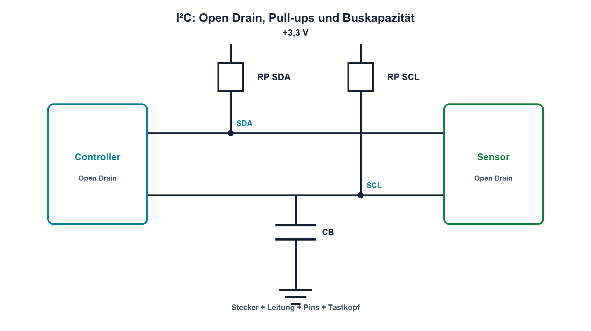

# 15.3 – I²C, Open Drain und Pull-up

[← Zurück](02-uart-und-rs-232.md) · [Modulübersicht](README.md) · [Kursübersicht](../README.md) · [Weiter →](04-spi-und-chip-select.md)

## Lernziele

Nach dieser Lektion kannst du:

- SDA und SCL als Open-Drain-Leitungen erklären
- Pull-up aus Strom und Anstiegszeit dimensionieren
- Start, Adresse, ACK und Stop elektrisch erkennen

## Warum ist das wichtig?

I²C verbindet viele Bausteine mit zwei Leitungen. Weil kein Teilnehmer aktiv High treibt, bestimmen Pull-ups und gesamte Buskapazität die steigenden Flanken. Ein logisch korrektes Protokoll kann elektrisch trotzdem zu langsam sein.

## Theorie

### Gemeinsamer Bus

SDA und SCL werden über Pull-ups RP nach VDD gezogen. Jeder Teilnehmer besitzt Open-Drain-Ausgänge und kann Low erzwingen. Dadurch sind ACK, Clock Stretching und Arbitration möglich, ohne dass High- und Low-Treiber gegeneinander arbeiten.

Eine Startbedingung ist SDA fallend bei SCL High, Stop ist SDA steigend bei SCL High. Daten sind während SCL High stabil. Nach acht Bits bestätigt der Empfänger im neunten Takt mit ACK Low.

### Pull-up-Bereich

Der kleinste RP wird durch zulässigen Sinkstrom und VOL begrenzt: `RPmin = (VDD − VOLmax)/IOL`. Der grösste RP folgt aus Buskapazität CB und erlaubter Anstiegszeit tr. Für die übliche 30–70-%-Definition gilt näherungsweise `tr ≈ 0,8473·RP·CB`.

Stecker, Leiterbahnen, Kabel, Tastköpfe und alle Eingänge tragen zu CB bei. Pull-ups an mehreren Modulen liegen parallel.

## Anschauliches Beispiel

Eine Feder zieht eine gemeinsame Fahne hoch; jeder Teilnehmer darf sie nach unten ziehen. Eine schwache Feder spart Kraft, braucht aber länger, um die Fahne wieder anzuheben.

## Berechnungsbeispiel

Bei RP = 4,7 kΩ und CB = 200 pF ergibt sich `tr ≈ 0,8473·4,7 kΩ·200 pF ≈ 796 ns`. Das kann für 100 kHz genügen, ist für schnellere Modi je nach Spezifikation zu langsam.

## Praxisbezug

Miss SDA und SCL mit kurzer Masseverbindung. Bestimme tr zwischen 30 % und 70 %, dekodiere Adresse und ACK und vergleiche zwei Pull-up-Werte. Notiere die zusätzliche Tastkopfkapazität.

## 🔗 Hardware ↔ Firmware

Das I²C-Peripheral erzeugt Start, Adresse und Takte; Hardware bestimmt Flanken und Low-Pegel. Timeout, Clock Stretching und Bus-Recovery gehören zur robusten Firmware. Vertiefung: STM32-Programmierkurs.

## Merksatz

> Bei I²C zieht Hardware aktiv nur Low; Pull-up und Buskapazität erzeugen die High-Flanke.

## Häufige Fehler und Missverständnisse

- Push-Pull für SDA oder SCL verwenden
- mehrere Pull-ups nicht parallel zusammenrechnen
- Frequenz messen, aber Anstiegszeit ignorieren
- ACK-Fehler nur als Adressproblem behandeln

## Zusammenfassung

I²C kombiniert Open Drain mit einem getakteten Protokoll. Pull-up, Sinkstrom und Gesamtkapazität müssen gleichzeitig passen.

## Übungsfragen

1. Wie erkennt man Start und Stop?
2. Berechne tr für 2,2 kΩ und 300 pF.
3. Was begrenzt RPmin?
4. Welche Busfehler kann Firmware automatisch lösen?

Weitere Aufgaben: [Übungen zu Modul 15](../uebungen/modul-15.md).

## Bezug Bildungsplan 2026

- Handlungskompetenzen: `b1-LK01–06`, `b4`, `b5`, `c1–c2`, `d9`
- Nachweise: gemessener und dekodierter I²C-Bus mit Pull-up-Nachweis; [Kompetenzmatrix](../bildungsplan-2026/kompetenzmatrix.md)
